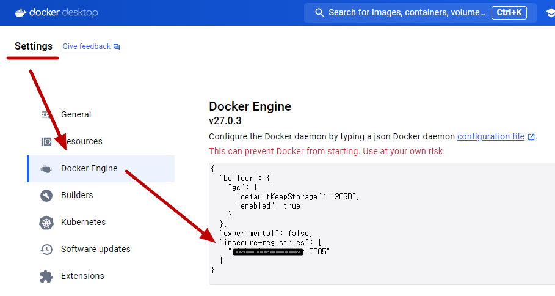

# 프로그램 환경

## 프로그램 목록
1. chocolately
1. powershell-core
1. microsoft-windows-terminal
1. vscode
1. git
1. nodejs-lts
1. speedscope
1. wsl2
1. docker-desktop
1. dotnet-sdk
1. k6
1. dotnet tool
   - dotnet-counters
   - dotnet-trace
   - dotnet-dump
   - dotnet-gcdump
   - dotnet-reportgenerator-globaltool

## Chocolately 설치
- Chocolatey는 Windows 운영 체제용 패키지 관리자입니다.
- 소프트웨어 설치, 업그레이드, 구성, 제거 등을 자동화하는 데 사용됩니다.
- Chocolatey는 Windows 환경에서 리눅스의 패키지 관리 시스템인 apt-get이나 yum과 유사한 역할을 합니다.

```shell
# 1. PowerShell 권리자 권한 실행

# 2. PowerShell 정책 변경
Get-ExecutionPolicy
Set-ExecutionPolicy Unrestricted

# # 3. Chocolatey 설치 경로 지정: "C:\ProgramData\chocolatey" 기본 설치 경로: 생략 가능
# #    - 시스템 변수 이름: ChocolateyInstall
# #    - 시스템 변수 값(설치 경로): D:\Workspace\Chocolatey
# [System.Environment]::SetEnvironmentVariable("ChocolateyInstall", "D:\Workspace\Chocolatey", [System.EnvironmentVariableTarget]::Machine)
# $env:ChocolateyInstall

# 4. choco 설치: https://chocolatey.org/install
Set-ExecutionPolicy Bypass -Scope Process -Force; [System.Net.ServicePointManager]::SecurityProtocol = [System.Net.ServicePointManager]::SecurityProtocol -bor 3072; iex ((New-Object System.Net.WebClient).DownloadString('https://community.chocolatey.org/install.ps1'))

# 5. choco 버전
choco -v
```

## 프로그램 설치 명령
```shell
# 1. Powershell-Core: https://community.chocolatey.org/packages/powershell-core/7.4.4#versionhistory
choco install powershell-core --version 7.4.4 -y
    pwsh -v

# 2. Windows Terminal: https://community.chocolatey.org/packages?q=windows%20terminal
choco install microsoft-windows-terminal --version 1.20.11781 -y
    wt -v

# 3. VSCode: https://community.chocolatey.org/packages?q=vscode
choco install vscode --version 1.91.1 -y
    code -v

# VSCode 확장 도구
# - 개발 확장 도구
#   - Remote Development: https://marketplace.visualstudio.com/items?itemName=ms-vscode-remote.vscode-remote-extensionpack
#   - Docker: https://marketplace.visualstudio.com/items?itemName=ms-azuretools.vscode-docker
#   - REST Client: https://marketplace.visualstudio.com/items?itemName=humao.rest-client
# - 편집 확장 도구
#   - Markdown Preview Enhanced: https://marketplace.visualstudio.com/items?itemName=shd101wyy.markdown-preview-enhanced
#   - Draw.io Integration: https://marketplace.visualstudio.com/items?itemName=ms-azuretools.vscode-docker
#   - Paste Image: https://marketplace.visualstudio.com/items?itemName=mushan.vscode-paste-image

# 4. Git: https://community.chocolatey.org/packages/git
choco install git --version 2.45.2 -y
    git -v

# 5. Node.js: https://community.chocolatey.org/packages/nodejs-lts
choco install nodejs-lts --version 20.16.0 -y
    node -v
    npm -v

# 6. speedscope: https://github.com/jlfwong/speedscope
npm install -g speedscope
    speedscope -v

# 7. WSL2: https://community.chocolatey.org/packages?q=wsl2
#   - Ubuntu 22.04 LTS
choco install wsl2 -y --version 2.0.0.20210721 --params "/Version:2 /Retry:true"
    wsl -v

# 8. Docker Desktop: https://community.chocolatey.org/packages/docker-desktop
choco install docker-desktop -y --version 4.32.0
    docker version

# 9. dotnet sdk: https://community.chocolatey.org/packages/dotnet-sdk/
choco install dotnet-sdk -y --version=8.0.303
choco install dotnet-sdk -y --version=8.0.100
    dotnet --list-sdks

# 10. k6: https://community.chocolatey.org/packages/k6
choco install k6 --version=0.56.0

# 11. dotnet tools 설치: https://learn.microsoft.com/ko-kr/dotnet/core/diagnostics/tools-overview
dotnet tool install -g dotnet-counters --version 8.0.532401
dotnet tool install -g dotnet-trace --version 8.0.532401
dotnet tool install -g dotnet-dump --version 8.0.532401
dotnet tool install -g dotnet-gcdump --version 8.0.532401
dotnet tool install -g dotnet-reportgenerator-globaltool --version 5.3.7

# https://github.com/dotMorten/DotNetOMDGenerator
#  generateomd /source=c:\github\dotnet\corefx\src /exclude="*/ref/*;*/tests/*;*/perftests/*"
dotnet tool install --global dotMorten.OmdGenerator
    dotnet tool list -g
```

## Docker Desktop

### 이미지 다운로드
```shell
# nodejs
docker image pull node:22.5.1
docker image pull node:lts-alpine3.20

# dotnet
docker image pull mcr.microsoft.com/dotnet/runtime:8.0
docker image pull mcr.microsoft.com/dotnet/sdk:8.0

# dive
docker image pull wagoodman/dive:v0.12.0

# aspire-dashboard
docker image pull mcr.microsoft.com/dotnet/aspire-dashboard:8.0.0

# rabbitmq
docker image pull rabbitmq:3-management-alpine

# 이미지 목록
docker image ls
# REPOSITORY                                  TAG                     IMAGE ID          SIZE
# node                                        22.5.1                  b966edc80bd3      1.11GB
# node                                        lts-alpine3.20          e2997a3fdff8      133MB
# mcr.microsoft.com/dotnet/runtime            8.0                     1ba50162b6e1      193MB
# mcr.microsoft.com/dotnet/sdk                8.0                     00fecb4bf40a      858MB
# wagoodman/dive                              v0.12.0                 cf2f0c72f085      51.7MB
# mcr.microsoft.com/dotnet/aspire-dashboard   8.0.0                   7215e173cdf4      180MB
# rabbitmq                                    3-management-alpine     1076874ab9eb      178MB
```



```json
{
  "insecure-registries": [
    "http://xxx.xxx.co.kr:5005"
  ]
}
```

```shell
# info 명령으로 insecure-registries 설정을 확인할 수 있습니다.
docker info

Server:
 Insecure Registries:
  xxx.xxx.co.kr:5005
```

## WSL2

### Ubuntu 다운로드
버전 | 이미지 파일
--- | ---
24.04 LTS Noble Numbat      | [ubuntu-noble-wsl-amd64-wsl.rootfs.tar.gz](https://cloud-images.ubuntu.com/wsl/noble/current/ubuntu-noble-wsl-amd64-wsl.rootfs.tar.gz)
22.04 LTS jammy jellyfish   | [ubuntu-jammy-wsl-amd64-wsl.rootfs.tar.gz](https://cloud-images.ubuntu.com/wsl/jammy/current/ubuntu-jammy-wsl-amd64-wsl.rootfs.tar.gz)
20.04 LTS focal fossa       | [ubuntu-20.04-server-cloudimg-amd64-wsl.rootfs.tar.gz](https://cloud-images.ubuntu.com/releases/focal/release/ubuntu-20.04-server-cloudimg-amd64-wsl.rootfs.tar.gz)
18.04 LTS bionic beaver     | [ubuntu-18.04-server-cloudimg-amd64-wsl.rootfs.tar.gz](https://cloud-images.ubuntu.com/releases/bionic/release/ubuntu-18.04-server-cloudimg-amd64-wsl.rootfs.tar.gz)

### Ubuntu 22.04 LTS 설치
```powershell
# 폴더 생성: 경로는 필요에 따라 조정하실 수 있습니다.
#
# D:\Workspace\wsl\Ubuntu\22.04
#     \Volume
#         WSL 머신 데이터 파일
#     \Release
#         ubuntu-jammy-wsl-amd64-wsl.rootfs.tar.gz
mkdir -p D:\Workspace\wsl\Ubuntu\22.04\Volume
mkdir -p D:\Workspace\wsl\Ubuntu\22.04\Release

# 설치: --import {Distro 이름} {Distro 데이터 파일 위치} {Distro 파일} [옵션]
wsl --import ubuntu22.04 `
    D:\Workspace\wsl\Ubuntu\22.04\Volume `
    D:\Workspace\wsl\Ubuntu\22.04\Release\ubuntu-jammy-wsl-amd64-wsl.rootfs.tar.gz `
    --version 2

# 목록: --list, -l [옵션], --verbose, -v
wsl -l -v
  NAME                   STATE           VERSION
* ubuntu22.04            Stopped         2

# 실행: --distribution, -d
wsl                             # 기본 distribution 실행
wsl -d ubuntu22.04              # 특정 distribution 실행

# 버전 확인
root@{호스트}:~# lsb_release -a
  No LSB modules are available.
  Distributor ID: Ubuntu
  Description:    Ubuntu 22.04.4 LTS
  Release:        22.04
  Codename:       jammy

# root 암호 변경
root@{호스트}:~# passwd

# 나오기
root@{호스트}:~# exit
```

```shell
#
# 추가 명령 이해
#

# 종료: --terminate, -t
wsl -t ubuntu22.04
wsl -l -v
#    NAME                   STATE           VERSION
#  * ubuntu22.04            Stopped         2

# 제거: --unregister
wsl --unregister ubuntu22.04
```

### Ubuntu 계정 생성
> **{계정}은** `hello`로 진행합니다.

```shell
# root 계정에서 계정 생성
#   - 계정: hello
root@{호스트}:~# adduser {계정}
# 계정 생성 확인
root@{호스트}:~# ls /home

# 계정 접속 테스트
{계정}@{호스트}:~$ su - {계정}
```

### Ubuntu 기본 계정
```shell
# 로그인 기본 계정: /etc/wsl.conf 파일을 생성한다
root@{호스트}:~# cat << EOF | sudo tee /etc/wsl.conf
[user]
default = {계정}
EOF

# sudo 권한
root@{호스트}:~# usermod -aG sudo {계정}

# 계정 설정 테스트: ubuntu을 재시작해야 합니다.
root@{호스트}:~# exit
wsl -t ubuntu22.04
wsl -d ubuntu22.04

# 계정 로그인: --user, -u
#   기본 계정 로그인
wsl -d ubuntu22.04
#   root 계정 로그인
wsl -d ubuntu22.04 -u root
#   특정 계정 로그인
wsl -d ubuntu22.04 -u {계정}

# sudo 권한 확인
{계정}@{호스트}:~$ id
uid=1000({계정}) gid=1001({계정}) groups=1001({계정}),27(sudo)
```

### WSL2 기본 가상화 지정
```shell
# 기본: --set-default, -s
wsl -s ubuntu22.04

# 기본 확인
wsl -l -v
  NAME                   STATE           VERSION
* ubuntu22.04            Running         2
  ubuntu24.04            Running         2
```

### WSL2 파일 공유


```shell
# 윈도우 -> WSL
\\wsl$                                  # 윈도우 탐색기에서 입력

# 윈도우 <- WSL
{계정}@{호스트}:~$ mount -l

{계정}@{호스트}:~$ cd /mnt
{계정}@{호스트}:~$ ls -al
  c  d  e  wsl  wslg

{계정}@{호스트}:~$ cd /mnt/c             # 윈도우 C:\ 드라이브
{계정}@{호스트}:~$ ls -al
```

### WSL2 자원 설정
- `%USERPROFILE%\.wslconfig`
  - 파일이 존재하지 않으면 .wslconfig 파일을 생성합니다.
- [Advanced settings configuration in WSL](https://learn.microsoft.com/en-us/windows/wsl/wsl-config)

```
[wsl2]
memory=16GB
processors=8
swap=0
localhostForwarding=true
```

### WSL2 Docker 통합


## SSH

### SSH 서버(WSL2 Ubuntu 서버)
```shell
# 1. 시스템에 대한 모든 호스트 키를 생성합니다
{계정}@{호스트}:~$ sudo ssh-keygen -A
# /etc/ssh/에서 생성된 호스트 키를 확인할 수 있습니다.
# root@{호스트}:~# ls /etc/ssh/ -al
#   ssh_host_dsa_key
#   ssh_host_dsa_key.pub
#   ssh_host_ecdsa_key
#   ssh_host_ecdsa_key.pub
#   ssh_host_ed25519_key
#   ssh_host_ed25519_key.pub
#   ssh_host_rsa_key
#   ssh_host_rsa_key.pub

# 2. ssh 접속시 암호 입력
{계정}@{호스트}:~$ sudo vi /etc/ssh/ssh_config
    PasswordAuthentication yes
#   Port 22                           포트
#   PermitRootLogin yes               root 허용
#   PubkeyAuthentication yes          공개키 인증
#   PasswordAuthentication yes        암호 인증
#   PermitEmptyPasswords no           빈 암호 제외

# 3. openssh-server 설치 및 재시작
sudo apt-get update
sudo apt-get install openssh-server -y
sudo service --status-all | grep ssh
sudo service ssh restart
sudo service ssh status

# 4. IP 확인
#   172.19.115.61: {WSL 가상화 ip}
ip a
    1: lo: <LOOPBACK,UP,LOWER_UP> mtu 65536 qdisc noqueue state UNKNOWN group default qlen 1000
        link/loopback 00:00:00:00:00:00 brd 00:00:00:00:00:00
        inet 127.0.0.1/8 scope host lo
        valid_lft forever preferred_lft forever
        inet6 ::1/128 scope host
        valid_lft forever preferred_lft forever
    2: eth0: <BROADCAST,MULTICAST,UP,LOWER_UP> mtu 1500 qdisc mq state UP group default qlen 1000
        link/ether 00:15:5d:12:89:dd brd ff:ff:ff:ff:ff:ff
        inet 172.19.115.61/20 brd 172.19.127.255 scope global eth0
        valid_lft forever preferred_lft forever
        inet6 fe80::215:5dff:fe12:89dd/64 scope link
        valid_lft forever preferred_lft forever
```

### SSH 클라이언트(윈도우 CLI)
```shell
# 1. WSL 서버: Home 디렉토리에 .ssh 폴더가 없으면 생성
ssh {계정}@{WSL 가상화 IP}
mkdir ~/.ssh
ls -al

# 2. 윈도우: SSH 키 생성(RSA 기반 형식으로 키 만들기)
#   - $env:USERPROFILE\.ssh\id_rsa
#   - $env:USERPROFILE\.ssh\id_rsa.pub
ssh-keygen

# 3. 윈도우: SSH Public 키 내용 복사
type $env:USERPROFILE\.ssh\id_rsa.pub | ssh {계정}@{WSL 가상화 IP} "cat >> .ssh/authorized_keys"

# 4. 윈도우: SSH 접속
ssh {계정}@{WSL 가상화 IP}

# 5. 키 등록 확인
cd .ssh
cat authorized_keys
```

## Vitepress 사이트 생성
```shell
# https://vitepress.dev/ko/guide/getting-started

# 0. Node.js 18버전 이상 설치

npm show vitepress versions   # 모든 버전
npm show vitepress version    # 최신 버전

# 1. VitePress 설치
#   - 이전 명령: npm install --save-dev vitepress
#     -D = --save-dev
#   - 특정 버전 설치: npm add -D vitepress@1.5.0
npm add -D vitepress
#   - 생성 파일
#     ├─ node_modules
#     │   └─ ...
#     ├─ package.json
#     └─ package-lock.json

# 2. VitePress 프로젝트 초기화
npx vitepress init

  ┌  Welcome to VitePress!
  │
  ◇  Where should VitePress initialize the config? # 현재 경로
  │  ./
  │
  ◇  Site title: # 사이트 제목
  │  Beyond Code
  │
  ◇  Site description: # 사이트 설명
  │  VOC |> DDD |> Architecture
  │
  ◇  Theme: # 사이트 테마
  │  Default Theme + Customization
  │
  ◇  Use TypeScript for config and theme files? # TypeScript 지원
  │  Yes
  │
  ◇  Add VitePress npm scripts to package.json? # 빌드를 위한 스크립트 추가
  │  Yes
  │
  └  Done! Now run npm run docs:dev and start writing.

#   - 생성 파일
#     ├─ .vitepress
#     │  ├─ theme
#     │  │   ├─ index.ts
#     │  │   └─ style.css
#     │  └─ config.js
#     │
#     ├─ node_modules
#     │  └─ ...
#     │
#     ├─ api-examples.md
#     ├─ markdown-examples.md
#     ├─ index.md
#     │
#     ├─ package.json
#     └─ package-lock.json

# 3. VitePress 빌드
npm run docs:dev

npm show medium-zoom versions
npm install medium-zoom

npm list
```

- `.vitepress\theme\index.ts`

```ts
import mediumZoom from 'medium-zoom';

export default {
  extends: DefaultTheme,
  // ...,
  enhanceApp({ app, router, siteData }) {
    router.onAfterRouteChanged = () => {
      mediumZoom('.main img', {
        margin: 16,           // 이미지와 화면의 여백 설정
        background: '#000',   // 확대 시 배경색
      });
    };
  },
} satisfies Theme
```

- `.vitepress\theme\style.css`

```css
.medium-zoom-overlay {
  z-index: 1000;
}

.medium-zoom-image {
  z-index: 1001;
}
```

```shell
# https://github.com/T-miracle/vitepress-plugin-image-viewer
npm i vitepress-plugin-image-viewer

# - `.vitepress\theme\index.ts`
// https://vitepress.dev/guide/custom-theme
import { h } from 'vue'
import type { Theme } from 'vitepress'
import DefaultTheme from 'vitepress/theme'
import 'viewerjs/dist/viewer.min.css';
import imageViewer from 'vitepress-plugin-image-viewer';
import vImageViewer from 'vitepress-plugin-image-viewer/lib/vImageViewer.vue';
import { useRoute } from 'vitepress';
import './style.css'

export default {
  extends: DefaultTheme,
  Layout: () => {
    return h(DefaultTheme.Layout, null, {
      // https://vitepress.dev/guide/extending-default-theme#layout-slots
    })
  },
  enhanceApp({ app, router, siteData }) {
    // ...
    app.component('vImageViewer', vImageViewer);
  },
  setup() {
    // Get route
    const route = useRoute();
    // Using
    imageViewer(route);
  }
} satisfies Theme
```

## Chocolately 주요 명령
```shell
#
# choco 패키지 설치
#
choco install {패키지 이름} -y
choco install {패키지 이름} -y --version {버전}
choco install {패키지 이름} -y --force --force-dependencies
# 오프라인 설치
#   - 패키지 다운로드: https://community.chocolatey.org/packages
choco install --source "C:\path\to\package.nupkg"

#
# choco 패키지 목록
#
choco list
choco list {패키지 이름}
choco list -i               # --include-programs

#
# choco 패키지 업그레이드
#
choco upgrade chocolately
# 모든 패키지 업그레이드
choco upgrade all                                       # 모든 패키지
choco upgrade all --except "'skype,conemu'"             # 특정 패키지 제외
# 특정 패키지 업그레이드
choco upgrade notepadplusplus                           # 1개 패키지
choco upgrade notepadplusplus googlechrome atom 7zip    # N개 패키지
choco upgrade nodejs.install --version 0.10.35

#
# choco 패키지 정보
#
choco info {패키지 이름}

#
# choco 패키지 제거
#
choco uninstall all                                     # 모든 패키지
choco uninstall git                                     # 패키지
choco uninstall ruby --version 1.8.7.37402              # 패키지 특정 버전
choco uninstall nodejs.install --all-versions           # 패키지 모든 버전

#
# choco 제거
#   폴더 삭제
Remove-Item -Recurse -Force $env:ChocolateyInstall
#   환경 변수 삭제: ChocolateyInstall
#   Path 변수 값 삭제: ChocolateyInstall 변수 값 경로 삭제
```