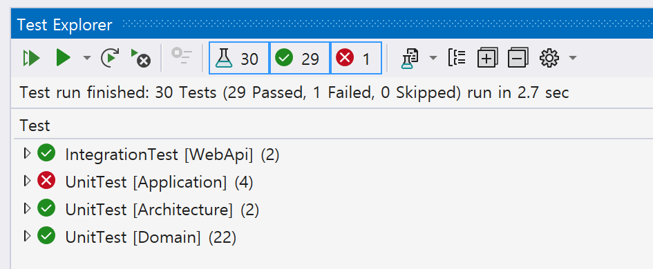

# 단위 테스트 구성

## 단위 테스트 패키지
- xUnit
- Shouldly

## 단위 테스트 솔루션 구성
```shell
└─ {Service}
    ├─ Src
    │  ├─ {Solution}.{Service}
    │  ├─ {Solution}.{Service}.Adapters.Infrastructure
    │  ├─ {Solution}.{Service}.Adapters.Persistence
    │  ├─ {Solution}.{Service}.Application
    │  └─ {Solution}.{Service}.Domain
    │
    │  #
    │  # 테스트
    │  #
    └─ Tests
       └─ {Solution}.{Project}.Tests.Unit              # 단위 테스트
           │  # 부수 목표
           ├─ Abstractions
           │  └─ Constants
           │
           │  # 주요 목표: 레이어 단위 테스트
           └─ LayerTests
               ├─ Application                          # Application 레이어
               │  └─ {Usecase}Tests.cs                 # Usecase 테스트
               │
               └─ Domain                               # Domain 레이어
                   ├─ Constants
                   ├─ Factories
                   └─ {AggregateRoot}Tests.cs          # Aggregate Root 테스트
```

## 단위 테스트 범주화


```cs
public static partial class Constants
{
    public static class UnitTest
    {
        public const string Architecture = nameof(Architecture);

        // 레이어
        public const string Domain = nameof(Domain);
        public const string Application = nameof(Application);
        public const string Persistence = nameof(Persistence);
        public const string Infrastructure = nameof(Infrastructure);
        public const string Presentation = nameof(Presentation);
    }
}
```

```cs
[Trait(nameof(UnitTest), UnitTest.Architecture)]
public class LayerDependencyTests : ArchitectureTestBase

[Trait(nameof(UnitTest), UnitTest.Domain)]
public sealed class GymTests
```
