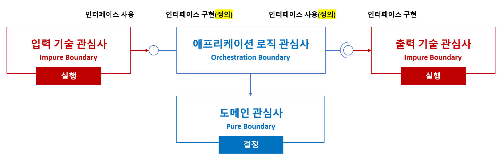

# 관심사의 분리

## 개요
- 애플리케이션을 설계할 때 핵심적인 원칙 중 하나는 관심사의 분리(Separation of Concerns, SoC) 입니다.
- 이는 서로 다른 목적과 책임을 가진 코드들을 명확히 나누어 유지보수성, 확장성, 테스트 용이성을 높이는 데 목적이 있습니다.

 

## 관심사
- **도메인 관심사(도메인 레이어: Domain Layer)**
  - 역할: 핵심 비즈니스 규칙, 도메인 모델, 불변의 도메인 로직을 다룹니다.
  - 위치: 도메인 레이어 (Domain Layer)
  - 특징: 외부 기술에 의존하지 않는 순수한 비즈니스 규칙
  - 경계: `Pure Boundary`
- **기술 관심사(어댑터 레이어: Adapter Layer)**
  - 역할: 사용자 인터페이스, 외부 시스템, 데이터베이스, 파일 시스템, 메시징 등 기술적 작업을 담당합니다.
  - 위치: 어댑터 레이어 (Adapter Layer)
    - 입력 기술 관심사: 사용자 입력 또는 외부 요청 수신
    - 출력 기술 관심사: 응답 전송, 외부 시스템 호출 등
  - 특징: 외부와의 상호작용으로 인해 부작용(Side Effect)이 존재
  - 경계: `Side Effect Boundary`
- **애플리케이션 로직 관심사(애플리케이션 레이어: Application Layer)**
  - 역할: 유스케이스(비즈니스 흐름)를 조합하고 조율하는 애플리케이션 서비스의 책임을 가집니다.
  - 위치: 애플리케이션 레이어 (Application Layer)
  - 특징: 도메인 모델을 조합하여 동작을 orchestrate하고, 외부 시스템에 대한 직접 접근은 인터페이스를 통해 의존을 역전합니다.
  - 경계: `Orchestration Boundary`

 

## 지침
- **경계 간 의존 방향을 명확히 하라**
  - 기술 관심사는 도메인 또는 애플리케이션 레이어에 의존해서는 안 됩니다.
  - 도메인은 오직 순수한 로직으로 구성되며 외부를 알지 못해야 합니다.
  - 애플리케이션은 도메인에 의존하되, 어댑터 레이어와는 인터페이스를 통해 느슨하게 결합합니다.
- **인터페이스 기반의 의존 역전(Dependency Inversion Principle)을 적용하라**
  - 도메인과 애플리케이션 레이어에서 필요한 동작을 인터페이스로 정의합니다.
  - 구현은 기술 관심사에서 수행하며, 런타임에 DI를 통해 연결합니다.
- **순수성과 부작용의 경계를 지켜라**
  - 도메인 로직은 가능한 한 순수 함수 형태로 작성하며, 상태 변경이나 외부 I/O를 포함하지 않도록 합니다.
  - 외부와의 상호작용(예: DB 저장, 메시지 발행 등)은 어댑터 레이어에서 수행합니다.
- **테스트 전략을 레이어별로 분리하라**
  - 도메인 레이어: 단위 테스트 (Pure 함수 기반)
  - 애플리케이션 레이어: Stub, Mock, TestDouble을 통한 유스케이스 테스트
  - 어댑터 레이어: 통합 테스트