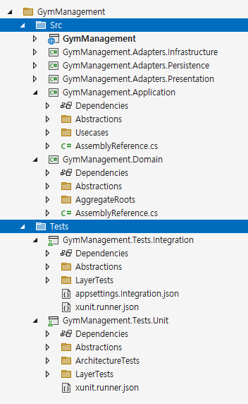

# 솔루션 폴더 구성

## 개요
- 소스 코드의 구조는 **책의 목차처럼** 명확하고 직관적이어야 합니다.
- 잘 정리된 폴더 구조는 새로운 개발자나 유지보수 담당자가 도메인과 시스템을 빠르게 이해하고, 변경이나 확장을 보다 안전하고 일관성 있게 수행할 수 있도록 돕습니다.
- 폴더 구조는 단순히 기술적인 구성 요소의 나열이 아니라, **시스템의 설계 철학과 책임의 흐름을 명확히 드러내야 합니다(소리치는 아키텍처, Screaming Architecture).**

<br/>

## 원칙

### 관심사의 분리 (Separation of Concerns)
- 시스템은 서로 다른 관심사로 나누어 설계되어야 하며, **각 관심사는 레이어로 구분됩니다.**
  - 도메인 관심사 (Domain 레이어): 도메인 모델 및 도메인 로직 중심의 순수 관심사
  - 기술 관심사 (Adapter 레이어): 외부 시스템과의 입출력을 담당하는 기술적 관심사 (DB, API 등)
  - 애플리케이션 로직 관심사 (Application 레이어): 유스케이스와 흐름을 조정하는 애플리케이션 로직 관심사

### 목표의 분리 (Separation of Purpose)
> 주요 목표(Primary Purpose) vs. 부수 목표(Secondary Purpose)
- 소프트웨어 구성 요소는 목표에 따라 **배치 방향을 달리합니다.**
  - 위쪽: 부수 목표(주요 목표 달성을 위한 부수적인 목표)
  - 아래쪽: 주요 목표

<br/>

## 지침

| 방향    | 관심사의 분리           | 목표의 분리                                  |
| ---    | ---                             | ---                              |
| 위쪽    | 기술 관심사 (무한)       | 부수 목표 (무한 -**_Abstractions_**-> 유한)  |
| 아래쪽  | 도메인 관심사 (유한)     | 주요 목표 (유한)                             |

- 레이어의 주요 목표를 직관적으로 이해하기 위해, 여러 부수 목표를 `Abstractions` 폴더 아래에 배치하여 부수 목표를 하나로 묶습니다.
- 이렇게 하면 부수 목표는 `Abstractions` 폴더 안에 고정되어 상단에 위치하게 되어, 주요 목표와 쉽게 구분할 수 있어 주요 목표를 더 잘 이해할 수 있습니다.
- `Abstractions` 폴더는 부수 목표를 해당 레이어의 주요 목표로부터 분리하고, 명확히 격리하기 위한 구조적 장치입니다.

```shell
{T}
 ├─Src
 │  ├─{T}                          // Host               > 위쪽: 기술 관심사 (부수 목표)
 │  ├─{T}.Adapters.Infrastructure  // Adapter Layer      >  │
 │  ├─{T}.Adapters.Persistence     // Adapter Layer      >  │
 │  ├─{T}.Application              // Application Layer  >  ↓
 │  └─{T}.Domain                   // Domain Layer       > 아래쪽: 도메인 관심사 (주요 목표)
 │     │
 │     ├─Abstractions                                    > 위쪽: 기술 관심사 (부수 목표)
 │     │                                                 >  ↓
 │     └─AggregateRoots                                  > 아래쪽: 도메인 관심사 (주요 목표)
 │
 └─Tests
    ├─{T}.Tests.Integration        // Integration Test   > 위쪽: 기술 관심사 (부수 목표)
    ├─{T}.Tests.Performance        // Performance Test   >  ↓
    └─{T}.Tests.Unit               // Unit Test          > 아래쪽: 도메인 관심사 (주요 목표)
```


