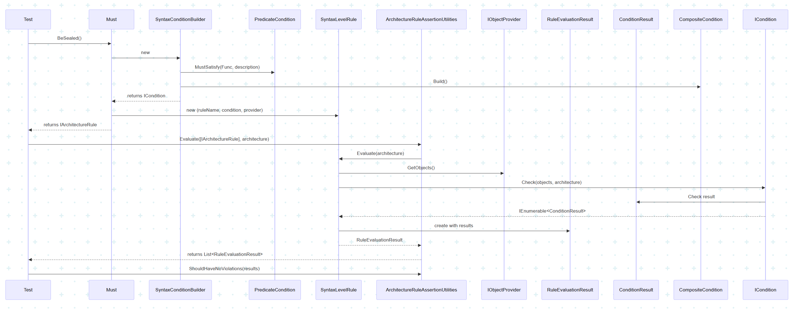
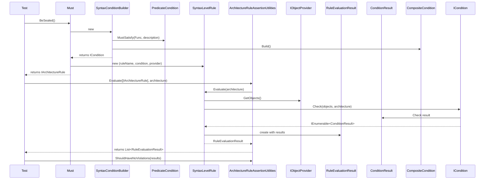
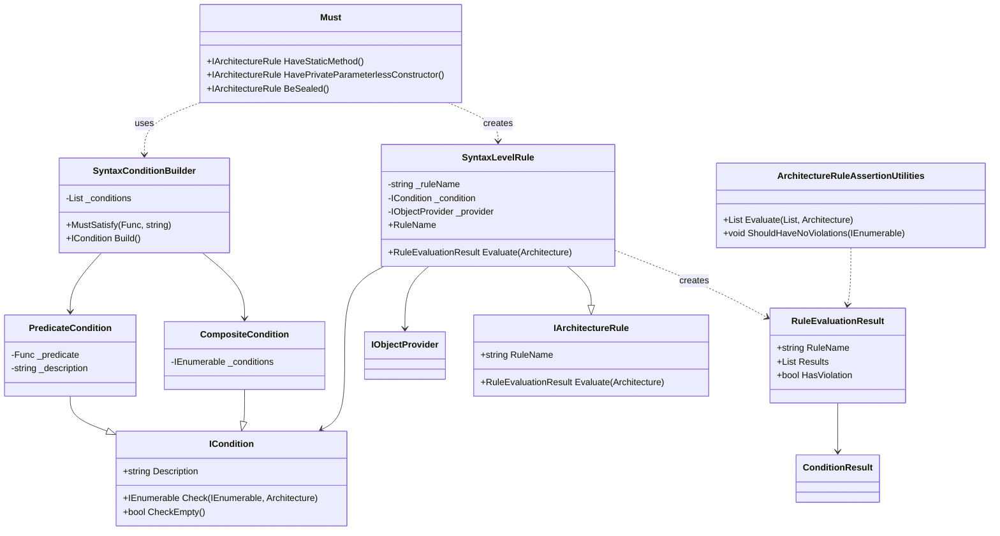

```cs
[Fact]
public void ValueObjectClasses_ShouldBe_Sealed()
{
    ArchRuleDefinition
        .Classes()
        .That()
        .ImplementInterface(typeof(IValueObject))
        .Should().BeSealed()
        .WithoutRequiringPositiveResults()
        .Check(Architecture);
}

[Theory]
[InlineData(IValueObject.CreateMethodName)]
[InlineData(IValueObject.ValidateMethodName)]
public void ValueObjectClasses_ShouldHave_StaticMethod(string requiredMethodName)
{
    ArchRuleDefinition
        .Classes()
        .That()
        .ImplementInterface(typeof(IValueObject))
        .Should().HaveStaticMethod(requiredMethodName)
        .WithoutRequiringPositiveResults()
        .Check(Architecture);
}

[Fact]
public void ValueObjectClasses_ShouldHave_PrivateParameterlessConstructor()
{
    ArchRuleDefinition
        .Classes()
        .That()
        .ImplementInterface(typeof(IValueObject))
        .Should().HavePrivateParameterlessConstructor()
        .WithoutRequiringPositiveResults()
        .Check(Architecture);
}
```

```cs
[Fact]
public void ValueObject_ShouldSatisfy_DesignRules()
{
    // Arrange
    var provider = ArchRuleDefinition
        .Classes()
        .That()
        .ImplementInterface(typeof(IValueObject));

    //
    // 설계 규칙
    //
    List<IArchitectureRule> sut = [
        // public sealed 클래스
        Must.BeSealed(provider),

        // privatie 생성자()
        Must.HavePrivateParameterlessConstructor(provider),

        // public static Create/Validate
        Must.HaveStaticMethod(provider,
            IValueObject.CreateMethodName,
            IValueObject.ValidateMethodName),

        // TODO Immutable
    ];

    // Act
    var actual = sut.Evaluate(Architecture);

    // Assert
    actual.ShouldHaveNoViolations();
}
```

## 다이어그램
### 시퀀스 다이어그램







- [ ] OR 조건
- [ ] Immutable 테스트
---
- [ ] 프로젝트 분리
---
- [ ] ReflectionLevelRules 코드 개선 작업
---
- [ ] 문서 정리
