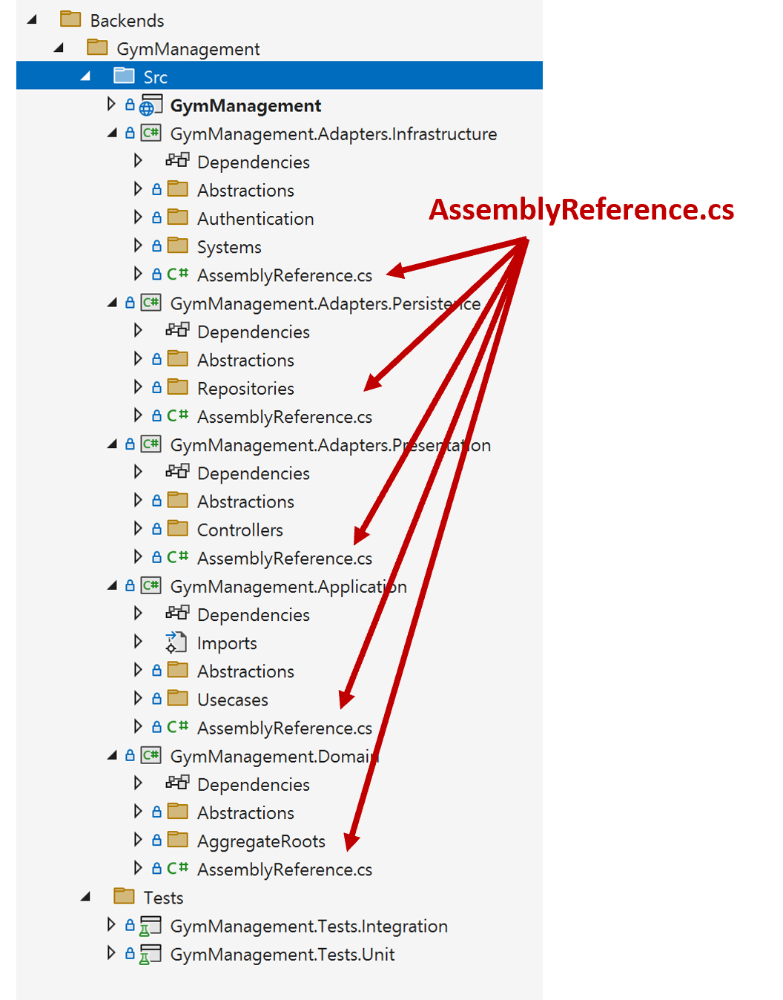

# 어셈블리별 AssemblyReference 정의

## 개요
- 모든 레이어별 프로젝트에 AssemblyReference 정적 클래스를 생성하여, 해당 레이어의 어셈블리를 명시적으로 참조할 수 있도록 합니다.
- 어셈블리를 레이어별로 체계적으로 관리할 수 있어, 아키텍처 테스트와 같이 어셈블리를 레이어 이름 단위로 명확하게 지정해야 하는 경우에도 효과적으로 활용할 수 있습니다.



<br/>

## AssemblyReference 코드
```cs
using System.Reflection;

namespace GymManagement.Application;

public static class AssemblyReference
{
    public static readonly Assembly Assembly = typeof(AssemblyReference).Assembly;
}
```

<br/>

## AssemblyReference 활용 예제
- AssemblyReference 정적 클래스를 어셈블리 단위로 구현함으로써, 아래와 같이 레이어별 어셈블리를 명시적으로 참조할 수 있습니다

```cs
public abstract class ArchitectureTestBase
{
    // 테스트 대상 어셈블리
    protected static readonly Architecture Architecture = new ArchLoader()
        .LoadAssemblies(
            // Adapter 레이어
            Adapters.Infrastructure.AssemblyReference.Assembly,
            Adapters.Persistence.AssemblyReference.Assembly,
            Adapters.Presentation.AssemblyReference.Assembly,

            // Application 레이어
            Application.AssemblyReference.Assembly,

            // Domain 레이어
            Domain.AssemblyReference.Assembly)
        .Build();
```
