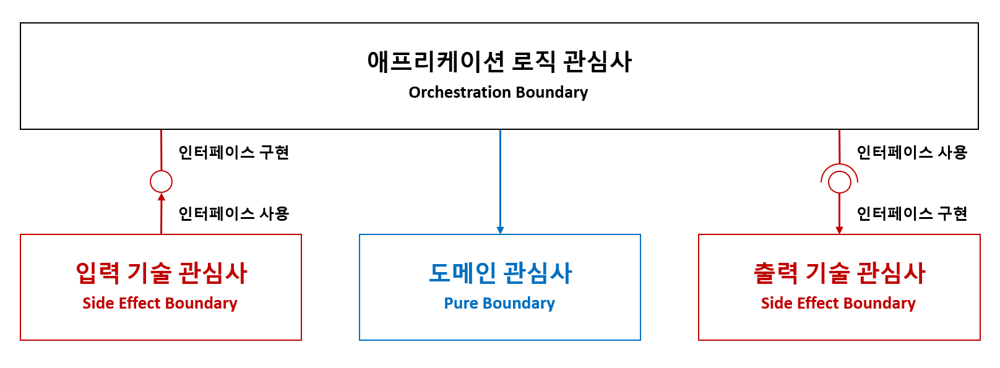

# 관심사를 분리하기

비즈니스을 구현하는 애플리케이션은 다음과 같은 세 가지 관심사로 분리합니다(SoC: Separation of Concerns).

- **도메인 관심사(도메인 레이어: Domain Layer)**
  - 비즈니스 규칙과 도메인 모델 등 순수한 도메인 관심사를 다룹니다.
  - Pure Boundary 입니다.
- **기술 관심사(어댑터 레이어: Adapter Layer)**
  - 사용자 인터페이스, 데이터베이스, 메시징 시스템 등 외부와의 통신을 처리하며, 기술적인 관심사를 담당합니다.
  - Side Effect Boundary 입니다.
- **애플리케이션 로직 관심사(애플리케이션 레이어: Application Layer)**
  - 도메인 모델을 활용하여 구체적인 유스케이스를 조합하고 조율하는 애플리케이션 로직을 담당합니다.
  - Orchestration Boundary 입니다.
