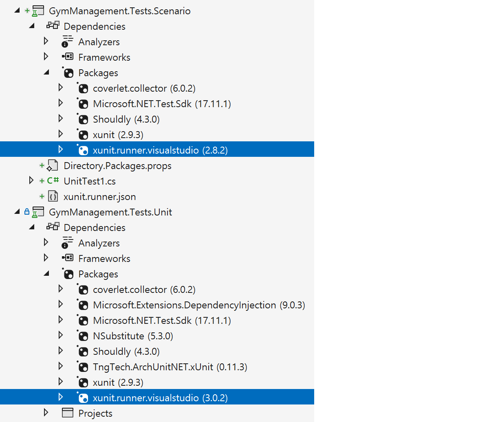

# NuGet 패키지 버전 중앙 관리

## 개요
- 기존 .NET 프로젝트에서는 각 프로젝트 파일(.csproj)마다 패키지 참조(PackageReference)와 버전(Version)을 개별적으로 관리했습니다.
- 이 방식은 프로젝트 수가 적을 때는 큰 문제가 되지 않았지만, 솔루션 내에 프로젝트가 많아질수록 다음과 같은 문제가 발생했습니다:
  - 버전 관리의 복잡성 증가
    - 여러 프로젝트에서 동일한 패키지를 참조하면서 서로 다른 버전을 사용하는 경우가 발생하여, 패키지 충돌이나 런타임 오류가 생길 수 있었습니다.
  - 일관성 유지의 어려움
    - 모든 프로젝트에서 패키지 버전을 일관되게 유지하려면, 각 프로젝트 파일을 수작업으로 수정해야 했습니다.
  - 유지보수 비용 증가
    - 패키지 버전을 업데이트할 때 모든 프로젝트 파일을 수정해야 하므로, 유지보수 작업이 비효율적이었습니다.
- `upgrade-assistant` 도구를 이용하여 `Directory.Package.props` 기반 패키지 관리로 업그레이드합니다.

<br/>

## upgrade-assistant 도구
```shell
# 도구 설치
dotnet tool install -g upgrade-assistant

# 도구 확인
dotnet tool list -g
  패키지 ID             버전            명령
  ------------------------------------------------------
  upgrade-assistant     0.5.820        upgrade-assistant

# 패키지 버전 중앙 관리: Directory.Package.props
upgrade-assistant upgrade
```


## Directory.Package.props 적용 전/후


- `upgrade-assistant` 도구를 이용하여 모든 프로젝트 파일의 `PackageReference`에서 `Version` 속성이 제거되고, 솔루션 루트에 위치한 `Directory.Package.props` 파일에 패키지 버전 정보가 명시됩니다.
- 이후 `Directory.Package.props` 파일에서 패키지 버전을 수정하면, 해당 패키지를 참조하는 모든 프로젝트에 일괄 적용되어 버전 관리를 보다 쉽게 할 수 있습니다.

<br/>

## 직접 만들기
### 중앙 관리 파일 생성
- 솔루션 루트 디렉터리에 패키지 버전을 통합 관리하는 전용 파일(`Directory.Package.props`)을 만듭니다.

```shell
# Directory.Package.props 파일 생성
dotnet new packagesprops
```

### 패키지 버전 정의
- 생성된 `Directory.Packages.props` 파일을 열고, 다음과 같이 작성합니다.
```xml
<Project>

  <PropertyGroup>
    <ManagePackageVersionsCentrally>true</ManagePackageVersionsCentrally>
  </PropertyGroup>

  <ItemGroup>
    <PackageVersion Include="Newtonsoft.Json" Version="13.0.1" />
  </ItemGroup>

</Project>
```

- `<ManagePackageVersionsCentrally>true</ManagePackageVersionsCentrally>`
이 속성은 프로젝트들이 패키지 버전을 개별적으로 관리하지 않고, 이 파일에서 관리하도록 설정하는 역할을 합니다.
- `<PackageVersion Include="패키지이름" Version="버전" />`
사용하고자 하는 NuGet 패키지와 버전을 명시합니다. 이 버전 정보는 모든 하위 프로젝트에 자동으로 반영됩니다.

### 프로젝트에서 패키지 버전 제거
- 이제 개별 .csproj 프로젝트 파일에서는 예전처럼 버전을 직접 명시할 필요가 없습니다.
- 변경 전
  ```xml
  <PackageReference Include="Newtonsoft.Json" Version="13.0.1" />
  ```
- 변경 후
  ```xml
  <PackageReference Include="Newtonsoft.Json" />
  ```
- 이처럼 Version 속성을 제거하면, 프로젝트는 자동으로 `Directory.Packages.props`에 정의된 버전을 참조하게 됩니다.

<br/>

## 개별 버전 지정하기
- 중앙 관리 방식은 매우 편리하지만, 일부 프로젝트에서는 특정 패키지의 다른 버전을 사용해야 할 수도 있습니다.
- 예를 들어 테스트용 프로젝트는 새로운 버전의 테스트 러너를 실험적으로 적용하고 싶을 수 있습니다.
- 이런 경우에는 해당 프로젝트의 `.csproj` 파일에서 아래와 같이 명시적으로 덮어쓸 수 있습니다.



- `xunit.runner.visualstudio` 버전을 특정 프로젝트에서는 다른 버전으로 지정합니다.
  - GymManagement.Tests.Unit: `3.0.2`
  - GymManagement.Tests.Scenario: `2.8.2`

```xml
<Project>

  <Import Project="$([MSBuild]::GetPathOfFileAbove(Directory.Packages.props, $(MSBuildThisFileDirectory)..))" />

  <ItemGroup>
    <PackageVersion Update="xunit.runner.visualstudio" Version="2.8.2" />
  </ItemGroup>

</Project>
```

- `<Import ...>` 구문은 현재 위치보다 위쪽 폴더를 탐색해 `Directory.Packages.props` 파일을 명시적으로 찾도록 도와줍니다.
- `<PackageVersion Update="..." Version="..." />`는 기존에 정의된 패키지 버전을 해당 프로젝트에서만 덮어쓰는(override) 방식입니다.