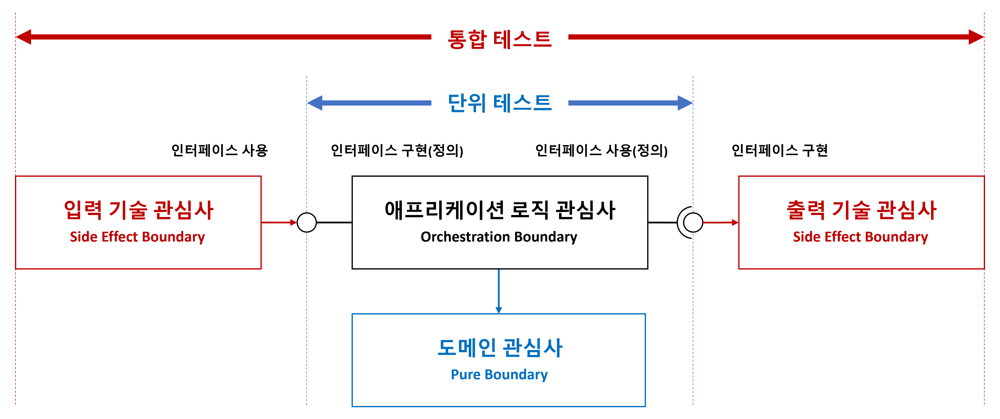

# 테스트 자동화하기

## 단위 테스트
- 단위 테스트는 **프로그램의 가장 작은 도메인 단위(도메인 관심사: Entity, Value Object, ...)**가 의도한 대로 동작하는지를 검증하는 테스트입니다.
- 외부 시스템과의 의존성을 제거하고, 테스트 대상 코드만을 격리하여 빠르고 정확한 검증을 목표로 합니다.

### 주요 특징
- 테스트 대상은 순수 로직(Pure Logic) 또는 오케스트레이션 로직
- 외부 의존성은 Mock, Stub 등을 사용하여 대체
- 실행 속도가 빠르고, 실패 원인이 명확함

 

## 통합 테스트
- 통합 테스트는 여러 구성 요소(모듈) 또는 시스템 간의 **실제 상호작용**을 테스트하여, 전체 시스템이 올바르게 연동되는지 검증하는 테스트입니다.
- DB, 파일 시스템, 외부 API 등과 실제로 통신하면서 오류 없이 작동하는지를 확인합니다.

### 주요 특징
- 실제 인프라와 연동되는 테스트
- 실행 속도는 느리지만, 현실적인 오류를 사전에 발견 가능
- 구성 요소 간의 연결 문제나 설정 오류 등을 탐지 가능
