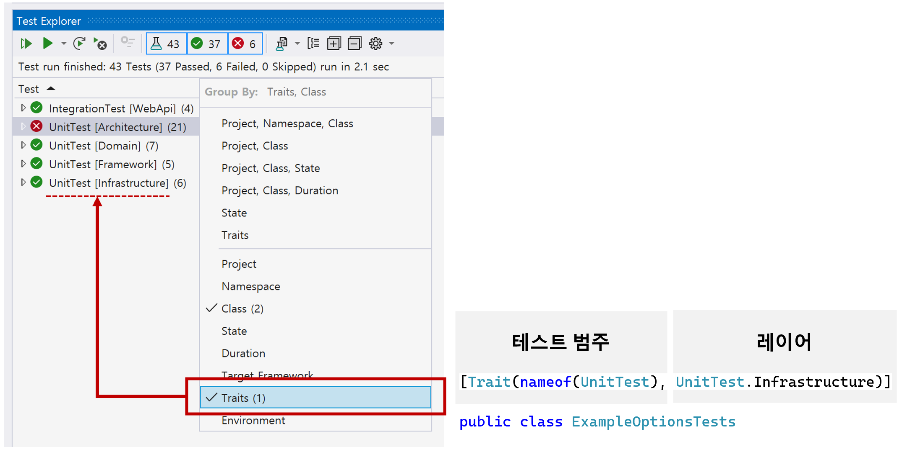

# 테스트 범주화

## 개요
- 테스트 클래스를 효율적으로 관리하기 위해 xUnit의 TraitAttribute를 활용하여 테스트를 그룹화합니다.
  - 테스트 범주: 단위 테스트, 통합 테스트, 성능 테스트 등 테스트의 성격에 따라 구분합니다.
  - 레이어: 도메인, 애플리케이션, 어댑터(인프라, 프리젠테이션, 영속성) 등 시스템 구조상의 위치에 따라 구분합니다.
- 이러한 방식으로 테스트를 분류하면, 다양한 기준(예: 테스트 범주, 레이어)으로 손쉽게 테스트를 필터링하고 관리할 수 있습니다.



## 테스트 범주화 정의
```cs
namespace GymManagement.Tests.Unit.Abstractions.Constants;

public static partial class Constants
{
    // 1. 테스트 범주: 단위 테스트
    public static class UnitTest
    {
        // 2. 테스트 대상

        // 아키텍처
        public const string Architecture = nameof(Architecture);

        // 도메인 레이어
        public const string Domain = nameof(Domain);

        // 애플리케이션 레이어
        public const string Application = nameof(Application);

        // 어댑터 레이어어
        public const string Infrastructure = nameof(Infrastructure);
        public const string Persistence = nameof(Persistence);
        public const string Presentation = nameof(Presentation);
    }
}
```

<br/>

## 테스트 범주화 적용
```cs
using static GymManagement.Tests.Unit.Abstractions.Constants.Constants;

// 테스트 범주화
[Trait(nameof(UnitTest), UnitTest.Domain)]
public sealed class GymTests
{
    // ...
}
```