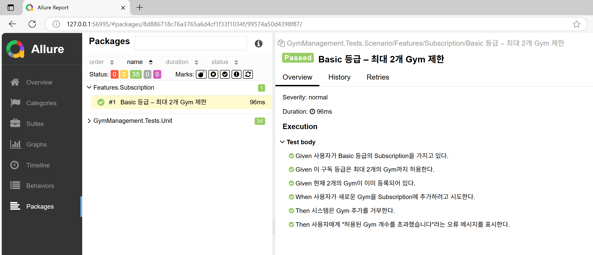

# 시나리오 테스트 (Reqnroll)

## 개요
- `Reqnroll`을 사용하여 `BDD(Behavior-Driven Development)` 테스트 시나리오를 작성하여 도메인 회귀 버그를 최소화합니다.
- `Allure`와 함께 사용하면 시나리오 기반 테스트 결과를 리포트로 시각화할 수 있어 비즈니스 담당자와 개발자 간 커뮤니케이션을 강화시킵니다.



<br/>

## 테스트 프로젝트

### Reqnroll 패키지
- Reqnroll.xUnit: `2.4.1`
- Allure.Reqnroll: `2.12.1`
- xunit: `2.9.3`
- **xunit.runner.visualstudio: `2.8.2`**
  - **.NET 9.0과 Allure.Xunit 2.12.1 버전에서는 xunit.runner.visualstudio 3.x.x 버전일 때는 정상동작하지 않습니다.**

<br/>

## 테스트 시나리오
```cucumber
Feature: Subscription

Subscription은 등급이 허용된 개수보다 많은 Gym을 추가할 수 없다(A subscription cannot have more gyms than the subscription allows).

Scenario: Basic 등급 – 최대 2개 Gym 제한
	Given 사용자가 Basic 등급의 Subscription을 가지고 있다.
	And 이 구독 등급은 최대 2개의 Gym까지 허용한다.
	And 현재 2개의 Gym이 이미 등록되어 있다.

	When 사용자가 새로운 Gym을 Subscription에 추가하려고 시도한다.

	Then 시스템은 Gym 추가를 거부한다.
	And 사용자에게 "허용된 Gym 개수를 초과했습니다"라는 오류 메시지를 표시한다.
```