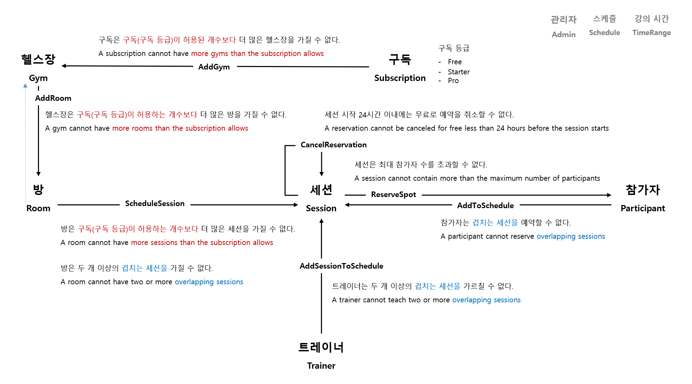

# 도메인 탐색

## 도메인 불변 조건



- **구독, Subscription**
  - AddGym
    > - 구독은 구독(구독 등급)이 허용된 개수보다 더 많은 헬스장을 가질 수 없다.
    > - A subscription cannot have more gyms than the subscription allows
- **헬스장, Gym**
  - AddRoom
    > - 헬스장은 구독(구독 등급)이 허용하는 개수보다 더 많은 방을 가질 수 없다.
    > - A gym cannot have more rooms than the subscription allows
- **방, Room**
  - ScheduleSession
    > - 방은 구독(구독 등급)이 허용하는 개수보다 더 많은 세션을 가질 수 없다.
    > - A room cannot have more sessions than the subscription allows

    > - 방은 두 개 이상의 겹치는 세션을 가질 수 없다.
    > - A room cannot have two or more overlapping sessions
- **트레이너, Trainer**
  - AddSessionToSchedule
    > - 트레이너는 두 개 이상의 겹치는 세션을 가르칠 수 없다.
    > - A trainer cannot teach two or more overlapping sessions
- **참가자, Participant**
  - AddToSchedule
    > - 참가자는 겹치는 세션을 예약할 수 없다.
    > - A participant cannot reserve overlapping sessions
- **세션, Session**
  - ReserveSpot
    > - 세션은 최대 참가자 수를 초과할 수 없다.
    > - A session cannot contain more than the maximum number of participants
  - CancelReservation
    > - 세션 시작 24시간 이내에는 무료로 예약을 취소할 수 없다.
    > - A reservation cannot be canceled for free less than 24 hours before the session starts


```shell
# 1. .NET SDK
dotnet new globaljson --sdk-version 9.0.100 --roll-forward latestMinor --force
dotnet --version

# 2. NuGet 저장소
dotnet new nuget.config

# 3. NuGet 패키지 버전
# Directory.Packages.props
dotnet tool install -g upgrade-assistant
upgrade-assistant upgrade

# 4. 프로젝트 빌드 속성
#Directory.Packages.props
```

## 패키지
- [SmartEnum](https://github.com/ardalis/SmartEnum)
- [Throw](https://github.com/amantinband/throw)
- [Shouldly](https://github.com/shouldly/shouldly)

## TODO
- [x] 도메인 | 구독, Subscription
- [x] 도메인 | 헬스장, Gym
- [x] 도메인 | 방, Room
- [x] 도메인 | 트레이너, Trainer
- [ ] 도메인 | 참가자, Participant
- [ ] 도메인 | 세션, Session
---
- [ ] 세션 | Flat
- [ ] 세션 | 폴더 구조화
- [ ] 세션 | 유스케이스
- [ ] 세션 | WebApi

---
- [x] 솔루션 | nuget.config
- [x] 솔루션 | Directory.Packages.props
- [ ] 솔루션 | Directory.Build.props
- [ ] 솔루션 | .editorconfig
- [ ] 솔루션 | Use primary constructor (IDE0290) 비활성화???
  ```
  csharp_style_prefer_primary_constructors

  [*.{cs,vb}]
  dotnet_diagnostic.IDE0290.severity = none
  ```
- [x] 솔루션 | public class -> public sealed class
- [ ] 솔루션 | ErrorOr -> CSharpFunctionalExtensions
- [ ] Adapter 프로젝트 | Serilog
- [ ] Adapter 프로젝트 | Serilog + ErrorOr 통합(Error 코드, 예외)
- [ ] Adapter 프로젝트 | OpenTelemtry
- [ ] Adapter 프로젝트 | Aspire Dashboard
- [ ] 도메인 프로젝트 | 성능 개선 Guid 패키지
- [x] 도메인 프로젝트 | file-scoped namespace
- [ ] 도메인 프로젝트 | Entity IValidator ???
- [ ] 도메인 프로젝트 | Error.Conflict -> DomainErrors
- [ ] 도메인 프로젝트 | 기본 Error 타입(정의된 Error 타입)
  ```
  Error.Validation();                                 -> DomainErrors.Validation(nameof( ... ));
  Error.Conflict();
  Error.Unexpected();
  Error.NotFound(description: "Booking not found");
  ```
- [x] 도메인 프로젝트 | Error 코드 -> nameof
- [x] 도메인 프로젝트 | **Error 단위는 Entity? 메서드 단위**
  ```
  DomainErrors{.Entity}.메서드Errors
  ```
- [x] 도메인 프로젝트 | = new(); -> = [];
- [ ] 도메인 프로젝트 | new() { time }; -> [ time ];
- [x] 도메인 프로젝트 | SubscriptionType -> Grade
- [x] 도메인 프로젝트 | 폴더 구성
  ```
  Enumerations
  Errors
  Events
  ValueObjects
  ```
- [ ] 도메인 프로젝트 | Throw?? 예외 발생 이유(중복 Id)
- [ ] 도메인 프로젝트 | 기본 생성자 겹침???
  ```cs
  private Schedule()
  {
  }

  public Schedule(    <-- 기본 값으로 "public Schedule()"이 된다
    Dictionary<DateOnly, List<TimeRange>>? calendar = null,
    Guid? id = null)
  ```
- [ ] 도메인 프로젝트 | Id 통일
  ```
  private readonly Guid _id;
    vs.
  public Guid Id { get; }
  ```
- [ ] 도메인 프로젝트 | Trainer _userId????
- [ ] 도메인 프로젝트 | Error에 실패 값 포함
- [ ] 도메인 프로젝트 | Error 클래스 메서드 단위??? vs. 도메인 클래스 단위???
- [ ] 도메인 프로젝트 | Room과 Trainer의 Schedule 인스턴스???
---
- [x] 테스트 프로젝트 | FluentAssertions -> Shouldly
- [x] 테스트 프로젝트 | sut
- [x] 테스트 프로젝트 | 범주화
- [x] 테스트 프로젝트 | public -> internal
- [x] 테스트 프로젝트 | 폴더 구성 Abstractions
- [x] 테스트 프로젝트 | Constants.Subscriptions -> Constants.Subscription
  ```
  Constants.Constants.{클래스}
  Constants.DomainConstants.{클래스}
  ```
- [x] 테스트 프로젝트 | xunit.runner.json
- [x] 테스트 프로젝트 | FluentAssertions -> Shouldly
- [x] 테스트 프로젝트 | Trait 단위 필터
- [x] 테스트 프로젝트 | Last -(성능 개선)-> [Count - 1], SonarQube 추천
- [x] 테스트 프로젝트 | SubscriptionTest 기반으로 GymTest Add 테스트 역시 동적 건수 기반으로 개선
- [x] 테스트 프로젝트 | reportgenerator
- [x] 테스트 프로젝트 | reportgenerator 대상 선정 필터
- [ ] 테스트 프로젝트 | GitHub Actions 로컬
- [ ] 테스트 프로젝트 | GitHub Actions 코드 커버리지
- [x] 테스트 프로젝트 | Room 규칙 테스트
  - 방은 두 개 이상의 겹치는 세션을 가질 수 없다.
  - A room cannot have two or more overlapping sessions

