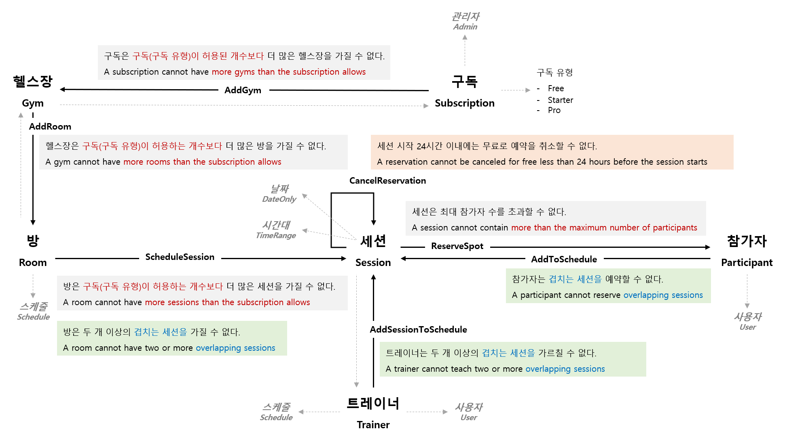
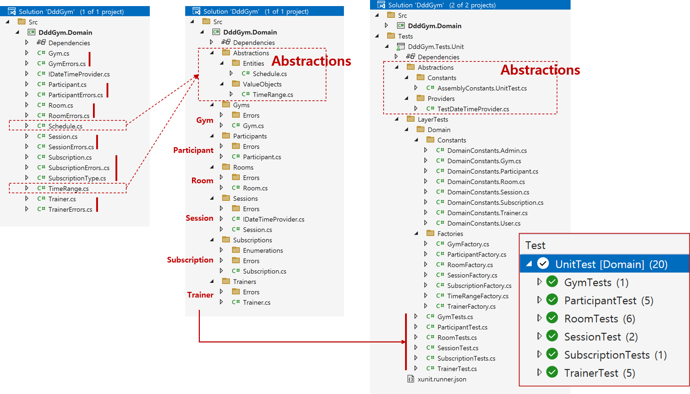

# 도메인 탐색

## 도메인 불변 조건



- **구독, Subscription**
  - AddGym
    > - 구독은 구독(구독 등급)이 허용된 개수보다 더 많은 헬스장을 가질 수 없다.
    > - A subscription cannot have more gyms than the subscription allows
- **헬스장, Gym**
  - AddRoom
    > - 헬스장은 구독(구독 등급)이 허용하는 개수보다 더 많은 방을 가질 수 없다.
    > - A gym cannot have more rooms than the subscription allows
- **방, Room**
  - ScheduleSession
    > - 방은 구독(구독 등급)이 허용하는 개수보다 더 많은 세션을 가질 수 없다.
    > - A room cannot have more sessions than the subscription allows

    > - 방은 두 개 이상의 겹치는 세션을 가질 수 없다.
    > - A room cannot have two or more overlapping sessions
- **트레이너, Trainer**
  - AddSessionToSchedule
    > - 트레이너는 두 개 이상의 겹치는 세션을 가르칠 수 없다.
    > - A trainer cannot teach two or more overlapping sessions
- **참가자, Participant**
  - AddToSchedule
    > - 참가자는 겹치는 세션을 예약할 수 없다.
    > - A participant cannot reserve overlapping sessions
- **세션, Session**
  - ReserveSpot
    > - 세션은 최대 참가자 수를 초과할 수 없다.
    > - A session cannot contain more than the maximum number of participants
  - CancelReservation
    > - 세션 시작 24시간 이내에는 무료로 예약을 취소할 수 없다.
    > - A reservation cannot be canceled for free less than 24 hours before the session starts

## 솔루션 구조화



```shell
{Project}
 ├─ Src
 │  └─ {Project}.Domain                   # Domain 레이어
 │     ├─ Abstractions                    # Domain 레이어를 위한 부수 코드
 │     └─ {Aggregate Root}                # Domain 레이어 주제
 └─ Tests
    └─ {Project}.Tests.Unit
       ├─ Abstractions                    # Unit 테스트를 위한 부수 코드
       └─ LayerTests                      # 레이어 테스트
          └─ Domain                       # 도메인 레이어 테스트
             └─ {Aggregate Root}
```

## 도메인 타입
```cs
// Aggregate Root
public sealed class Trainer : AggregateRoot { }
public sealed class Gym : AggregateRoot { }
public sealed class Participant : AggregateRoot { }
public sealed class Room : AggregateRoot { }
public sealed class Session : AggregateRoot { }
public sealed class Subscription : AggregateRoot { }

// Entity
public sealed class Schedule : Entity { }

// Value Object
public sealed class TimeRange : ValueObject { }
```


## 패키지
- [SmartEnum](https://github.com/ardalis/SmartEnum)
- [Throw](https://github.com/amantinband/throw)
- [Shouldly](https://github.com/shouldly/shouldly)