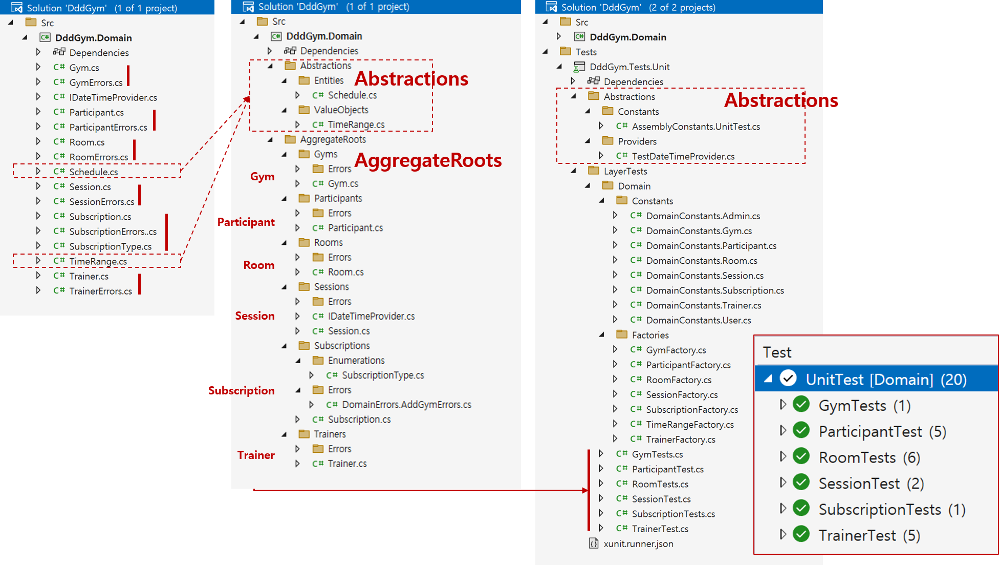

# 도메인 탐색

## 설계 목표
- `1.` **주요 도메인 규칙(불변 조건)을** 발굴하여 객체 관계를 구성하고 검증합니다.

## 도메인 규칙(불변 조건)


- **구독, Subscription**
  - AddGym
    > - 구독은 구독(구독 등급)이 허용된 개수보다 더 많은 헬스장을 가질 수 없다.
    > - A subscription cannot have more gyms than the subscription allows
- **헬스장, Gym**
  - AddRoom
    > - 헬스장은 구독(구독 등급)이 허용하는 개수보다 더 많은 방을 가질 수 없다.
    > - A gym cannot have more rooms than the subscription allows
- **방, Room**
  - ScheduleSession
    > - 방은 구독(구독 등급)이 허용하는 개수보다 더 많은 세션을 가질 수 없다.
    > - A room cannot have more sessions than the subscription allows

    > - 방은 두 개 이상의 겹치는 세션을 가질 수 없다.
    > - A room cannot have two or more overlapping sessions
- **트레이너, Trainer**
  - AddSessionToSchedule
    > - 트레이너는 두 개 이상의 겹치는 세션을 가르칠 수 없다.
    > - A trainer cannot teach two or more overlapping sessions
- **참가자, Participant**
  - AddToSchedule
    > - 참가자는 겹치는 세션을 예약할 수 없다.
    > - A participant cannot reserve overlapping sessions
- **세션, Session**
  - ReserveSpot
    > - 세션은 최대 참가자 수를 초과할 수 없다.
    > - A session cannot contain more than the maximum number of participants
  - CancelReservation
    > - 세션 시작 24시간 이내에는 무료로 예약을 취소할 수 없다.
    > - A reservation cannot be canceled for free less than 24 hours before the session starts

## 솔루션 구조화



```shell
{Project}                                 # 프로젝트
 │
 ├─ Src                                   # 소스
 │  └─ {Project}.Domain                   # Domain 레이어
 │     ├─ Abstractions                    # Domain 레이어 부수 코드
 │     │  ├─ Errors
 │     │  ├─ Events
 │     │  ├─ ValueObjects
 │     │  └─ ...
 │     │
 │     └─ AggregateRoots                  # Domain 레이어 주제 코드
 │        └─ {Aggregate Root}s            # Aggregate Root
 │           ├─ Enumerations
 │           ├─ Errors
 │           ├─ Events
 │           ├─ ValueObjects
 │           ├─ {Entitiy}...
 │           └─ {Aggregate Root}
 │
 └─ Tests                                 # 테스트
    └─ {Project}.Tests.Unit               # 단위 테스트
       ├─ Abstractions                    # 단위 테스트 부수 코드
       └─ LayerTests                      # 레이어 단위 테스트
          └─ Domain                       # 도메인 레이어 단위 테스트
             └─ {Aggregate Root 테스트}
```

## 도메인 규칙 테스트
- **구독, Subscription**
  - AddGym
    > - 구독은 구독(구독 등급)이 허용된 개수보다 더 많은 헬스장을 가질 수 없다.
    > - A subscription cannot have more gyms than the subscription allows

```cs
[Fact]
public void AddGym_WhenMoreThanSubscriptionAllows_ShouldFail()
{
  // Arrange
  Subscription sut = SubscriptionFactory.CreateSubscription();

  List<Gym> gyms = Enumerable.Range(0, sut.GetMaxGyms() + 1)
    .Select(_ => GymFactory.CreateGym(id: Guid.NewGuid()))
    .ToList();

  // Act
  var addGymResults = gyms.ConvertAll(sut.AddGym);

  // Assert: 추가 성공 검증(마지막 추가를 제외한 결과)
  var allButLastAddGymResults = addGymResults.Take(..^1);
  allButLastAddGymResults.ShouldAllBe(result => !result.IsError);

  // Assert: 추가 실패 검증(마지막 추가 결과)
  var lastAddGymResult = addGymResults[^1];
  lastAddGymResult.IsError.ShouldBeTrue();
  lastAddGymResult.FirstError
    .ShouldBe(AddGymErrors.CannotHaveMoreGymsThanSubscriptionAllows);
}
```

- **헬스장, Gym**
  - AddRoom
    > - 헬스장은 구독(구독 등급)이 허용하는 개수보다 더 많은 방을 가질 수 없다.
    > - A gym cannot have more rooms than the subscription allows

```cs
[Fact]
public void AddRoom_WhenMoreThanSubscriptionAllows_ShouldFail()
{
    // Arrange
    int maxRooms = 1;
    Gym sut = GymFactory.CreateGym(maxRooms: maxRooms);

    var rooms = Enumerable.Range(0, maxRooms + 1)
        .Select(_ => RoomFactory.CreateRoom(id: Guid.NewGuid()))
        .ToList();

    // Act
    var addRoomResults = rooms.ConvertAll(sut.AddRoom);

    // Assert: 추가 성공 검증(마지막 추가를 제외한 결과)
    var allButLastAddRoomResults = addRoomResults.Take(..^1);
    allButLastAddRoomResults.ShouldAllBe(result => !result.IsError);

    // Assert: 추가 실패 검증(마지막 추가 결과)
    var lastAddRoomResult = addRoomResults[^1];
    lastAddRoomResult.IsError.ShouldBeTrue();
    lastAddRoomResult.FirstError
      .ShouldBe(AddRoomErrors.CannotHaveMoreRoomsThanSubscriptionAllows);
}
```

- **방, Room**
  - ScheduleSession
    > - 방은 구독(구독 등급)이 허용하는 개수보다 더 많은 세션을 가질 수 없다.
    > - A room cannot have more sessions than the subscription allows

    > - 방은 두 개 이상의 겹치는 세션을 가질 수 없다.
    > - A room cannot have two or more overlapping sessions

```cs
public void ScheduleSession_WhenMoreThanSubscriptionAllows_ShouldFail()
{
    // Arrange
    int maxDailySessions = 1;
    Room sut = RoomFactory.CreateRoom(maxDailySessions: maxDailySessions);

    var sessions = Enumerable.Range(0, maxDailySessions + 1)
        .Select(_ => SessionFactory.CreateSession(id: Guid.NewGuid()))
        .ToList();

    // Act
    var scheduleSessionResults = sessions.ConvertAll(sut.ScheduleSession);

    // Assert: 추가 성공 검증(마지막 추가를 제외한 결과)
    var allButLastScheduleSession = scheduleSessionResults.Take(..^1);
    allButLastScheduleSession.ShouldAllBe(result => !result.IsError);

    // Assert: 추가 실패 검증(마지막 추가 결과)
    var lastScheduleSessionResult = scheduleSessionResults[^1];
    lastScheduleSessionResult.IsError.ShouldBeTrue();
    lastScheduleSessionResult.FirstError
      .ShouldBe(ScheduleSessionErrors.CannotHaveMoreSessionThanSubscriptionAllows);
}
```

- **방, Room**
  - ScheduleSession
    > - 방은 두 개 이상의 겹치는 세션을 가질 수 없다.
    > - A room cannot have two or more overlapping sessions

```cs
[Theory]
[InlineData(1, 3, 1, 3)]
[InlineData(1, 3, 2, 3)]
[InlineData(1, 3, 2, 4)]
[InlineData(1, 3, 0, 2)]
[InlineData(1, 3, 0, 4)]
public void ScheduleSession_WhenSessionOverlapsWithAnotherSession_ShouldFail(
    int startHourSession1,
    int endHourSession1,
    int startHourSession2,
    int endHourSession2)
{
    // Arrange
    Room sut = RoomFactory.CreateRoom();

    Session session1 = SessionFactory.CreateSession(
        date: DomainConstants.Session.Date,
        time: TimeRangeFactory.CreateFromHours(startHourSession1, endHourSession1),
        id: Guid.NewGuid());

    Session session2 = SessionFactory.CreateSession(
        date: DomainConstants.Session.Date,
        time: TimeRangeFactory.CreateFromHours(startHourSession2, endHourSession2),
        id: Guid.NewGuid());

    // Act
    var addSession1Result = sut.ScheduleSession(session1);
    var addSession2Result = sut.ScheduleSession(session2);

    // Assert
    addSession1Result.IsError.ShouldBeFalse();

    addSession2Result.IsError.ShouldBeTrue();
    addSession2Result.FirstError
      .ShouldBe(ScheduleSessionErrors.CannotHaveTwoOrMoreOverlappingSessions);
}
```

## 도메인 타입
```cs
// Aggregate Root
public sealed class Trainer : AggregateRoot { }
public sealed class Gym : AggregateRoot { }
public sealed class Participant : AggregateRoot { }
public sealed class Room : AggregateRoot { }
public sealed class Session : AggregateRoot { }
public sealed class Subscription : AggregateRoot { }

// Entity
public sealed class Schedule : Entity { }

// Value Object
public sealed class TimeRange : ValueObject { }
```


## 패키지
- [SmartEnum](https://github.com/ardalis/SmartEnum)
- [Throw](https://github.com/amantinband/throw)
- [Shouldly](https://github.com/shouldly/shouldly)