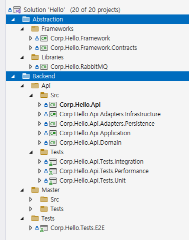

# 솔루션 구조

```shell
{Product}.sln
  │ # Abstraction 범주: Backend와 Frontend을 구성하기 위해 필요한 부수적인 코드
  ├───Abstraction
  │   ├───Frameworks
  │   │   ├───{Corporation}.{Product}.Framework
  │   │   └───{Corporation}.{Product}.Framework.Contracts
  │   └───Libraries
  │       └───{Corporation}.{Product}.RabbitMQ
  │
  │ # Backend 범주
  ├───Backend
  │   ├───{Service}
  │   │   ├───Src
  │   │   │   ├───{Corporation}.{Product}.{Service}                             // 호스트 프로젝트
  │   │   │   ├───{Corporation}.{Product}.{Service}.Adapters.Infrastructure     // Adapter 레이어
  │   │   │   ├───{Corporation}.{Product}.{Service}.Adapters.Persistence        // Adapter 레이어
  │   │   │   ├───{Corporation}.{Product}.{Service}.Application                 // Application 레이어
  │   │   │   └───{Corporation}.{Product}.{Service}.Domain                      // Domain 레이어
  │   │   └───Tests
  │   │       ├───{Corporation}.{Product}.{Service}.Tests.Integration           // Integration 테스트
  │   │       ├───{Corporation}.{Product}.{Service}.Tests.Performance           // Performance 테스트
  │   │       └───{Corporation}.{Product}.{Service}.Tests.Unit                  // Unit Test
  │   ├───{Service}
  │   │   ├───Src
  │   │   └───Tests
  │   └───Tests
  │       └───{Corporation}.{Product}.Tests.E2E                                 // End to End 테스트
  │
  │ # Frontend 범주
  └───Frontend
      └───{UI}
          ├───Src
          │   ├───{Corporation}.{Product}.{UI}                                  // 호스트 프로젝트
          │   ├───{Corporation}.{Product}.{UI}.Adapters.Infrastructure          // Adapter 레이어
          │   ├───{Corporation}.{Product}.{UI}.Adapters.Persistence             // Adapter 레이어
          │   ├───{Corporation}.{Product}.{UI}.Application                      // Application 레이어
          │   └───{Corporation}.{Product}.{UI}.Domain                           // Domain 레이어
          └───Tests
              ├───{Corporation}.{Product}.{UI}.Tests.Integration                // Integration 테스트
              ├───{Corporation}.{Product}.{UI}.Tests.Performance                // Performance 테스트
              └───{Corporation}.{Product}.{UI}.Tests.Unit                       // Unit Test

```
- 범주
  - Abstraction: Backend와 Frontend을 구성하기 위해 필요한 부수적인 코드
  - Backend
  - Frontend
- 레이어
  - 기술
    - Adapter
  - 비즈니스
    - Application: 비즈니스 흐름
    - Domain: 비즈니스 단위
- 이름
  - {Corporation}: 조직
  - {Product}: 제품
  - {Service}: Backend 프로그램
  - {UI}: Frontend 프로그램



- 예제
  - {Corporation}: Corp
  - {Product}: Hello
  - {Service}: Api, Master
  - {UI}: 생략