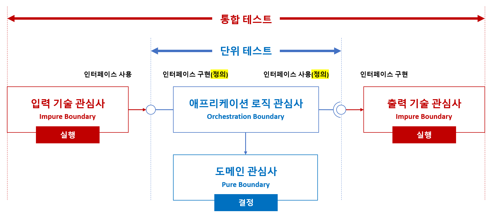

> Make It Work, Make It Right, Make It Fast

[저장소 소개 오디오 .wav 파일 by 노트북LM](./README.wav)

## 목표
> 코드는 팀이 함께 완성해 가는 한 편의 글입니다. 우리는 그 글을 차곡차곡 쌓아 시스템을 만들어 갑니다.
- 소스 코드의 구조는 **책의 목차처럼** 명확하고 직관적이어야 하며, 이를 통해 도메인과 시스템을 자연스럽게 이해할 수 있어야 합니다.
- 테스트 코드는 검증 도구를 넘어, **비즈니스 규칙을 이해하고 학습하는** 데 핵심적인 가이드 역할을 해야 합니다.

 

## 도메인 주도 설계와 함수형 프로그래밍

### 주요 개념
도메인 주도 설계의 '무엇을 표현할지'와 함수형 프로그래밍의 '어떻게 표현할지'가 만나서, 변경에 강하고, 테스트 가능하고, 명확한 의도를 가진 코드를 만듭니다.
- **무엇을 표현할지: 복잡성 분리**
  - 복잡한 비즈니스 로직을 도메인 모델 중심으로 풀어나가는 설계 방법입니다.
  - 도메인 전문가의 언어(Ubiquitous Language)로 시스템을 설계하는 것이 핵심입니다.
- **어떻게 표현할지: 부작용 최소화**
  - 함수(수학적인 함수)에 기반한 프로그래밍 방식입니다.
  - 상태 변경 없이, 입력에 따라 일관된 출력을 보장합니다.

### 공통 목표
- **변경에 강한 모델**
  - 도메인 주도 설계: 복잡성 분리 (관심사의 분리: 도메인과 기술)
  - 함수형 프로그래밍: 부작용 최소화 (합성 함수: 부작용 없는 순수 함수 연결)
- **예측 가능한 동작**
  - 도메인 주도 설계: 명확한 경계 (Bounded Context)
  - 함수형 프로그래밍: 순수 함수 지향
- **풍부한 도메인 표현**
  - 도메인 주도 설계: 명확한 의미 부여 (Ubiquitous Language)
  - 함수형 프로그래밍: 타입 기반 설계

 

## 애플리케이션 아키텍처

### 아키텍처 기술 맵

### Internal 아키텍처 (Hexagonal 아키텍처)

- 도메인
  - **`LanguageExt.Core`: 함수형**
  - `MediatR`: 기술 관심사와 도메인 관심사 간의 느슨한 결합 (Mediator 패턴)
  - `FluentValidation`: 유효성 검사
  - `Ardalis.SmartEnum`: 열거형 도메인 타입
  - `Ulid`: 고유 ID
- 테스트
  - `xUnit`: 테스트
  - **`TngTech.ArchUnitNET`: 아키텍처 테스트**
  - `Reqnroll`: BDD (Behavior-Driven Development) 테스트
  - `Verify`: 스냅샷 테스트
  - `Testcontainers`: 컨테이너 테스트
  - `NBomber`: 부하 테스트
  - `coverlet`: 코드 커버리지
  - `Shouldly`: Fluent 테스트 검증
  - `NSubstitute`: 인터페이스 Mocking
  - `Bogus`: Fake 데이터 생성기
  - `Allure Report`: 테스트 보고서
- 기술
  - **`OpenTelemetry`: 관찰 가능성 (Observability)**
  - `FastEndpoints`: Web API
  - `ZiggyCreatures.FusionCache`: 메모리 캐시
  - `MassTransit`: RabbitMQ
  - `Entity Framework Core`: Command ORM
  - `Dapper`: Query ORM
  - `Polly`: Resilience

### External 아키텍처 (Microservices 아키텍처)
> TODO

 

## 글쓰기 지침
- 001 | 솔루션 | [관심사의 분리 (Separation of Concerns)](./01-guide/solution/solution-separation-of-concerns.md)
- 002 | 솔루션 | [테스트 자동화 (Unit Test, Integration Test)](./01-guide/solution/solution-test-automation.md)
- 003 | 솔루션 | [폴더 구성](./01-guide/solution/solution-structure-principle.md)
- 004 | 솔루션 | [.NET SDK 버전 (global.json)](./01-guide/solution/solution-sdk-version.md)
- 005 | 솔루션 | [NuGet 저장소 소스 (nuget.config)](./01-guide/solution/solution-nuget-config.md)
- 006 | 솔루션 | [NuGet 패키지 버전 중앙 관리 (Directory.Packages.props)](./01-guide/solution/solution-nuget-package-version.md)
- 007 | 솔루션 | 프로젝트 속성 중앙 관리 (Directory.Build.props)
- 008 | 솔루션 | 전역 버전
- 009 | 프로젝트 | [어셈블리 정의 (AssemblyReference.cs)](./01-guide/project/project-assemblyreference.md)
- 010 | 프로젝트 | [클래스 기본 접근 제어자 (internal sealed)](./01-guide/project/project-class-access-modifiers.md)
- 011 | 프로젝트 | [옵션 유효성 검사 (appsettings.json, IOption&lt;T&gt;)](./01-guide/project/project-options-validation.md)
- 012 | 프로젝트 | [소스 생성기](./01-guide/project/project-source-generator.md)
- 013 | 테스트 | [테스트 범주화](./01-guide/test/test-category.md)
- 014 | 테스트 | [테스트 보고서 (Code Coverage Report, Allure Report)](./01-guide/test/test-report.md)
- 015 | 테스트 | [스냅샷 테스트 (Snapshot)](./01-guide/test/test-snapshot.md)
- 016 | 테스트 | [설계 규칙 테스트 (ArchUnitNET)](./01-guide/test/test-design-rule.md)
- 017 | 테스트 | [도메인 규칙 테스트 (BDD: Reqnroll)](./01-guide/test/test-reqnroll.md)
- 018 | 도메인 레이어 | 값 객체 설계 규칙
- 019 | 도메인 레이어 | 엔티티 설계 규칙
- 020 | 애플리케이션 레이어 | [CQRS 메시지](./01-guide/layer/application-cqrs-message.md)
- 021 | 애플리케이션 레이어 | 이벤트 메시지
- 022 | 애플리케이션 레이어 | [파이프라인](./01-guide/layer/application-pipelines.md)
- ...

 

## 글쓰기 Hands-on Labs
"[Getting Started: Domain-Driven Design](https://dometrain.com/course/getting-started-domain-driven-design-ddd/?ref=dometrain-github&promo=getting-started-domain-driven-design)" 강의 예제를 Functional 도메인 주도 설계와 아키텍처로 재구성하는 글입니다.

- **Part 1. Hexagonal 아키텍처 (도메인 레이어)**
  - [ ] Chapter 01. 도메인 탐험
  - [ ] Chapter 02. 도메인 구조화
  - [ ] Chapter 03. 도메인 함수형화
  - [ ] Chapter 04. 도메인 Entity Id 소스 생성기
  - [ ] Chapter 05. 도메인 시나리오 테스트 (BDD: Cucumber)
- **Part 2. Hexagonal 아키텍처 (애플리케이션 레이어)**
  - [ ] Chapter 06. 유스케이스 CQRS & Event
  - [ ] Chapter 07. 유스케이스 미들웨어
  - [ ] Chapter 08. 유스케이스 시나리오 테스트 (BDD: Cucumber)
- **Part 3. Hexagonal 아키텍처 (어댑터 레이어)**
  - [ ] Chapter 09. Web API
  - [ ] Chapter 10. IAdapter 인터페이스 소스 생성기
  - [ ] Chapter 11. 저장소 CQRS (Command: EF Core, Query: Dapper)
  - [ ] Chapter 12. 컨테이너화
  - [ ] Chapter 13. 통합 테스트
  - [ ] Chapter 14. 부하 테스트
- **Part 4. Microservices 아키텍처**
  - [ ] Chapter 15. Aspire
  - [ ] Chapter 16. RabbitMQ
  - [ ] Chapter 17. Resilience
  - [ ] Chapter 18. Reverse Proxy
  - [ ] Chapter 19. Chaos Engineering
- **Part 5. 운영**
  - [ ] Chapter 20. OpenFeature (Feature Flag 관리)
  - [ ] Chapter 21. OpenSearch (Observability 시스템)
  - [ ] Chapter 22. Ansible (Infrastructure as Code)
  - [ ] Chapter 23. Backstage (Building Developer Portals)
