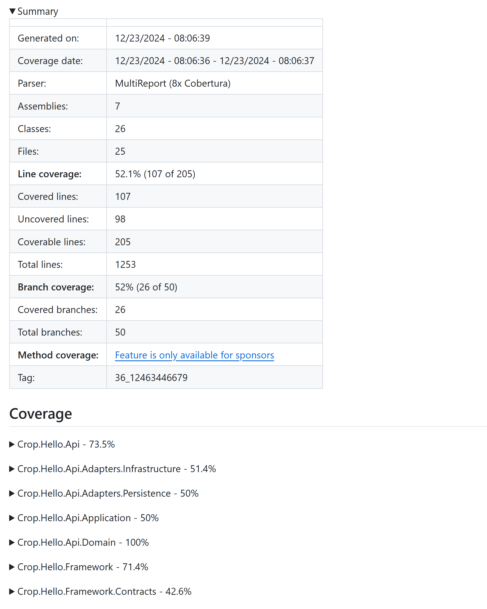
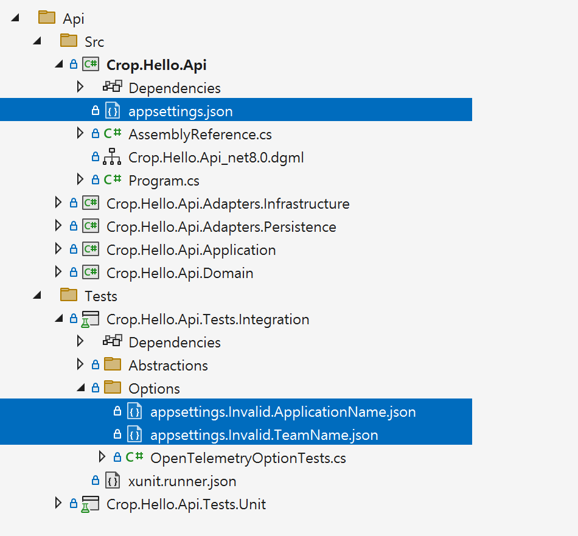
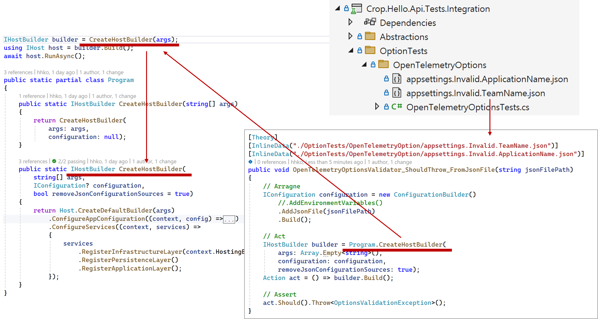

[](https://github.com/hhko/better-code-with-ddd/actions/workflows/build.yml)

> 슬기로운 코드를 만들기 위한 아름다운 여정

# Table of Contents
- Part 0. Seminar
  - [x] [Ch 01. Overview of Internal Architecture](./Part0.Seminar/Ch01.Overview-InternalArchitecture/README.md)
- Part 1. Overview
  - [x] [Ch 01. Technology Map](#ch-1-technology-map)
  - [x] [Ch 02. Internal Architecture](#ch-2-internal-architecture)
  - [ ] [Ch 03. External Architecture](#ch-3-external-architecture)
- Part 2. Architecture
  - [x] [Ch 03. Architecture Overview](#ch-3-architecture-overview)
  - [x] [Ch 04. Architecture Principles](#ch-4-architecture-principles)
  - [x] [Ch 05. Layer Isolation](#ch-5-layer-isolation)
  - [x] [Ch 06. Layer Testing](#ch-6-layer-testing)
  - [x] [Ch 07. Layer Enhancement](#ch-7-layer-enhancement)
  - [x] [Ch 08. Service Integration](#ch-8-service-integration)
  - [x] [Ch 09. Internal Architecture Comparison](#ch-9-internal-architecture-comparison)
- Part 3. Solution
  - [x] [Ch 10. Solution Structure](#ch-10-solution-structure)
  - [x] [Ch 11. Solution Build Configuration](#ch-11-solution-build-configuration)
  - [ ] [Ch 12. Solution Code Analysis](#ch-12-solution-code-analysis)
  - [x] [Ch 13. Solution Architecture Testing](#ch-13-solution-architecture-testing)
  - [x] [Ch 14. Solution Layer Dependency Injection](#ch-14-solution-layer-dependency-injection)
  - [ ] [Ch 15. Solution Build Automation](#ch-15-solution-build-automation)
  - [ ] Ch 16. Solution Container Deployment Automation
- Part 4. Observability
  - [ ] Ch 17. Aspire Dashboard
  - [ ] cH 18. Grafana System
  - [ ] Ch 19. OpenSearch System
  - [ ] Ch 20. Logs
  - [ ] Ch 21. Traces
  - [ ] Ch 22. Metrics
- Part 5. Host
  - [ ] [Ch 23. Console Host](#ch-23-console-host)
  - [ ] Ch 24. WebApi Host
  - [x] [Ch 25. Option](#ch-25-option)
  - [ ] Ch 26. Container Health Check
- Part 6. Hosts
  - [ ] [Ch 27. Schedule Host](#ch-23-schedule-host)
  - [ ] Ch 28. RabbitMQ Host
  - [ ] Ch 29. gRPC Host
  - [ ] Ch 30. WebApi Host
- Part 7. Internal Tactical Design
  - [x] [Ch 31. Tactical Design Map](#ch-27-tactical-design-map)
  - [ ] [Ch 32. Output Type(Result)](#ch-28-output-type)
  - [ ] Ch 33. Domain Type
  - [ ] TODO
- Part 8. External Tactical Design
- Part 9. Strategic Design

<br/>

# Part 1. Overview

# Ch 1. Technology Map


# Ch 2. Internal Architecture
> - 내부 아키텍처 목표는 레이어 배치입니다.
> - **Application 레이어가** 내부 아키텍처의 레이어를 주관(主管)합니다.


- Application 레이어
  - `MediatR`
    - `MediatR.Contracts`
- Adapter 레이어
  - `Serilog`
    - `Serilog.Extensions.Hosting`
    - `Serilog.Settings.Configuration`
    - `Serilog.Sinks.Console`
    - `Serilog.Sinks.File`
    - `Destructurama.Attributed`
    - `Serilog.Exceptions`
  - `Microsoft.Extensions.Hosting.WindowsServices`
  - `Quartz`
    - `Quartz.Extensions.Hosting`
  - `FluentValidation`
    - `FluentValidation.DependencyInjectionExtensions`
- Unit Test
  - `xunit`
  - `FluentAssertions`
  - `TngTech.ArchUnitNET.xUnit`
- GitHub Actions
  - `actions/checkout`
  - `actions/setup-dotnet`
  - `danielpalme/ReportGenerator-GitHub-Action`
  - `dorny/test-reporter`

# Ch 3. External Architecture
> - 외부 아키텍처 목표는 서비스 배치입니다.

- TODO

<br/>

---

<br/>

# Part 2. Architecture

# Ch 3. Architecture Overview

## Ch 3.1 아키텍처 정의


※ 출처: [Making Architecture Matter, 소프트웨어 아키텍처의 중요성](https://www.youtube.com/watch?v=4E1BHTvhB7Y)

## Ch 3.2 아키텍처 범주


※ 출처: [Making old applications new again](https://sellingsimplifiedinsights.com/asset/app-development/ASSET_co-modernization-whitepaper-inc0460201-122016kata-v1-en_1511772094768.pdf)

```
Application Architecture
  ├─ Monolithic Architecture
  ├─ Modular Monolithic Architecture
  ├─ N-tier Architecture
  └─ Microservices Architecture
      ├─ Internal Architecture
      │    └─ Layered Architecture
      │         ├─ Hexagonal Architecture
      │         ├─ Onion Architecture
      │         ├─ Clean Architecture
      │         ├─ Vertical Slice Architecture
      │         └─ ...
      │
      └─ External Architecture
           └─ 외부 시스템 구성 아키텍처: 예. CNCF Landscape
```
- `Microservices` Architecture = `Internal` Architecture + `External` Architecture
  

  ※ 출처: [DDD 및 CQRS 패턴을 사용하여 마이크로 서비스에서 비즈니스 복잡성 처리](https://learn.microsoft.com/en-us/dotnet/architecture/microservices/microservice-ddd-cqrs-patterns/)

## Ch 3.3 아키텍처 역사


  ※ 출처: [The Grand Unified Theory of Clean Architecture and  Pyramid ](https://www.youtube.com/watch?v=mzznsq4jCHY)

<br/>

# Ch 4. Architecture Principles
> 아키텍처 원칙: [Separation of concerns](https://learn.microsoft.com/ko-kr/dotnet/architecture/modern-web-apps-azure/architectural-principles#separation-of-concerns)


## Ch 4.1 관심사의 분리
- 개발 시 요구사항과 운영 시 로그는 서로 다른 시점이지만, **코드에 대한 관점은 Biz.와 Tech. 관심사 기준으로 같아야 합니다.**
  - **개발 시** 요구사항을 비즈니스와 기술 관심사로 분해합니다.
  - **운영 시** 로그를 비즈니스와 기술 관심사로 식별합니다.


## Ch 4.2 레이어
- 개발 시 요구사항과 운영 시 로그는 서로 다른 시점이지만, **코드에 대한 관점은 레이어 기준으로 동일해야 합니다.**


- **비즈니스 관심사**
  - Application: 비즈니스 흐름(Biz. Flow)
  - Domain: 비즈니스 단위(Biz. Unit)
- **기술 관심사**
  - Adapter
    - `Known` 입력 Adapter
    - ~~`Unknown` 입력 Adapter~~
    - `Known` 출력 Adapter
    - `Unknown` 출력 Adapter: 부수 효과(Side Effects)

## Ch 4.3 레이어 배치


<br/>

# Ch 5. Layer Isolation

## Ch 5.1 격리 전

- 출력의 변화 영향이 입력까지 전파됩니다.

## Ch 5.2 격리 후

- 입출력 인터페이스를 활용하여, 입출력 변화의 영향이 Operation 레이어에 전파되지 않도록 차단합니다(Strategy 패턴).

<br/>

# Ch 6. Layer Testing


- 단위 테스트: Biz. 관심사를 테스트합니다.
- 통합 테스트: Tech. 관심사까지 포함하여 Biz. 관심사를 테스트합니다.

<br/>

# Ch 7. Layer Enhancement

## Ch 7.1 격리 고도화


- Mediator 패턴을 활용하여, 격리된 레이어 간의 소통을 위해 인터페이스의 입출력을 메시지 기반으로 단순화합니다.
  - 메시지는 컴파일 타임과 런타임 모두에서 호출자와 수신자 정보를 숨길 수 있습니다(느슨한 결합).
    | 구분             | Mediator  패턴  | Strategy  패턴 |
    | ---              | ---            | ---            |
    | **Compile-time** | Unknown        | Unknown        |
    | **Runtime**      | Unknown        | Known          |
  - 메시지는 런타임에 메시지에 부가 기능을 더 쉽게 추가할 수 있습니다(Decorator 패턴)
  - 메시지는 입출력을 범주화할 수 있습니다(Command 메시지와 Query 메시지: CQRS 패턴).

## Ch 7.2 메시지 고도화

- Mediator 패턴은 Decorator 패턴과 조합하여 동적으로 메시지에 새 기능을 추가할 수 있습니다.
  - 예. 메시지 처리 시간 로그
  - 예. 입력 메시지 유효성 검사
  - 예. Command 메시지일 때 트랜잭션 처리(CQRS 패턴)


## Ch 7.3 메시지 범주화(CQRS)


- Mediator 패턴을 통해 데이터 쓰기를 위한 메시지(Command)와 데이터를 읽기 위한 메시지(Query)로 구분할 수 있습니다.
  - Command 메시지: 데이터 가변(`CUD`:`Create, Update, Delete`)
  - Query 메시지: 데이터 불변(`R`: `Read`)
- `Command`: ORM(OLTP, Create, Update, Delete)
  - Command는 데이터의 상태를 변경하는 작업을 담당합니다.
  - 이 작업은 일반적으로 여러 테이블을 참조하거나 복잡한 트랜잭션을 포함할 수 있습니다.
  - 따라서 Command는 데이터베이스에 변경을 가하는데, 복잡한 로직을 처리하거나 여러 엔티티와 상호작용할 수 있습니다.
- `Query`: SQL(OLAP, Read)
  - Query는 데이터베이스에서 데이터를 읽어오는 작업에 해당합니다.
  - 일반적으로 Command보다 쿼리의 수가 많을 수 있으며, 데이터 조회만을 목적으로 하므로 복잡도가 낮고 최적화된 방식으로 실행됩니다.
  - Query는 데이터의 상태를 변경하지 않고, 데이터를 읽어오는 데 집중합니다.

## Ch 7.4 메시지 범주화(CQRS) 흐름

※ 출처: [Module Requests Processing via CQRS](https://github.com/kgrzybek/modular-monolith-with-ddd?tab=readme-ov-file#34-module-requests-processing-via-cqrs)  

| 구분       | Command  | Query      |
| ---        | ---      | ---        |
| 트랜잭션    | O(필요)  | X(불 필요)  |
| 구현       | ORM      | SQL        |
| DTO 변환   | O(필요)  | X(불 필요)  |
| SQL 복잡도 | ↓(낮다)  | ↑(높다)     |

- 데이터 읽기 위한 메시지 처리에서는 SQL 구문을 사용하여 DTO 데이터 변환 없이 데이터베이스 조회 결과를 바로 반환합니다.

<br/>

# Ch 8. Service Integration


- 서비스 통합은 Biz. 관심사와 분리하여 Tech. 관심사(Adapter 레이어) 중심으로 구성할 수 있게 됩니다(Microservice 아키텍처 패턴).

<br/>

# Ch 9. Internal Architecture Comparison
## Ch 9.1 Port 비교


| 구분                | 아키텍처        | 헥사고날 아키텍처 |
| ---                 | ---           | ---               |
| Known 입출력 Port   | Mediator 패턴  | Strategy 패턴      |
| Unknown 입출력 Port | Strategy 패턴  | Strategy 패턴      |

- 헥사고날 아키텍처에서는 Known과 Unknown 외부 입출력을 명시적으로 구분하지 않지만, 우리는 이를 구분하여 Port를 정의합니다.
  - Known 입출력은 Mediator 패턴을 활용하여 메시지 기반으로 처리합니다.
  - Unknown 입출력은 Strategy 패턴을 사용하여 인터페이스를 통해 처리합니다.

## Ch 9.2 Message 비교


- 데이터 쓰기를 위한 메시지(Command)와 데이터를 읽기 위한 메시지(Query)로 구분합니다.
- 모든 메시지를 대상으로 부가 기능을 Decorator로 추가합니다.

## Ch 9.3 Adapter 비교


- Known과 Unknown 외부 입출력을 명시적으로 구분하여 Adapter 위치를 배치합니다.
  - Known 입출력은 Mediator 패턴을 활용하여 메시지 발신과 수신을 구현합니다.
  - Unknown 입출력은 Strategy 패턴을 사용하여 인터페이스을 구현합니다.

## Ch 9.4 Application 비교


- Application은 동일하게 모두 DDD 전술 설계 패턴에서 제시하는 Application Service 중심으로 구현됩니다.

## Ch 9.5 Domain 비교


- Domain은 동일하게 모두 DDD 전술 설계 패턴에서 제시하는 Entity와 Value Object 그리고 Domain Service을 중심으로 구현됩니다.

<br/>

---

<br/>

# Part 3. Solution

# Ch 10. Solution Structure
> 예제 코드: [링크](./Ch10.SolutionStructure/)

```shell
.\new-sln.ps1 -t1 Crop -t2 Hello -t3s Master, Api
```
- new-sln.ps1 파일: [링크](./Templates/new-sln.ps1)

## Ch 10.1 솔루션 구조 템플릿
```shell
{T2}.sln
  │ # Asset 범주: 공유 자산
  ├─Assets
  │   ├─Frameworks
  │   │   ├─Src
  │   │   │   ├─{T1}.{T2}.Framework
  │   │   │   └─{T1}.{T2}.Framework.Contracts
  │   │   └─Tests
  │   │       └─{T1}.{T2}.Framework.Tests.Unit
  │   ├─Libraries
  │   │   └─{T1}.{T2}.[Tech]                                    // 예. RabbitMQ, ...
  │   └─Domains
  │       ├─Src
  │       │   └─{T1}.{T2}.Domain
  │       └─Tests
  │           └─{T1}.{T2}.Domain.Tests.Unit                      // 공유 도메인
  │
  │ # Backend 범주
  ├─Backend
  │   ├─{T3}
  │   │   ├─Src
  │   │   │   ├─{T1}.{T2}.{T3}                                  // Host
  │   │   │   ├─{T1}.{T2}.{T3}.Adapters.Infrastructure          // Adapter 레이어
  │   │   │   ├─{T1}.{T2}.{T3}.Adapters.Persistence             // Adapter 레이어
  │   │   │   ├─{T1}.{T2}.{T3}.Application                      // Application 레이어
  │   │   │   └─{T1}.{T2}.{T3}.Domain                           // Domain 레이어
  │   │   └─Tests
  │   │       ├─{T1}.{T2}.{T3}.Tests.Integration                // Integration 테스트
  │   │       ├─{T1}.{T2}.{T3}.Tests.Performance                // Performance 테스트
  │   │       └─{T1}.{T2}.{T3}.Tests.Unit                       // Unit Test
  │   ├─{T3}
  │   │   ├─Src
  │   │   └─Tests
  │   └─Tests
  │       └─{T1}.{T2}.Tests.E2E                                 // End to End 테스트
  │
  │ # Frontend 범주
  └─Frontend
      └─{T3}
          ├─Src
          │   ├─{T1}.{T2}.{T3}                                  // Host
          │   ├─{T1}.{T2}.{T3}.Adapters.Infrastructure          // Adapter 레이어
          │   ├─{T1}.{T2}.{T3}.Adapters.Persistence             // Adapter 레이어
          │   ├─{T1}.{T2}.{T3}.Application                      // Application 레이어
          │   └─{T1}.{T2}.{T3}.Domain                           // Domain 레이어
          └─Tests
              ├─{T1}.{T2}.{T3}.Tests.Integration                // Integration 테스트
              ├─{T1}.{T2}.{T3}.Tests.Performance                // Performance 테스트
              └─{T1}.{T2}.{T3}.Tests.Unit                       // Unit Test
```

## Ch 10.2 솔루션 구조 형식

| Level  | Src             | Tests            |
|------- |-------------    |--------------    |
| `{T1}` | Corporation     | Corporation      |
| `{T2}` | Solution        | Solution          |
| `T3`   | Service 또는 UI  | Service 또는 UI  |
| `T4`   | **Layers**      | **Tests**        |
| `T5`   | **Sub-Layers**  | **Test Pyramid** |

- Layers
  - Domain: 비즈니스 단위(Biz. Unit)
  - Application: 비즈니스 흐름(Biz. Flow)
  - Adapters: 기술 관심사
    - Infrastructure
    - Persistence
    - Presentation
- Test Pyramid
  - Unit
  - Integration
  - Performance
  - E2E(End to End)

## Ch 10.3 솔루션 구조 예제


- Src 예: `Corporation`.`Solution`.`Service`.`Adapters`.`Infrastructure`
    - T1: Corporation
    - T2: Solution
    - T3: Service
    - T4: Adapters
    - T5: Infrastructure
- Src 예: `Corporation`.`Solution`.`Service`.`Domain`
  - T5 생략일 때
- Src 예:`Service`.`Adapters`.`Infrastructure`
  - T1, T2 생략일 때
- Tests 예: `Corporation`.`Solution`.`Service`.`Tests`.`Unit`
  - T1: Corporation
  - T2: Solution
  - T3: Service
  - T4: Tests
  - T5: Unit
- Tests 예: `Service`.`Tests`.`Unit`
  - T1, T2 생략일 때

<br/>

# Ch 11. Solution Build Configuration

## Ch 11.1 .NET SDK 빌드 버전
- `global-json` 파일은 .NET 프로젝트에서 특정 .NET SDK 버전을 지정하여 일관된 개발 환경을 유지하기 위해 사용됩니다.
  - 예제 코드: [global-json](./Ch11.SolutionBuildSettings/global.json)

```shell
# Host에 설치된 .NET SDK 목록
dotnet --list-sdks

# 템플릿 확인
dotnet new list | findstr nuget
  템플릿 이름          약식 이름                       언어     태그
  ------------------- -----------------------------  -------  -----------
  global.json 파일     globaljson,global.json                  Config

# globaljson 파일 생성
#  - 8.0.100 이상 8.0.xxx 버전(예: 8.0.303 또는 8.0.402)을 허용합니다.
dotnet new globaljson --sdk-version 8.0.100 --roll-forward latestFeature --force
#  - 8.0.100 이상 8.0.1xx 버전(예: 8.0.103 또는 8.0.199)을 허용합니다.
dotnet new globaljson --sdk-version 8.0.100 --roll-forward latestPatch --force
#  - 8.0.100 지정된 버전만을 사용합니다.
dotnet new globaljson --sdk-version 8.0.100 --roll-forward disable --force

# .NET SDK 빌드 버전 확인
dotnet --version
```

- .NET SDK 버전 형식: "[global.json](https://learn.microsoft.com/ko-kr/dotnet/core/tools/global-json)"에 지정된 버전에서부터 상위 버전(rollForward) 범위를 지정합니다.
  ```
  x.y.znn
  ```
  - `x`: major
  - `y`: minor
  - `z`: feature, 0 ~ 9
  - `n`: patch, 0 ~ 99

- `latestFeature` 예
  ```json
  {
    "sdk": {
      "version": "8.0.302",
      "rollForward": "latestFeature"
    }
  }
  ```
  - 8.0.302 이전의 모든 .NET SDK 버전을 허용하지 않으며 8.0.302 이상 8.0.xxx 버전(예: 8.0.303 또는 8.0.402)을 허용합니다.

- `latestPatch` 예
  ```json
  {
    "sdk": {
      "version": "8.0.102",
      "rollForward": "latestPatch"
    }
  }
  ```
  - 8.0.102 이전의 모든 .NET SDK 버전을 허용하지 않으며 8.0.102 이상 8.0.1xx 버전(예: 8.0.103 또는 8.0.199)을 허용합니다.
- `disable` 예
  ```json
  {
    "sdk": {
      "version": "8.0.102",
      "rollForward": "disable"
    }
  }
  ```
  - 8.0.102 지정된 .NET SDK 버전만을 허용하빈다.

## Ch 11.2 패키지 소스
- `nuget.config` 파일은 솔루션 수준에서 패키지 소스을 관리합니다.
  - 예제 코드: [nuget.config](./Ch11.SolutionBuildSettings/nuget.config)

```shell
# 템플릿 확인
dotnet new list | findstr nuget
  템플릿 이름        약식 이름                      언어     태그
  ---------------- -----------------------------  -------  ---------
  NuGet 구성        nugetconfig,nuget.config               Config

# 템플릿 파일 생성
dotnet new nuget.config
```

```xml
<?xml version="1.0" encoding="utf-8"?>
<configuration>
  <packageSources>
    <!--To inherit the global NuGet package sources remove the <clear/> line below -->
    <clear />
    <add key="nuget" value="https://api.nuget.org/v3/index.json" />
  </packageSources>
</configuration>
```
- 전역 설정에 지정된 기존 NuGet 패키지 소스 목록을 모두 제거 후에 새 패키지 저장소 `https://api.nuget.org/v3/index.json`을 지정합니다.

## Ch 11.3 중앙 패키지 버전 관리
- `Directory.Package.props` 파일을 통해 각 프로젝트의 패키지 버전을 일일이 수정하지 않고, 한 곳에서 공통 패키지 버전을 정의할 수 있습니다.
  - 예제 코드: [Directory.Packages.props](./Ch11.SolutionBuildSettings/Directory.Packages.props)

```shell
# 도구 설치
dotnet tool install -g upgrade-assistant

# 도구 확인
dotnet tool list -g
  패키지 ID             버전            명령
  ------------------------------------------------------
  upgrade-assistant     0.5.820        upgrade-assistant

# 중앙 패키지 파일 생성
upgrade-assistant upgrade
```


- 프로젝트 파일 변경 전/후
  
  - 프로젝트 파일에서 `PackageReference`의 `Version`을 제거 시킵니다.
- Directory.Package.props 변경 전/후
  
  - 프로젝트 파일에서 제거된 `PackageReference`의 `Version` 값을 `PackageVersion`으로 추가하여 버전을 중앙에서 관리합니다.

## Ch 11.4 중앙 빌드 속성 관리
- `Directory.Build.props` 파일을 사용하면 각 프로젝트 파일에 일일이 동일한 속성을 추가할 필요 없이, 한 곳에서 공통 속성을 정의하고 관리할 수 있습니다.
  - 예제 코드: 솔루션 빌드 속성 [Directory.Build.props](./Ch11.SolutionBuildSettings/Directory.Build.props)
  - 예제 코드: 테스트 빌드 속성 [Directory.Build.props](./Ch11.SolutionBuildSettings/Backend/Tests/Directory.Build.props)

```shell
# 전체 공통 빌드 속성
#   - 전체 프로젝트 대상 Directory.Build.props 파일 생성
.\new-buildprops.ps1

# 테스트 공통 빌드 속성
#   - .\Backend\Api\Tests\ 프로젝트 대상으로
#   - 상위 `Directory.Build.props`을 Import한 Directory.Build.props 파일 생성
.\new-buildprops.ps1 -t .\Backend\Api\Tests\ -i

# 테스트 공통 빌드 속성
#   - .\Backend\Master\Tests\ 프로젝트 대상으로
#   - 상위 `Directory.Build.props`을 Import한 Directory.Build.props 파일 생성
.\new-buildprops.ps1 -t .\Backend\Master\Tests\ -i
```
- new-buildprops.ps1 파일: [링크](./Templates/new-buildprops.ps1)

```shell
{T2}.sln
Directory.Build.props                                // 전역 프로젝트 공통 빌드 속성
  │
  ├─Backend
  │   ├─{T3}
  │   │   ├─Src
  │   │   │   ├─{T1}.{T2}.{T3}
  │   │   │   └─...
  │   │   └─Tests
  │   │       ├─Directory.Build.props                // 테스트 프로젝트 공통 빌드 속성
  │   │       ├─{T1}.{T2}.{T3}.Tests.Integration
  │   │       ├─{T1}.{T2}.{T3}.Tests.Performance
  │   │       └─{T1}.{T2}.{T3}.Tests.Unit
```
- 전역 프로젝트 공통 빌드 속성: 솔루션 파일(.sln)과 같은 경로에 있는 `Directory.Build.props` 파일은 전체 공통 빌드 속성을 정의합니다.
  ```xml
  <Project>

    <PropertyGroup>
      <!-- 빌드 -->
      <TargetFramework>net8.0</TargetFramework>
      <ImplicitUsings>enable</ImplicitUsings>
      <Nullable>enable</Nullable>
      <!--
      <NoWarn>NU1701;NU1803;NU1902</NoWarn>
      -->

      <!-- 버전 -->
      <AppVersion>1.0.100</AppVersion>
      <FileVersion>$(AppVersion)</FileVersion>
      <AssemblyVersion>$(AppVersion)</AssemblyVersion>
      <Version>$(AppVersion)</Version>

      <!-- 메타 -->
      <Company>조직</Company>
      <ProductName>제품</ProductName>
      <Copyright>Copyright © 2024</Copyright>
    </PropertyGroup>

  </Project>
  ```
- 테스트 프로젝트 공통 빌드 속성: Tests 폴더에 있는 `Directory.Build.props` 파일은 Test 프로젝트 공통 빌드 속성을 정의합니다.
  ```xml
  <Project>
    <!--
      현재 파일의 위치에서 상위로 디렉터리를 거슬러 올라가면서 Directory.Build.props 파일을 찾고,
      해당 파일이 발견되면 프로젝트에 포함시키는 역할을 합니다.
    -->
    <Import Project="$([MSBuild]::GetPathOfFileAbove('Directory.Build.props', '$(MSBuildThisFileDirectory)../'))" />

    <!-- 테스트 프로젝트 공통 속성 -->
    <PropertyGroup>
      <IsPackable>false</IsPackable>
      <IsTestProject>true</IsTestProject>
    </PropertyGroup>

    <!-- 솔루션 탐색기에서 TestResults 폴더 제외 -->
    <!--
    <ItemGroup>
      <None Remove="TestResults\**" />
    </ItemGroup>
    -->

    <!-- xunit.runner.json 설정 -->
    <ItemGroup>
      <Content Include="xunit.runner.json" CopyToOutputDirectory="PreserveNewest" />
    </ItemGroup>

    <!-- 전역 using 구문 -->
    <ItemGroup>
      <Using Include="Xunit" />
      <Using Include="FluentAssertions" />
    </ItemGroup>

  </Project>
  ```
- 테스트 Runner 설정: xunit.runner.json
  ```json
  {
    "$schema": "https://xunit.net/schema/current/xunit.runner.schema.json",
    "methodDisplay": "method",
    "diagnosticMessages": true
  }
  ```
- `Directory.Build.props` 적용 후
  - EXE 프로젝트 .csproj 파일
    ```xml
    <Project Sdk="Microsoft.NET.Sdk">
      <PropertyGroup>
        <OutputType>Exe</OutputType>
        <!--
        // 솔루션 폴더에 있는 Directory.Build.props 빌드 속성을 사용합니다.

        <TargetFramework>net8.0</TargetFramework>
        <ImplicitUsings>enable</ImplicitUsings>
        <Nullable>enable</Nullable>
        -->
      </PropertyGroup>
    </Project>
    ```
  - ClassLibrary 프로젝트 .csproj 파일
    ```xml
    <Project Sdk="Microsoft.NET.Sdk">
      <PropertyGroup>
        <!--
        // 솔루션 폴더에 있는 Directory.Build.props 빌드 속성을 사용합니다.

        <TargetFramework>net8.0</TargetFramework>
        <ImplicitUsings>enable</ImplicitUsings>
        <Nullable>enable</Nullable>
        -->
      </PropertyGroup>
    </Project>
    ```
  - Test 프로젝트 .csproj 파일
    ```xml
    <Project Sdk="Microsoft.NET.Sdk">
      <PropertyGroup>
        <!--
        // 솔루션 폴더에 있는 Directory.Build.props 빌드 속성을 사용합니다.

        <TargetFramework>net8.0</TargetFramework>
        <ImplicitUsings>enable</ImplicitUsings>
        <Nullable>enable</Nullable>

        // Tests 폴더에 있는 Directory.Build.props 빌드 속성을 사용합니다.
        <IsPackable>false</IsPackable>
        <IsTestProject>true</IsTestProject>
        -->
      </PropertyGroup>
    </Project>
    ```

## Ch 11.5 단일 파일 빌드
```shell
# 윈도우
<PublishSingleFile>true</PublishSingleFile>
<SelfContained>true</SelfContained>
<PublishReadyToRun>true</PublishReadyToRun>
<IncludeNativeLibrariesForSelfExtract>true</IncludeNativeLibrariesForSelfExtract>

# 리눅스
```
- TODO

<br/>

# Ch 12. Solution Code Analysis

```init
#
# 코드 스타일
#

# 네임스페이스 파일 스코프
dotnet_diagnostic.IDE0161.severity = warning
csharp_style_namespace_declarations = file_scoped:warning

# 기본 생성자
dotnet_diagnostic.IDE0290.severity = warning

[*.generated.cs]
generated_code = true
```

```xml
<EnforceCodeStyleInBuild>true</EnforceCodeStyleInBuild>
```

## Ch 12.1 코드 스타일 분석
```xml
<EnforceCodeStyleInBuild>true</EnforceCodeStyleInBuild>
<TreatWarningsAsErrors>true</TreatWarningsAsErrors>
```

- `IDExxxx`
- `EnforceCodeStyleInBuild`: 코드 스타일 분석 활성화
  - [코드 스타일 규칙](https://learn.microsoft.com/en-us/dotnet/fundamentals/code-analysis/style-rules/)은 .NET 프로젝트 빌드 시 기본적으로 비활성화되어 있으므로, 이를 사용하려면 명시적으로 활성화해야 합니다.
- `TreatWarningsAsErrors`: 경고를 에러화

```shell
# 템플릿 확인
dotnet new list | findstr editor
  템플릿 이름          약식 이름                       언어     태그
  ------------------- -----------------------------  -------  ---------
  EditorConfig 파일    editorconfig,.editorconfig              Config

# 템플릿 파일 생성
dotnet new editorconfig
```

```ini
[*.{cs,vb}]

# 코드 스타일: 네임스페이스
#
# - IDE0160: Use block-scoped namespace
# - IDE0161: Use file-scoped namespace
dotnet_diagnostic.IDE0161.severity = warning

# csharp_style_namespace_declarations = block_scoped
# csharp_style_namespace_declarations = file_scoped
csharp_style_namespace_declarations = file_scoped:warning

# 코드 분석: 기본 생성자
dotnet_diagnostic.IDE0290.severity = warning
```
- `.editorConfig` 파일을 이용하여 코드 스타일을 정의할 수 있습니다. `.editorConfig`은 Visual Studio 옵션 대화 상자에 지정된 코드 스타일보다 우선합니다.
- 네임스페이스 규칙: [file_scoped](https://learn.microsoft.com/en-us/dotnet/fundamentals/code-analysis/style-rules/ide0160-ide0161)

```cs
// -{EnforceCodeStyleInBuild}-> 경고 -{TreatWarningsAsErrors}-> 에러
namespace Crop.Hello.Api.Adapters.Infrastructure   // block-scoped
{
    public class Class1
    {

    }
}
```
```
error IDE0161:
 파일 범위 namespace 스로 변환 (https://learn.microsoft.com/dotnet/fundamentals/code-analysis/style-rules/ide0161)
```

## Ch 12.2 코드 품질 분석
```xml
<EnableNETAnalyzers>true</EnableNETAnalyzers>
<AnalysisLevel>latest</AnalysisLevel>
<AnalysisMode>All</AnalysisMode>
<CodeAnalysisTreatWarningsAsErrors>true</CodeAnalysisTreatWarningsAsErrors>
<WarningsNotAsErrors>$(WarningsNotAsErrors);CS8073;CS8882;CS8887;CS8848</WarningsNotAsErrors>
```
- `CAxxxx`: AnalysisMode가 .editorconfig보다 우선 순위가 높습니다.
- `EnableNETAnalyzers`: 코드 품질 분석 활성화
- `AnalysisLevel`: 코드 품질 분석 버전
- `AnalysisMode`: 코드 품질 분석 범위
- `CodeAnalysisTreatWarningsAsErrors`: AnalysisMode에서 검출된 코드 품질 분석 경고를 에러화(.editorconfig에서 검출된 경고를 에러화하지는 않는다)
- `WarningsNotAsErrors` 경고 무시

## Ch 12.3 코드 품질 지표
- TODO

<br/>

# Ch 13. Solution Architecture Testing


- Abstractions
  - 테스트를 위해 부가적으로 필요한 코드를 배치 시킵니다.
- ArchitectureTests
  - 아키텍처 테스트 코드를 배치합니다.

## Ch 13.1 레이어 어셈블리

```cs
using System.Reflection;

namespace Crop.Hello.Api;

public static class AssemblyReference
{
    public static readonly Assembly Assembly = typeof(AssemblyReference).Assembly;
}
```

- 모든 레이어 어셈블리(프로젝트)에 공통적으로 `AssemblyReference`을 구현합니다.
  

## Ch 13.2 레이어 의존성 테스트
- [ArchUnitNET](https://github.com/TNG/ArchUnitNET) 패키지

```cs
using ArchUnitNET.Domain;
using ArchUnitNET.Fluent;
using ArchUnitNET.Loader;

// ArchitectureTests/ArchitectureBaseTest.cs
public abstract class ArchitectureBaseTest
{
  // 레이어 어셈블리 집합
  protected static readonly Architecture Architecture = new ArchLoader()
    .LoadAssemblies(
      Adapters.Infrastructure.AssemblyReference.Assembly,
      Adapters.Persistence.AssemblyReference.Assembly,
      Application.AssemblyReference.Assembly,
      Domain.AssemblyReference.Assembly)
    .Build();

  // Adapter Infrastructure 레이어
  protected static readonly IObjectProvider<IType> AdapterInfrastructureLayer = ArchRuleDefinition
    .Types()
    .That()
    .ResideInAssembly(Adapters.Infrastructure.AssemblyReference.Assembly)
    .As("Adapters.Infrastructure");

  // Adapter Persistence 레이어
  protected static readonly IObjectProvider<IType> AdapterPersistenceLayer = ArchRuleDefinition
    .Types()
    .That()
    .ResideInAssembly(Adapters.Persistence.AssemblyReference.Assembly)
    .As("Adapters.Persistence");

  // Application 레이어
  protected static readonly IObjectProvider<IType> ApplicationLayer = ArchRuleDefinition
    .Types()
    .That()
    .ResideInAssembly(Application.AssemblyReference.Assembly)
    .As("Application");

  // Domain 레이어
  protected static readonly IObjectProvider<IType> DomainLayer = ArchRuleDefinition
    .Types()
    .That()
    .ResideInAssembly(Domain.AssemblyReference.Assembly)
    .As("Domain");
}
```
- ArchLoader을 통해 검증을 수행할 전체 어셈블리를 구성합니다.
- ArchRuleDefinition으로 개별 어셈블리을 정의합니다.

```cs
// Abstractions/Constants/Constants.UnitTest.cs
internal static partial class Constants
{
  public static class UnitTest
  {
    public const string Architecture = nameof(Architecture);

    public const string Infrastructure = nameof(Infrastructure);
    public const string Persistence = nameof(Persistence);
    public const string Presentation = nameof(Presentation);
    public const string Application = nameof(Application);
    public const string Domain = nameof(Domain);
  }
}

// ArchitectureTests/LayerDependencyTests.cs
[Trait(nameof(UnitTest), UnitTest.Architecture)]
public class LayerDependencyTests : ArchitectureBaseTest
{
  [Fact]
  public void DomainLayer_ShouldNotHave_Dependencies_OnAnyOtherLayer()
  {
    IObjectProvider<IType>[] layers = [
      AdapterInfrastructureLayer,
      AdapterPersistenceLayer,
      ApplicationLayer
    ];

    foreach (var layer in layers)
    {
      ArchRuleDefinition
        .Types()
        .That()
        .Are(DomainLayer)
        .Should()
        .NotDependOnAny(layer)
        .Check(Architecture);
    }
  }
```

- 레이어 의존성 테스트
  - DomainLayer_ShouldNotHave_Dependencies_OnAnyOtherLayer
  - ApplicationLayer_ShouldNotHave_Dependencies_OnAdapterLayer
  - AdapterLayer_ShouldNotHave_Dependencies_OnDomainLayer

## Ch 13.3 CQRS 네이밍 컨벤션 테스트

```cs
[Fact]
public void CommandMessages_ShouldEndWith_Command()
{
  var suts = ArchRuleDefinition
    .Classes()
    .That()
    .ImplementInterface(typeof(ICommand));

  if (!suts.GetObjects(Architecture).Any())
    return;

  // public sealed recoard XyzCommand : ICommand { }
  suts.Should().BePublic()
    .AndShould().BeSealed()
    .AndShould().BeRecord()
    .AndShould().HaveNameEndingWith(NamingConvention.Command)
    .Check(Architecture);
}
```

- CQRS 테스트
  - CommandMessages_ShouldEndWith_Command
  - CommandMessagesT_ShouldEndWith_Command
  - CommandUseCases_ShouldEndWith_CommandUsecase
  - CommandUseCasesT_ShouldEndWith_CommandUsecase
  - QueryMessagesT_ShouldEndWith_Query
  - QueryUseCasesT_ShouldEndWith_QueryUsecase

## Ch 13.4 레이어 의존성 다이어그램


```shell
dotnet tool install -g DependencyVisualizerTool --version 1.0.0-beta.3
dotnet tool list -g

DependencyVisualizer .\Backend\Api\Src\Crop.Hello.Api\Crop.Hello.Api.csproj --projects-only
```

<br/>

# Ch 14. Solution Layer Dependency Injection

## Ch 14.1 레이어 의존성 폴더 구성
- Adapter 레이어 Infrastructure에서 OpenTelemetryOptions 옵션을 사용하기 위한 레이어 의존성 주입 사레입니다.

```shell
Abstractions/                             # 레이어 주 목표가 아닌 부수적인 코드
  Registration/                           # 의존성 등록
    InfrastructureLayerRegistration.cs    # {레이어}Registration.cs
                                          #  예. InfrastructureLayerRegistration.cs
                                          #  예. PersistenceLayerRegistration.cs
                                          #  예. ApplicationLayerRegistration.cs
```

- 부수 코드(레이어 주 목표가 아닌 코드)
  - `Abstractions`
    - 레이어 주 목표 외 부수적으로 필요한 코드를 배치 시킵니다.
- 의존성
  - `Registration`
    - 의존성 등록합니다.
  - `{레이어}Registration.cs`
    - 레이어 의존성 등록 파일입니다.

<br/>

# Ch 15. Solution Build Automation

```
.github/workflows/build.yaml
```
- GitHub Action 스크립트는 `.github/workflows/` 폴더의 yaml 파일로 배치합니다.

```shell
{솔루션}
  ├─.build                                          # 빌드 자동화 결과
  │   └─coverage
  │       ├─Cobertura.xml                           # 머지된 Cobertura.xml 파일
  │       └─SummaryGithub.md                        # 코드 커버리지 Markdown 파일
  │
  ├─{솔루션}.sln
  ├─.build.ps1                                      # 로컬 빌드 파일
  │
  ├─ ...
      └─{테스트 프로젝트}
          └─TestResults
              ├─0ca60e99-32fb-43ac-bbd3-01f5a5ef6886
              │   └─coverage.cobertura.xml         # Cobertura 코드 커버리지 파일
              └─logs.trx                           # trx 로그 파일
```
- `dotnet test`은 "테스트 프로젝트" 단위로 Cobertura 코드 커버리지 파일과 trx 로그 파일을 생성합니다.
- `ReportGenerator`은 개별 Cobertura 코드 커버리지 파일을 통합하여 .build 폴더에 머지된 코드 커버리지 관련 파일(Cobertura.xml, SummaryGithub.md)을 생성합니다.

## Ch 15.1 코드 커버리지 보고서


```yml
# 코드 커버리지 생성: Cobertura.xml, MarkdownSummaryGithub.md
- name: Generate Coverage Reports
  uses: danielpalme/ReportGenerator-GitHub-Action@5.4.1
  if: always()
  with:
    reports: '${{ env.coverage_in_cobertura_files }}'
    targetdir: '${{ env.coverage_out_dir }}'
    reporttypes: 'Cobertura;MarkdownSummaryGithub'
    verbosity: "Warning"
    title: "Code Coverage"
    tag: "${{ github.run_number }}_${{ github.run_id }}"
    customSettings: ""                # https://github.com/danielpalme/ReportGenerator/wiki/Settings.
    toolpath: "reportgeneratortool"   # dotnet tool.

# 코드 커버러지 $GITHUB_STEP_SUMMARY에 추가
- name: Publish Coverage Reports in Build Summary
  if: always()
  run: cat "${{ env.coverage_out_dir }}/SummaryGithub.md" >> $GITHUB_STEP_SUMMARY
  shell: bash
```
- [ReportGenerator-GitHub-Action](https://github.com/danielpalme/ReportGenerator-GitHub-Action)
- `if: always()`을 이용하여 테스트가 실패할 때도 코드 커버리지를 생성합니다.
- 코드 커버리지 SummaryGithub.md 파일 내용을 $GITHUB_STEP_SUMMARY에 출력하여 빌드 "Summary"에 포함 시킵니다.

## Ch 15.2 테스트 보고서


```yml
- name: Publish Test Detail Report
  uses: dorny/test-reporter@v1.9.1
  if: always()
  with:
    name: Test Detail Report
    path: "${{ env.solution_dir }}/**/*.trx"
    reporter: dotnet-trx
```

- [test-reporter](https://github.com/dorny/test-reporter)
- `if: always()`을 이용하여 테스트가 실패할 때도 테스트 보고서를 생성하여 실패 로그를 확인합니다.

<br/>

---

<br/>

# Part 5. Hosts Configuration

# Ch 23. Console Host
```xml
<Project>
  <ItemGroup>
    <InternalsVisibleTo Include="Crop.Hello.Api.Tests.Integration" />
  </ItemGroup>
</Project>
```

```cs
IHostBuilder builder = CreateHostBuilder(args);
using IHost host = builder.Build();
await host.RunAsync();

public static partial class Program
{
  public static IHostBuilder CreateHostBuilder(string[] args)
  {
    return CreateHostBuilder(
      args: args,
      configuration: null);
  }

  public static IHostBuilder CreateHostBuilder(
    string[] args,
    IConfiguration? configuration,
    bool removeJsonConfigurationSources = true)
  {
    return Host.CreateDefaultBuilder(args)
      .ConfigureAppConfiguration((context, config) =>
      {
        if (configuration is null)
          return;

        // 기존 환경 설정 제거
        if (removeJsonConfigurationSources)
        {
          //((List<IConfigurationSource>)config.Sources).RemoveAll(source => source is JsonConfigurationSource);
          for (int i = config.Sources.Count - 1; i >= 0; i--)
          {
            if (config.Sources[i] is JsonConfigurationSource)
            {
              config.Sources.RemoveAt(i);
            }
          }
        }

        // 신규 환경 설정 추가
        config.AddConfiguration(configuration);
      })
      .ConfigureServices((context, services) =>
      {
        // 레이어 의존성 등록
        services
          .RegisterInfrastructureLayer(context.HostingEnvironment, context.Configuration)
          .RegisterPersistenceLayer()
          .RegisterApplicationLayer();
      });
  }
}
```
- 테스트 환경에서 `IConfiguration`을 제어할 수 있도록 `CreateHostBuilder` 메서드에서 매개변수를 제공합니다.

```cs
[Fact]
public void We_CanTest_TheHost()
{
  // Arragne
  IHostBuilder builder = Program.CreateHostBuilder(
    args: Array.Empty<string>());

  // Act
  // ...

  // Assert
  // ...

}
```

# Ch 24. WebApi Host
- TODO 테스트 가능한 호스트

# Ch 25. Option
## Ch 25.1 레이어 의존성 주입(예. 옵션 패턴)
```shell
Abstractions/                             # 레이어 주 목표가 아닌 부수적인 코드
  Registration/                           # 의존성 등록
    InfrastructureLayerRegistration.cs    # {레이어}Registration.cs
    OptionsRegistration.cs                # 옵션 의존성 등록

  Options/                                # 옵션
    OpenTelemetry/
      OpenTelemetryOptions.cs             # 옵션 데이터
      OpenTelemetryOptionsValidator.cs    # 옵션 데이터 유효성 검사
```
- 옵션 의존성 등록을 위한 폴더 구성

```cs
// 옵션 의존성 등록
internal static class OptionsRegistration
{
  internal static IServiceCollection RegisterOptions(this IServiceCollection services)
  {
    // FluentValidation 통합을 위한 확장 메서드
    services.AddOptionsWithValidation<
      OpenTelemetryOptions,
      OpenTelemetryOptionsValidator>(nameof(OpenTelemetryOptions));

    return services;
  }
}
```
- `AddOptionsWithValidation` 확장 메서드는 FluentValidation 패키지를 이용하여 옵션 데이터 유효성 검사를 수행하도록 확장합니다.
- 참고 자료
  - [Adding validation to strongly typed configuration objects using FluentValidation](https://andrewlock.net/adding-validation-to-strongly-typed-configuration-objects-using-flentvalidation/)
  - [Easily Validate the Options Pattern with FluentValidation](https://www.youtube.com/watch?v=I0YPTeCYvrE)

```cs
// 옵션 데이터
public sealed class OpenTelemetryOptions
{
  public string TeamName { get; init; } = default!;
}

// 옵션 데이터 유효성 검사: FluentValidation 패캐지
internal sealed class OpenTelemetryOptionsValidator
  : AbstractValidator<OpenTelemetryOptions>
{
  public OpenTelemetryOptionsValidator()
  {
    RuleFor(x => x.TeamName).NotEmpty();
  }
}
```

## Ch 25.2 레이어 의존성 테스트(예. 옵션 패턴)


```cs
IHostBuilder builder = CreateHostBuilder(args);
using IHost host = builder.Build();
await host.RunAsync();
```
- `IHostBuilder` 생성을 `CreateHostBuilder` 메서드로 분리하여, 테스트 환경에서도 `IHostBuilder`를 생성할 수 있도록 제공합니다.

```cs
[Theory]
[InlineData("./Options/appsettings.Invalid.TeamName.json")]
[InlineData("./Options/appsettings.Invalid.ApplicationName.json")]
public void OpenTelemetryOptionsValidator_ShouldThrow_FromJsonFile(string jsonFilePath)
{
  // Arragne
  IConfiguration configuration = new ConfigurationBuilder()
    .AddJsonFile(jsonFilePath)
    .Build();
  IHostBuilder builder = Program.CreateHostBuilder(
    args: Array.Empty<string>(),
    configuration: configuration,           // 테스트 appsettings.json 설정
    removeJsonConfigurationSources: true);  // 기본 appsettings.json 모두 삭제

  // Act
  Action act = () => builder.Build();

  // Assert
  act.Should().Throw<OptionsValidationException>();
}
```

<br/>

# Ch 26. Container Health Check

<br/>

---

<br/>

# Part 6. Hosts

| IHost    | Windows Service | Container | Integration Test | Performance Test | Pipeline(Exception) |
| ---      | :---:           | :---:     | :---:            | :---:            | :---:               |
| Schedule | O               | O         | O                |                  |                     |
| WebApi   |                 |           |                  |                  |                     |
| RabbitMQ |                 |           |                  |                  |                     |
| gRPC     |                 |           |                  |                  |                     |

# Ch 27. Schedule Host

## Ch 27.1 윈도우 서비스
```shell
# 윈도우 서비스 의존성 등록
RegisterInfrastructureLayer   # Infrastructure 레이어
  -> RegisterWindowsService
     -> AddWindowsService     # Microsoft.Extensions.Hosting.WindowsServices 패키지

# 윈도우 서비스 활성화
EnableInfrastructureLayer     # Infrastructure 레이어
  -> EnableWindowsService
     -> UseWindowsService     # Microsoft.Extensions.Hosting.WindowsServices 패키지
```

```cs
// Microsoft.Extensions.Hosting.WindowsServices 패키지
using Microsoft.Extensions.Hosting;

IHostBuilder builder = CreateHostBuilder(args);
using IHost host = builder.Build();
await host.RunAsync();

public static IHostBuilder CreateHostBuilder(
  string[] args,
  IConfiguration? configuration,
  bool removeJsonConfigurationSources = true)
{
  return Host.CreateDefaultBuilder(args)
    .ConfigureAppConfiguration((context, config) =>
    {
      // ...
    })
    .ConfigureServices((context, services) =>
    {
      services
        .RegisterInfrastructureLayer(context.HostingEnvironment, context.Configuration)
        .RegisterPersistenceLayer()
        .RegisterApplicationLayer();
    })
    .EnableInfrastructureLayer();
}
```
```cs
public static class InfrastructureLayerRegistration
{
  // 의존성 등록
  public static IServiceCollection RegisterInfrastructureLayer(
    this IServiceCollection services,
    IHostEnvironment environment,
    IConfiguration configuration)
  {
    return services
      .RegisterOptions()
      .RegisterWindowsService()
      .RegisterOpenTelemetry(environment, configuration);
  }

  // 활성화
  public static IHostBuilder EnableInfrastructureLayer(this IHostBuilder app)
  {
    return app
      .EnableWindowsService();
  }
}
```
```cs
internal static class WindowsServiceRegistration
{
  internal static IServiceCollection RegisterWindowsService(this IServiceCollection service)
  {
    // 윈도우 서비스 의존성 등록
    service.AddWindowsService();

    return service;
  }

  internal static IHostBuilder EnableWindowsService(this IHostBuilder app)
  {
    // 윈도우 서비스 활성화
    app.UseWindowsService();

    return app;
  }
}
```

```bat
@echo off

:: 서비스 설치
sc create "MyService" ^                               :: 서비스 이름
  binPath= "C:\Path\To\MyService.exe" ^               :: 서비스 전체 경로
  start= auto                                         :: 서비스 시작 설정

:: 복구 동작 설정 (3번 실패 시 1분 후 재시작)
sc failure "MyService" ^                              :: 서비스 이름
  reset= 3600  ^                                      :: 1시간 후 복구 카운터 초기화
  actions= restart/60000/restart/60000/restart/60000  :: 1분 후 서비스 재시작(서비스 복구 동작)

echo "서비스 설치 및 복구 설정 완료"

:: 서비스 제거 예제
:: sc stop "MyService"
:: sc delete "MyService"
```

## Ch 27.2 컨테이너너

## Ch 27.3 통합 테스트


- `appsettings.json` 유효성 통합 테스트

<br/>

---

<br/>

# Part 7. Internal Tactical Design

# Ch 31. Tactical Design Map


<br/>

# Ch 32. Output Type
- IResult 타입으로 모든 Known과 Unknown 입출력 메서드 결과 타입으로 정의합니다.

## Ch 32.1 IResult 타입 정의
- 성공과 실패를 구분하며, 성공 시에는 값을 가지고, 실패 시에는 에러 값을 포함합니다.
- 특히, 유효성 검사 실패의 경우 다수의 에러 값을 정의할 수 있습니다.

```cs
// IResult/IResult<out TValue> 타입
public interface IResult
{
  bool IsSuccess { get; }
  bool IsFailure { get; }
  Error Error { get; }
}

public interface IResult<out TValue>
  : IResult
{
  TValue Value { get; }
}

// IValidationResult 타입
public interface IValidationResult
{
  Error[] ValidationErrors { get; }
}

public sealed class ValidationResult
  : Result
  , IValidationResult
{ }

public sealed class ValidationResult<TValue>
  : Result<TValue>
  , IValidationResult
{ }

// Error 타입
public sealed partial record class Error(string Code, string Message)
```

- `IResult/IResult<TValue>`
  - 생성
    - 성공
      - 값이 없을 때: Success()
      - 값이 있을 때: Success\<TValue\>(TValue value)
    - 실패
      - 값이 없을 때: Failure(Error error)
      - 값이 있을 때: Failure\<TValue\>(Error error)
      - 값이 있을 때: Failure\<TValue\>()
  - 타입 변환: 실패일 때 & 값이 있을 때
    - ValidationResult\<TValue\> ToValidationResult\<TValue\>()
    - ValidationResult\<TValue\> ToValidationResult()
- `ValidationResult/ValidationResult<TValue>`
  - 생성
    - 성공
      - 값이 없을 떄: WithoutErrors()
      - 값이 있을 때: WithoutErrors(TValue? value)
    - 실패
      - 값이 없을 때: WithErrors(params Error[] validationErrors)
      - 값이 있을 때: WithErrors(params Error[] validationErrors)
      - 값이 없을 때: WithErrors(ICollection\<Error\> validationErrors)
      - 값이 있을 때: ???
  - 타입 변환
    - none
- `Error`
  - 생성
    - New(string code, string message)
    - FromException\<TException\>(TException exception)
  - 타입 변환
    - string
      - 암시적(Code): operator
      - 명시적(Message): ToString()
    - ValidationResult
      - ToValidationResult()
      - ToValidationResult\<TValue\>()
    - Result
      - ToResult()
      - ToResult\<TValue\>()

<br/>

---

<br/>

