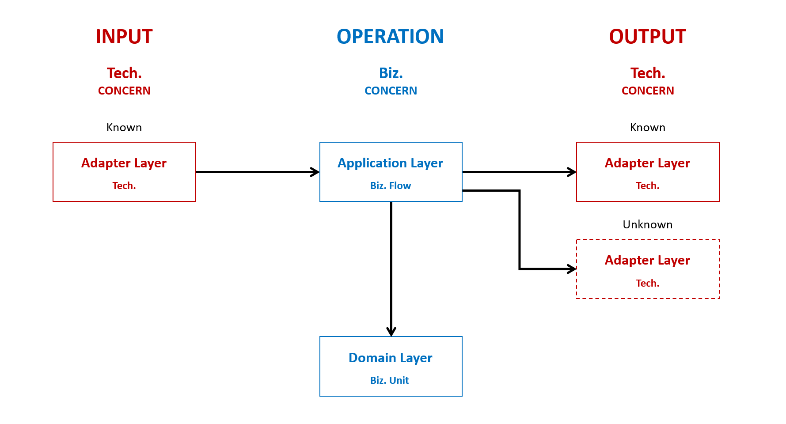
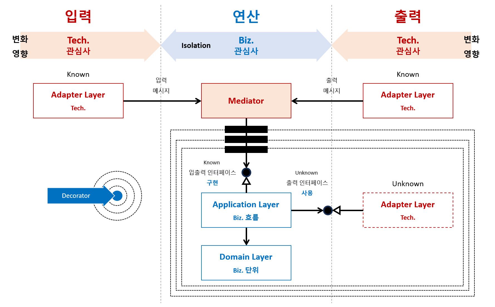
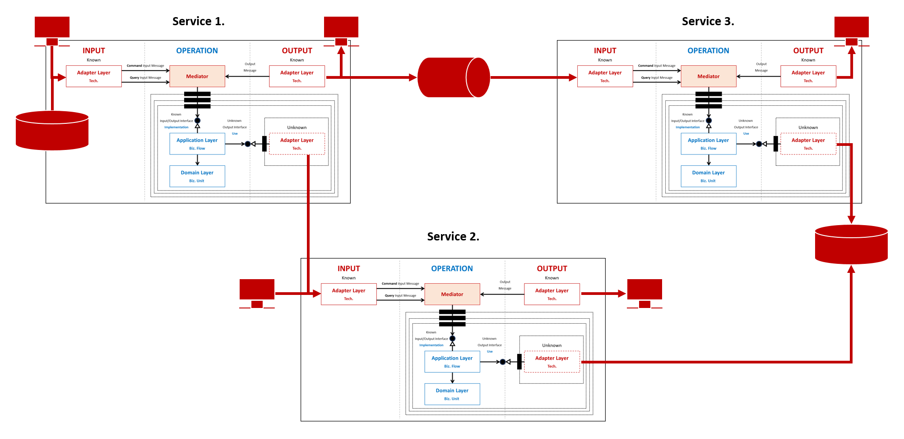
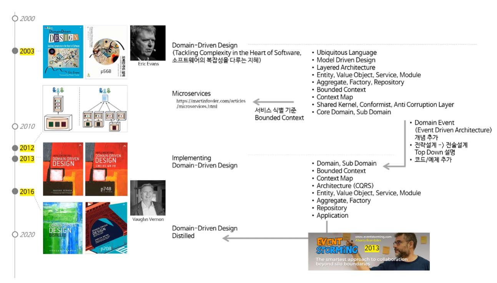

# _better_ _**CODE**_ _with domain-driven design_

## Tech. Map


<br/>

## Table of Contents
- Part 1. 아키텍처
  - [x] [Ch 01. 아키텍처 개요](#ch-1-아키텍처-개요)
  - [x] [Ch 02. 아키텍처 원칙](#ch-2-아키텍처-원칙)
  - [x] [Ch 03. 레이어 격리](#ch-3-레이어-격리)
  - [x] [Ch 04. 레이어 테스트](#ch-4-레이어-테스트)
  - [x] [Ch 05. 레이어 고도화](#ch-5-레이어-고도화)
  - [x] [Ch 06. 서비스 통합](#ch-6-서비스-통합)
  - [ ] Ch 07. 아키텍처 비교
- Part 3. 솔루션
  - [x] [Ch 08. 솔루션 구조](#ch-8-솔루션-구조)
  - [ ] [Ch 09. 솔루션 설정](#ch-9-솔루션-설정)
  - [ ] Ch 10. 솔루션 테스트
  - [ ] Ch 11. 솔루션 빌드
  - [ ] Ch 12. 솔루션 배포
- Part 4. 관찰 가능성
  - [ ] Ch 13. Aspire 대시보드
  - [ ] Ch 14. OpenSearch 시스템
  - [ ] TODO 로그
  - [ ] TODO 추적
  - [ ] TODO 지표
- Part 5. Internal 전술 설계
  - [x] [Ch 15. 전술 설계 패턴](#ch-15-전술-설계-패턴)
  - [ ] TODO
- Part 6. External 전술 설계
- Part 7. 전략 설계

<br/>

---

<br/>

# Part 1. 아키텍처

# Ch 1. 아키텍처 개요

## 아키텍처 정의


※ 출처: [Making Architecture Matter, 소프트웨어 아키텍처의 중요성](https://www.youtube.com/watch?v=4E1BHTvhB7Y)

## 아키텍처 범주


※ 출처: [Making old applications new again](https://sellingsimplifiedinsights.com/asset/app-development/ASSET_co-modernization-whitepaper-inc0460201-122016kata-v1-en_1511772094768.pdf)

```
Application Architecture
  ├─ Monolithic Architecture
  ├─ Modular Monolithic Architecture
  ├─ N-tier Architecture
  └─ Microservices Architecture
      ├─ Internal Architecture
      │    └─ Layered Architecture
      │         ├─ Hexagonal Architecture
      │         ├─ Onion Architecture
      │         ├─ Clean Architecture
      │         ├─ Vertical Slice Architecture
      │         └─ ...
      │
      └─ External Architecture
           └─ 외부 시스템 구성 아키텍처: 예. CNCF Landscape
```
- Microservices Architecture = Internal Architecture + External Architecture
  

  ※ 출처: [DDD 및 CQRS 패턴을 사용하여 마이크로 서비스에서 비즈니스 복잡성 처리](https://learn.microsoft.com/en-us/dotnet/architecture/microservices/microservice-ddd-cqrs-patterns/)

## 아키텍처 역사


  ※ 출처: [The Grand Unified Theory of Clean Architecture and Test Pyramid ](https://www.youtube.com/watch?v=mzznsq4jCHY)

<br/>

# Ch 2. 아키텍처 원칙
> 아키텍처 원칙: [Separation of concerns](https://learn.microsoft.com/ko-kr/dotnet/architecture/modern-web-apps-azure/architectural-principles#separation-of-concerns)

## 관심사의 분리
- 개발 시 요구사항과 운영 시 로그는 서로 다른 시점이지만, **코드에 대한 관점은 Biz.와 Tech. 관심사 기준으로 같아야 합니다.**
  - **개발 시** 요구사항을 비즈니스와 기술 관심사로 분해합니다.
  - **운영 시** 로그를 비즈니스와 기술 관심사로 식별합니다.


## 레이어
- 개발 시 요구사항과 운영 시 로그는 서로 다른 시점이지만, **코드에 대한 관점은 레이어 기준으로 동일해야 합니다.**


- **비즈니스 관심사**
  - Application: 비즈니스 흐름(Biz. Flow)
  - Domain: 비즈니스 단위(Biz. Unit)
- **기술 관심사**
  - Adapter
    - `Known` 입력 Adapter
    - ~~`Unknown` 입력 Adapter~~
    - `Known` 출력 Adapter
    - `Unknown` 출력 Adapter: 부수 효과(Side Effects)

## 레이어 배치


<br/>

# Ch 3. 레이어 격리

## 격리 전


## 격리 후

- 입출력 인터페이스를 이용하여 레이어를 격리합니다(Strategy 패턴)

<br/>

# Ch 4. 레이어 테스트


- 단위 테스트: Biz. 관심사를 테스트합니다.
- 통합 테스트: Tech. 관심사까지 포함하여 Biz. 관심사를 테스트합니다.

<br/>

# Ch 5. 레이어 고도화

## 격리 고도화


- Mediator 패턴을 활용하여, 격리된 레이어 간의 소통을 위해 인터페이스의 입출력을 메시지 기반으로 단순화합니다.
  - 메시지는 컴파일 타임과 런타임 모두에서 호출자와 수신자 정보를 숨길 수 있습니다(느슨한 결합).
    | 구분             | Mediator  패턴  | Strategy  패턴 |
    | ---              | ---            | ---            |
    | **Compile-time** | Unknown        | Unknown        |
    | **Runtime**      | Unknown        | Known          |
  - 메시지는 런타임에 메시지에 부가 기능을 더 쉽게 추가할 수 있습니다(Decorator 패턴)
  - 메시지는 입출력을 범주화할 수 있습니다(Command 메시지와 Query 메시지: CQRS 패턴).

## 메시지 고도화

- Mediator 패턴은 Decorator 패턴과 조합하여 동적으로 메시지에 새 기능을 추가할 수 있습니다.
  - 예. 메시지 처리 시간 로그
  - 예. 입력 메시지 유효성 검사
  - 예. Command 메시지일 때 트랜잭션 처리(CQRS 패턴)

## 메시지 범주화(CQRS)


- Mediator 패턴을 통해 데이터 쓰기를 위한 메시지(Command)와 데이터를 읽기 위한 메시지(Query)로 구분할 수 있습니다.
  - Command 메시지: 데이터 가변(`CUD`:`Create, Update, Delete`)
  - Query 메시지: 데이터 불변(`R`: `Read`)

## 메시지 범주화(CQRS) 흐름

※ 출처: [Module Requests Processing via CQRS](https://github.com/kgrzybek/modular-monolith-with-ddd?tab=readme-ov-file#34-module-requests-processing-via-cqrs)  

| 구분       | Command  | Query      |
| ---        | ---      | ---        |
| 트랜잭션    | O(필요)  | X(불 필요)  |
| 구현       | ORM      | SQL        |
| DTO 변환   | O(필요)  | X(불 필요)  |
| SQL 복잡도 | ↓(낮다)  | ↑(높다)     |

- 데이터 읽기 위한 메시지 처리에서는 SQL 구문을 사용하여 DTO 데이터 변환 없이 데이터베이스 조회 결과를 바로 반환합니다.

<br/>

# Ch 6. 서비스 통합


- 서비스 통합은 Biz. 관심사와 분리하여 Tech. 관심사(Adapter 레이어) 중심으로 구성할 수 있게 됩니다(Microservice 아키텍처 패턴).

<br/>

# Ch 07. 아키텍처 비교
- TODO

<br/>

---

<br/>

# Part 3. 솔루션

# Ch 8. 솔루션 구조
> 예제 코드: [링크](./Ch08.SolutionStructure/)

## 솔루션 구조 템플릿
```shell
{T2}.sln
  │ # 부수(Abstraction) 범주: Backend와 Frontend을 구성하기 위해 필요한 부수적인 코드
  ├─Abstraction
  │   ├─Frameworks
  │   │   ├─{T1}.{T2}.Framework
  │   │   └─{T1}.{T2}.Framework.Contracts
  │   ├─Libraries
  │   │   └─{T1}.{T2}.[Tech]                                    // 예. RabbitMQ, ...
  │   └─Domains
  │       └─{T1}.{T2}.[Domain]                                  // 공유 도메인, ...
  │
  │ # Backend 범주
  ├─Backend
  │   ├─{T3}
  │   │   ├─Src
  │   │   │   ├─{T1}.{T2}.{T3}                                  // 호스트 프로젝트
  │   │   │   ├─{T1}.{T2}.{T3}.Adapters.Infrastructure          // Adapter 레이어
  │   │   │   ├─{T1}.{T2}.{T3}.Adapters.Persistence             // Adapter 레이어
  │   │   │   ├─{T1}.{T2}.{T3}.Application                      // Application 레이어
  │   │   │   └─{T1}.{T2}.{T3}.Domain                           // Domain 레이어
  │   │   └─Tests
  │   │       ├─{T1}.{T2}.{T3}.Tests.Integration                // Integration 테스트
  │   │       ├─{T1}.{T2}.{T3}.Tests.Performance                // Performance 테스트
  │   │       └─{T1}.{T2}.{T3}.Tests.Unit                       // Unit Test
  │   ├─{T3}
  │   │   ├─Src
  │   │   └─Tests
  │   └─Tests
  │       └─{T1}.{T2}.Tests.E2E                                 // End to End 테스트
  │
  │ # Frontend 범주
  └─Frontend
      └─{T3}
          ├─Src
          │   ├─{T1}.{T2}.{T3}                                  // 호스트 프로젝트
          │   ├─{T1}.{T2}.{T3}.Adapters.Infrastructure          // Adapter 레이어
          │   ├─{T1}.{T2}.{T3}.Adapters.Persistence             // Adapter 레이어
          │   ├─{T1}.{T2}.{T3}.Application                      // Application 레이어
          │   └─{T1}.{T2}.{T3}.Domain                           // Domain 레이어
          └─Tests
              ├─{T1}.{T2}.{T3}.Tests.Integration                // Integration 테스트
              ├─{T1}.{T2}.{T3}.Tests.Performance                // Performance 테스트
              └─{T1}.{T2}.{T3}.Tests.Unit                       // Unit Test
```

### 솔루션 구조 형식

| Level  | Src             | Tests            |
|------- |-------------    |--------------    |
| `{T1}` | Corporation     | Corporation      |
| `{T2}` | Product         | Product          |
| `T3`   | Service 또는 UI  | Service 또는 UI  |
| `T4`   | **Layers**      | Tests            |
| `T5`   | **Sub-Layers**  | **Test Pyramid** |

- Layers
  - 기술 관심사
    - Adapter
  - 비즈니스 관심사
    - Application: 비즈니스 흐름(Biz. Flow)
    - Domain: 비즈니스 단위(Biz. Unit)
- Sub-Layers: 기술 관심사
  - Infrastructure
  - Persistence
  - Presentation
- Test Pyramid
  - Unit
  - Integration
  - Performance
  - E2E(End to End)

### 솔루션 구조 예제
- Src 예: `Corporation`.`Product`.`Service`.`Adapters`.`Infrastructure`
    - T1: Corporation
    - T2: Product
    - T3: Service
    - T4: Adapters
    - T5: Infrastructure
- Src 예: `Corporation`.`Product`.`Service`.`Domain`: T5 생략일 때
- Src 예:`Service`.`Adapters`.`Infrastructure`: T1, T2 생략일 때
- Tests 예: `Corporation`.`Product`.`Service`.`Tests`.`Unit`
  - T1: Corporation
  - T2: Product
  - T3: Service
  - T4: Tests
  - T5: Unit
- Tests 예: `Service`.`Tests`.`Unit`: T1, T2 생략일 때


<br/>

# Ch 9. 솔루션 설정

## .NET SDK 빌드 버전
- `global-json` 파일은 .NET 프로젝트에서 특정 .NET SDK 버전을 지정하여 일관된 개발 환경을 유지하기 위해 사용됩니다.
  - 예제 코드: [global-json](./Ch09.SolutionSettings/global.json)

```shell
# Host에 설치된 .NET SDK 목록
dotnet --list-sdks

# 템플릿 확인
dotnet new list | findstr nuget
  템플릿 이름          약식 이름                       언어     태그
  ------------------- -----------------------------  -------  -----------
  global.json 파일     globaljson,global.json                  Config

# globaljson 파일 생성
#  - 8.0.100 이상 8.0.xxx 버전(예: 8.0.303 또는 8.0.402)을 허용합니다.
dotnet new globaljson --sdk-version 8.0.100 --roll-forward latestFeature --force
#  - 8.0.100 이상 8.0.1xx 버전(예: 8.0.103 또는 8.0.199)을 허용합니다.
dotnet new globaljson --sdk-version 8.0.100 --roll-forward latestPatch --force
#  - 8.0.100 지정된 버전만을 사용합니다.
dotnet new globaljson --sdk-version 8.0.100 --roll-forward disable --force

# .NET SDK 빌드 버전 확인
dotnet --version
```

- .NET SDK 버전 형식: "[global.json](https://learn.microsoft.com/ko-kr/dotnet/core/tools/global-json)"에 지정된 버전에서부터 상위 버전(rollForward) 범위를 지정합니다.
  ```
  x.y.znn
  ```
  - `x`: major
  - `y`: minor
  - `z`: feature, 0 ~ 9
  - `n`: patch, 0 ~ 99
- `latestFeature` 예: 8.0.302 이전의 모든 .NET SDK 버전을 허용하지 않으며 8.0.302 이상 8.0.xxx 버전(예: 8.0.303 또는 8.0.402)을 허용합니다.
  ```json
  {
    "sdk": {
      "version": "8.0.302",
      "rollForward": "latestFeature"
    }
  }
  ```
- `latestPatch` 예: 8.0.102 이전의 모든 .NET SDK 버전을 허용하지 않으며 8.0.102 이상 8.0.1xx 버전(예: 8.0.103 또는 8.0.199)을 허용합니다.
  ```json
  {
    "sdk": {
      "version": "8.0.102",
      "rollForward": "latestPatch"
    }
  }
  ```
- `disable` 예: 8.0.102 지정된 .NET SDK 버전만을 허용하빈다.
  ```json
  {
    "sdk": {
      "version": "8.0.102",
      "rollForward": "disable"
    }
  }
  ```

## 패키지 소스
- `nuget.config` 파일은 솔루션 수준에서 패키지 소스을 관리합니다.
  - 예제 코드: [nuget.config](./Ch09.SolutionSettings/nuget.config)

```shell
# 템플릿 확인
dotnet new list | findstr nuget
  템플릿 이름        약식 이름                      언어     태그
  ---------------- -----------------------------  -------  ---------
  NuGet 구성        nugetconfig,nuget.config               Config

# 템플릿 생성
dotnet new nuget.config
```

### 기본 패키지 소스
```xml
<?xml version="1.0" encoding="utf-8"?>
<configuration>
  <packageSources>
    <!--To inherit the global NuGet package sources remove the <clear/> line below -->
    <clear />
    <add key="nuget" value="https://api.nuget.org/v3/index.json" />
  </packageSources>
</configuration>
```
- 전역 설정에 지정된 기존 NuGet 패키지 소스 목록을 모두 제거 후에 새 패키지 저장소 `https://api.nuget.org/v3/index.json`을 지정합니다.

## 중앙 패키지 관리
- `Directory.Package.props` 파일을 통해 각 프로젝트의 패키지 버전을 일일이 수정하지 않고, 한 곳에서 공통 패키지 버전을 정의할 수 있습니다.
  - 예제 코드: [Directory.Packages.props](./Ch09.SolutionSettings/Directory.Packages.props)

```shell
dotnet tool install -g upgrade-assistant


dotnet tool list -g
패키지 ID             버전            명령
------------------------------------------------------
upgrade-assistant     0.5.820        upgrade-assistant
```


### 변경 전/후 프로젝트 파일

- 프로젝트 파일에서 `PackageReference`의 `Version`을 제거 시킵니다.

### 변경 전/후 Directory.Package.props

- 프로젝트 파일에서 제거된 `PackageReference`의 `Version` 값을 `PackageVersion`으로 추가하여 버전을 중앙에서 관리합니다.

## 중앙 빌드 관리
- `Directory.Build.props` 파일을 사용하면 각 프로젝트 파일에 일일이 동일한 속성을 추가할 필요 없이, 한 곳에서 공통 속성을 정의하고 관리할 수 있습니다.
  - 예제 코드: 솔루션 빌드 속성 [Directory.Build.props](./Ch09.SolutionSettings/Directory.Build.props)
  - 예제 코드: 테스트 빌드 속성 [Directory.Build.props](./Ch09.SolutionSettings/Backend/Tests/Directory.Build.props)

```shell
# 템플릿 확인
dotnet new list | findstr props
  템플릿 이름                            약식 이름     언어      태그
  ------------------------------------  -----------  -------  ----------------
  MSBuild Directory.Build.props 파일     buildprops            MSBuild/props

# Directory.Build.props 기본 파일 생성
dotnet new buildprops
```

### Directory.Build.props
```shell
{T2}.sln
Directory.Build.props                                           // 전역 프로젝트 빌드 속성
  │
  ├─Backend
  │   ├─{T3}
  │   │   ├─Src
  │   │   │   ├─{T1}.{T2}.{T3}
  │   │   │   └─...
  │   │   └─Tests
  │   │       ├─Directory.Build.props                           // 테스트 프로젝트 빌드 속성
  │   │       ├─{T1}.{T2}.{T3}.Tests.Integration
  │   │       ├─{T1}.{T2}.{T3}.Tests.Performance
  │   │       └─{T1}.{T2}.{T3}.Tests.Unit
```

- 전역 프로젝트 빌드 속성: 전역 프로젝트 속성은 솔루션 폴더에 있는 `Directory.Build.props` 파일에 정의합니다.
  ```xml
  <Project>
    <PropertyGroup>
      <TargetFramework>net8.0</TargetFramework>
      <ImplicitUsings>enable</ImplicitUsings>
      <Nullable>enable</Nullable>
    </PropertyGroup>
  </Project>
  ```
- 테스트 프로젝트 빌드 속성: 테스트 프로젝트의 추가적인 속성은 전역 프로젝트 속성 외에 Tests 폴더의 `Directory.Build.props` 파일에 정의합니다.
  ```xml
  <Project>
    <!--
      현재 파일의 위치에서 상위로 디렉터리를 거슬러 올라가면서 Directory.Build.props 파일을 찾고,
      해당 파일이 발견되면 프로젝트에 포함시키는 역할을 합니다.
    -->
    <Import Project="$([MSBuild]::GetPathOfFileAbove('Directory.Build.props', '$(MSBuildThisFileDirectory)../'))" />

    <PropertyGroup>
      <IsPackable>false</IsPackable>
      <IsTestProject>true</IsTestProject>
    </PropertyGroup>
  </Project>
  ```

### 프로젝트 파일(Directory.Build.props 적용 후)
- EXE 프로젝트 .csproj 파일
  ```xml
  <Project Sdk="Microsoft.NET.Sdk">
    <PropertyGroup>
      <OutputType>Exe</OutputType>
      <!--
      // 솔루션 폴더에 있는 Directory.Build.props 파일에 있는 속성을 사용합니다.

      <TargetFramework>net8.0</TargetFramework>
      <ImplicitUsings>enable</ImplicitUsings>
      <Nullable>enable</Nullable>
      -->
    </PropertyGroup>
  </Project>
  ```
- ClassLibrary 프로젝트 .csproj 파일
  ```xml
  <Project Sdk="Microsoft.NET.Sdk">
    <PropertyGroup>
      <!--
      // 솔루션 폴더에 있는 Directory.Build.props 파일에 있는 속성을 사용합니다.

      <TargetFramework>net8.0</TargetFramework>
      <ImplicitUsings>enable</ImplicitUsings>
      <Nullable>enable</Nullable>
      -->
    </PropertyGroup>
  </Project>
  ```
- Test 프로젝트 .csproj 파일
  ```xml
  <Project Sdk="Microsoft.NET.Sdk">
    <PropertyGroup>
      <!--
      // 솔루션 폴더에 있는 Directory.Build.props 파일에 있는 속성을 사용합니다.

      <TargetFramework>net8.0</TargetFramework>
      <ImplicitUsings>enable</ImplicitUsings>
      <Nullable>enable</Nullable>

      // Tests 폴더에 있는 Directory.Build.props 파일에 있는 속성을 사용합니다.
      <IsPackable>false</IsPackable>
      <IsTestProject>true</IsTestProject>
      -->
    </PropertyGroup>
  </Project>
  ```

## 코드 분석
- TODO 코드 스타일
- TODO 코드 품질

## 컨테이너
- TODO 이름 규칙
- TODO Health Check
- TODO 진단 도구

<br/>

---

<br/>

# Ch 10. 솔루션 테스트

## 테스트
- TODO 코드 커버리지
- TODO Fake 데이터
- TODO AutoFixture???

## 컨테이너 테스트
- TODO PostgreSQL
- TODO RabbitMQ, ...

## 통합 테스트
- TODO WebApi
- TODO RabbitMQ
- TODO FileSystem(반복 작업)
- TODO ...

## 성능 테스트
- TODO ...

<br/>

---

<br/>

# Ch 11. 솔루션 빌드
- TODO 코드 커버리지
- TODO 프로젝트 의존성 다이어그램
- TODO 코드 정적 분석?
- TODO EFCore 다이어그램
- TODO 빌드 조건?
  - 브랜치
  - PR
  - 대상 파일

<br/>

---

<br/>

# Ch 12. 솔루션 배포
- TODO GitHub Release
- TODO GitHub 컨테이너
- TODO 버전

<br/>

---

<br/>

# Part 4. 관찰 가능성

# Ch 13. Aspire 대시보드
- TODO

<br/>

# Ch 14. OpenSearch 시스템
- TODO

<br/>

---

<br/>

# Part 5. Internal 전술 설계

# Ch 15. 전술 설계 패턴


<br/>

---

<br/>

# 참고 자료
- [ ] [SharedKernelSample](https://github.com/NimblePros/SharedKernelSample)
  - Domain과 Application 레이어 구현을 위한 기본 타입 기본 구현과 테스트 참고
- [ ] [C#10 `record struct` Deep Dive & Performance Implications](https://nietras.com/2021/06/14/csharp-10-record-struct/)
- [ ] [Hexagonal Architecture - What Is It? Why Should You Use It?](https://www.happycoders.eu/software-craftsmanship/hexagonal-architecture/)

## 클린 아키텍처 템플릿
- [ ] [ardalis | CleanArchitecture](https://github.com/ardalis/CleanArchitecture)
- [ ] [amantinband | clean-architecture](https://github.com/amantinband/clean-architecture)

## DDD
- [x] [DDD 그리고 MSA](https://www.youtube.com/watch?v=DOpt6IWU6LU)
  [](https://www.youtube.com/watch?v=DOpt6IWU6LU)
  - 주요 도서를 중심으로 도메인 주도 설계 역사를 이해할 수 있습니다.
- [ ] [Moving IO to the edges of your app](https://www.youtube.com/watch?v=P1vES9AgfC4)  
  [](https://www.youtube.com/watch?v=P1vES9AgfC4)  
  - 아키텍처 관점에서 Pure Function과 Impure Function 배치의 중요성을 이해할 수 있습니다.
- [ ] [modular-monolith-with-ddd](https://github.com/kgrzybek/modular-monolith-with-ddd)

## 테스트
### 아키텍처 테스트
- [ ] [Enforcing Software Architecture With Architecture Tests](https://www.milanjovanovic.tech/blog/enforcing-software-architecture-with-architecture-tests)
- [ ] [Shift Left With Architecture Testing in .NET](https://www.milanjovanovic.tech/blog/shift-left-with-architecture-testing-in-dotnet)

## 속성
### 코드 분석
- [ ] [Editorconfig In Visual Studio In 10 Minutes or Less](https://www.youtube.com/watch?v=CQW5b58mPdg&t)
  - editorconfig 탭 간격, 마지막 라인, 네임스페이 기본 값(컴파일러 수준)
- [ ] [How To Write Clean Code With The Help Of Static Code Analysis](https://www.youtube.com/watch?v=0nVT1gM4vPg)
  - Directory.Build.props 파일을 이용한 코드 분석 패키지 전역화, 코드 분석을 위한 빌드 설정