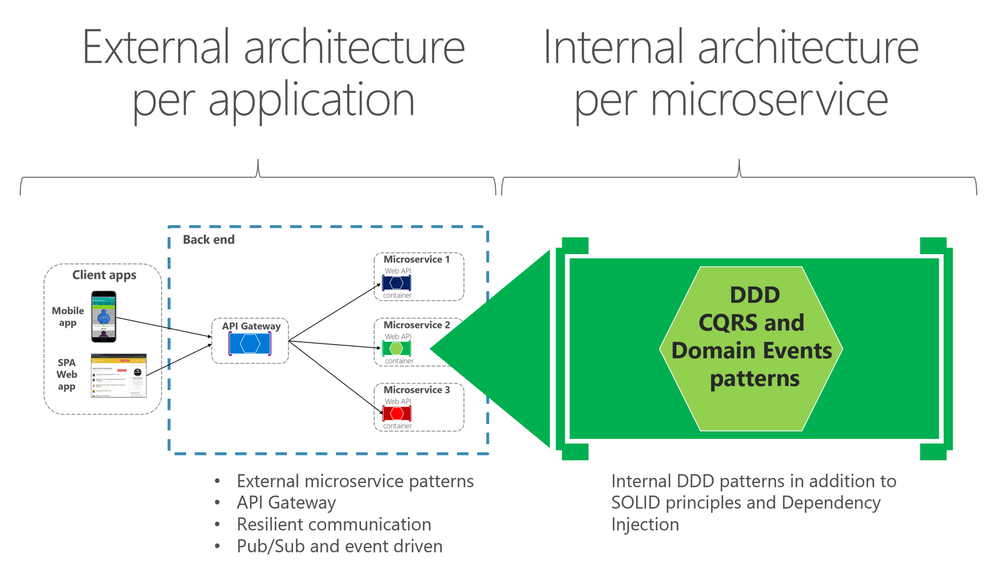
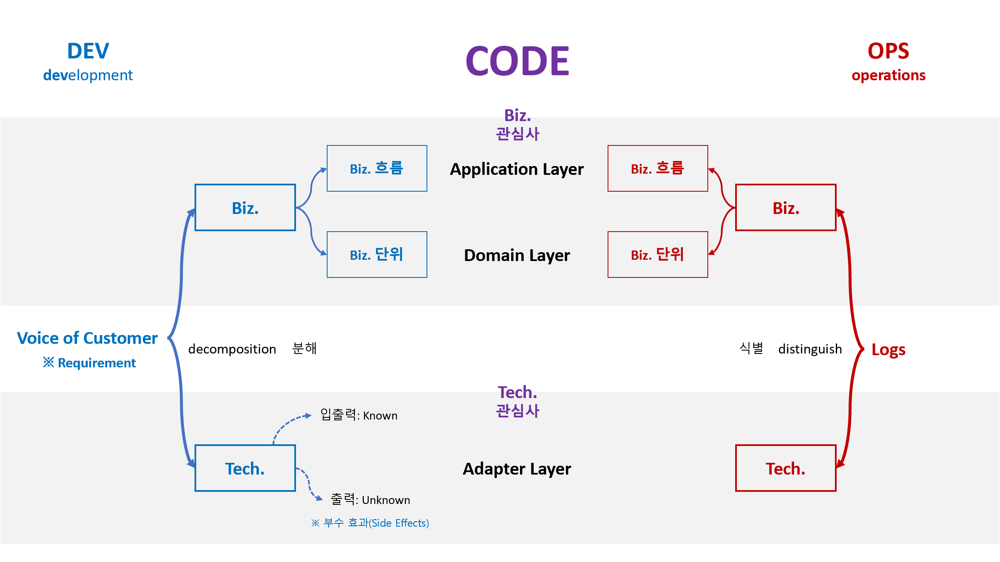

# Better code with Domain-Driven Design

## 기술 맵


## 목차
- Part 1. 아키텍처
  - [x] [Ch 01. 아키텍처](#ch-1-아키텍처)
  - [x] [Ch 02. 관심사의 분리](#ch-2-관심사의-분리)
  - [x] [Ch 03. 레이어 격리](#ch-3-레이어-격리)
  - [x] [Ch 04. 레이어 테스트](#ch-4-레이어-테스트)
  - [x] [Ch 05. 레이어 격리 고도화](#ch-5-레이어-격리-고도화)
- Part 2. 솔루션
  - [x] [Ch 06. 솔루션 구조](#ch-6-솔루션-구조)
  - [ ] [Ch 07. 솔루션 설정](#ch-7-솔루션-설정)
  - [ ] Ch 08. 테스트
  - [ ] Ch 09. 빌드
  - [ ] Ch 10. 배포

<br/>

# Ch 1. 아키텍처

## 아키텍처 정의


## 아키텍처 범주


```
Application Architecture
  ├─ Monolithic Architecture
  ├─ Modular Monolithic Architecture
  ├─ N-tier Architecture
  └─ Microservices Architecture
      ├─ Internal Architecture
      │    └─ Layered Architecture
      │         ├─ Hexagonal Architecture
      │         ├─ Onion Architecture
      │         ├─ Clean Architecture
      │         └─ Vertical Slice Architecture
      │
      └─ External Architecture
           └─ 외부 시스템 구성 아키텍처: 예. CNCF Landscape
```
- Microservices Architecture = Internal Architecture + External Architecture
  

## 아키텍처 역사


<br/>

# Ch 2. 관심사의 분리

## 분리
- **개발할 때**: 요구사항을 비즈니스와 기술 관심사로 분해합니다.
- **운영할 때**: 로그를 비즈니스와 기술 관심사로 식별합니다.

### 레이어


- 분해하고 식별된 코드는 **레이어 단위**로 관리합니다.
  - **기술 관심사**
    - Adapter
      - Known 입력
      - Known 출력
      - Unknown 출력: 부수 효과(Side Effects)
  - **비즈니스 관심사**
    - Application: 비즈니스 흐름
    - Domain: 비즈니스 단위

### 레이어 배치


<br/>

# Ch 3. 레이어 격리

## 격리 전


## 격리 후

- Strategy 패턴

<br/>

# Ch 4. 레이어 테스트


- 단위 테스트
- 통합 테스트

<br/>

# Ch 5. 레이어 격리 고도화

## 격리 고도화


- Mediator는 컴파일 타임과 런타임 모두에서 호출자 인스턴스가 드러나지 않게 메시지를 처리합니다
  | 구분            | Mediator | Strategy |
  | ---            | ---       | ---      |
  | **컴파일 타임** | Unknown   | Unknown  |
  | **런타임**      | Unknown  | Known    |

## 메시지 고도화

- Decorator 패턴: 입력 메시지에 대한 부가 기능을 추가합니다.
  - 예. 메시지 처리 시간 로그
  - 예. 입력 메시지 유효성 검사
  - 예. Command 메시지일 때 트랜잭션 처리(CQRS 패턴)

<br/>

# Ch 6. 솔루션 구조
- 예제 코드: [링크](./Ch06.SolutionStructure/)

## 솔루션 구조 템플릿
```shell
{Product}.sln
  │ # 범주 Abstraction: Backend와 Frontend을 구성하기 위해 필요한 부수적인 코드
  ├─Abstraction
  │   ├─Frameworks
  │   │   ├─{Corporation}.{Product}.Framework
  │   │   └─{Corporation}.{Product}.Framework.Contracts
  │   └─Libraries
  │       └─{Corporation}.{Product}.{Tech}                                    // 예. RabbitMQ, ...
  │
  │ # 범주 Backend
  ├─Backend
  │   ├─{Service}
  │   │   ├─Src
  │   │   │   ├─{Corporation}.{Product}.{Service}                             // 호스트 프로젝트
  │   │   │   ├─{Corporation}.{Product}.{Service}.Adapters.Infrastructure     // Adapter 레이어
  │   │   │   ├─{Corporation}.{Product}.{Service}.Adapters.Persistence        // Adapter 레이어
  │   │   │   ├─{Corporation}.{Product}.{Service}.Application                 // Application 레이어
  │   │   │   └─{Corporation}.{Product}.{Service}.Domain                      // Domain 레이어
  │   │   └─Tests
  │   │       ├─{Corporation}.{Product}.{Service}.Tests.Integration           // Integration 테스트
  │   │       ├─{Corporation}.{Product}.{Service}.Tests.Performance           // Performance 테스트
  │   │       └─{Corporation}.{Product}.{Service}.Tests.Unit                  // Unit Test
  │   ├─{Service}
  │   │   ├─Src
  │   │   └─Tests
  │   └─Tests
  │       └─{Corporation}.{Product}.Tests.E2E                                 // End to End 테스트
  │
  │ # 범주 Frontend
  └─Frontend
      └─{UI}
          ├─Src
          │   ├─{Corporation}.{Product}.{UI}                                  // 호스트 프로젝트
          │   ├─{Corporation}.{Product}.{UI}.Adapters.Infrastructure          // Adapter 레이어
          │   ├─{Corporation}.{Product}.{UI}.Adapters.Persistence             // Adapter 레이어
          │   ├─{Corporation}.{Product}.{UI}.Application                      // Application 레이어
          │   └─{Corporation}.{Product}.{UI}.Domain                           // Domain 레이어
          └─Tests
              ├─{Corporation}.{Product}.{UI}.Tests.Integration                // Integration 테스트
              ├─{Corporation}.{Product}.{UI}.Tests.Performance                // Performance 테스트
              └─{Corporation}.{Product}.{UI}.Tests.Unit                       // Unit Test
```

- **범주**
  - Abstraction: Backend와 Frontend을 구성하기 위해 필요한 부수적인 코드
  - Backend
  - Frontend
- **레이어**
  - 기술 관심사
    - Adapter
      - Adpaters.Infrastructure
      - Adpaters.Persistence
      - Adpaters.Presentation
  - 비즈니스 관심사
    - Application: 비즈니스 흐름
    - Domain: 비즈니스 단위
- **이름**
  - {Corporation}: 회사
  - {Product}: 제품
  - {Service}: Backend 프로그램
  - {UI}: Frontend 프로그램

## 솔루션 구조 예


- **이름**
  - {Corporation}: Corp
  - {Product}: Hello
  - {Service}:
    - Api
    - Master
  - {UI}: 생략

<br/>

# Ch 7. 솔루션 설정

## SDK 버전
- TODO global.json

## 빌드 설정 중앙화
- TODO Directory.Build.prop
- TODO ServerGarbageCollection

## 패키지 버전 중앙화
- TODO Directory.Package.prop

## 코드 분석
- 코드 스타일
- 코드 품질

## 컨테이너
- TODO 이름 규칙
- todo

<br/>

---

<br/>

# 참고 자료
- [ ] [SharedKernelSample](https://github.com/NimblePros/SharedKernelSample)
  - Domain과 Application 레이어 구현을 위한 기본 타입 기본 구현과 테스트 참고
- [ ] [C#10 `record struct` Deep Dive & Performance Implications](https://nietras.com/2021/06/14/csharp-10-record-struct/)

## 클린 아키텍처 템플릿
- [ ] [ardalis | CleanArchitecture](https://github.com/ardalis/CleanArchitecture)

## 테스트
### 아키텍처 테스트
- [ ] [Enforcing Software Architecture With Architecture Tests](https://www.milanjovanovic.tech/blog/enforcing-software-architecture-with-architecture-tests)
- [ ] [Shift Left With Architecture Testing in .NET](https://www.milanjovanovic.tech/blog/shift-left-with-architecture-testing-in-dotnet)

## 설정
### 코드 분석
- [ ] [Editorconfig In Visual Studio In 10 Minutes or Less](https://www.youtube.com/watch?v=CQW5b58mPdg&t)
  - editorconfig 탭 간격, 마지막 라인, 네임스페이 기본 값(컴파일러 수준)
- [ ] [How To Write Clean Code With The Help Of Static Code Analysis](https://www.youtube.com/watch?v=0nVT1gM4vPg)
  - Directory.Build.props 파일을 이용한 코드 분석 패키지 전역화, 코드 분석을 위한 빌드 설정