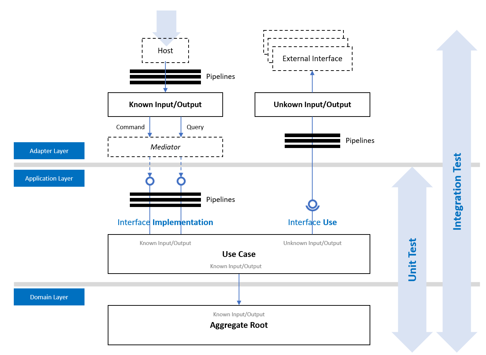

> 슬기로운 코드를 만들기 위한 아름다운 여정
- 솔루션 탐색기는 **도서의 목차**와 같습니다.
- 테스트 코드는 **개발자 매뉴얼**입니다.

 

# 아키텍처
## 아키텍처 맵

## Internal 아키텍처 구성도

## External 아키텍처 구성도
> TODO

 

# 목차
## 개요
- Part 0. 세미나
  - [x] [Ch 01. Internal 아키텍처 개요](./Part0-Seminar/Ch01.InternalArchitecture/README.md)
- Part 1. 개요
  - [x] [Ch 01. 프로그램 환경](./Part1-Overview/Ch01-Prerequisite/README.md)
  - [x] [Ch 02. 아키텍처](./Part1-Overview/Ch02-Architecture/README.md)
  - [ ] [Ch 03. 아키텍처 진단](./Part1-Overview/Ch03-ArchitectureDiagnosis/README.md)
  - [x] [Ch 04. Internal 아키텍처](./Part1-Overview/Ch04-InternalArchitecture/README.md)
  - [ ] [Ch 05. External 아키텍처](./Part1-Overview/Ch05-ExternalArchitecture/README.md)
- `TODO`