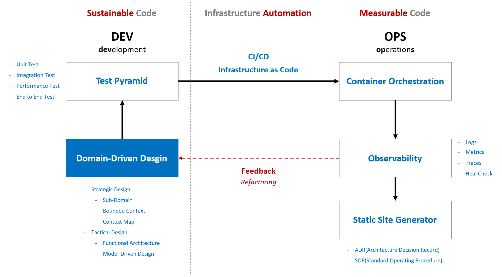
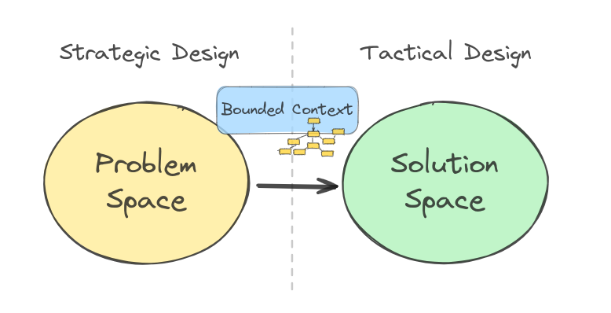

# Better code with Domain-Driven Design

## 기술 맵

## 목차
- **Part 1. 개요**
  - [x] [Ch 1. 관심사의 분리](./Part01-Overview/Ch01-SoC/)
  - [ ] [Ch 2. 비즈니스 레이어 격리](./Part01-Overview/Ch02-BusinessLayerIsolation/)
  - [x] [Ch 3. 솔루션 구조](./Part01-Overview/Ch03-SolutionStructure/)
  - [ ] Ch 4. 솔루션 설정
  - [ ] Ch 5. 테스트
  - [ ] Ch 6. 빌드
  - [ ] Ch 7. 배포

 

- 전략 설계
    
  ※ 이미지 출처: [Strategic Design Explained](https://miro.medium.com/v2/resize:fit:1400/format:webp/1*vJzxC1yeMtIKxuk-8Fj8YA.png)

 

---

 

# 참고 자료
- [ ] [SharedKernelSample](https://github.com/NimblePros/SharedKernelSample)
  - Domain과 Application 레이어 구현을 위한 기본 타입 기본 구현과 테스트 참고
- [ ] [C#10 `record struct` Deep Dive & Performance Implications](https://nietras.com/2021/06/14/csharp-10-record-struct/)

## 클린 아키텍처 템플릿
- [ ] [ardalis | CleanArchitecture](https://github.com/ardalis/CleanArchitecture)

## 테스트
### 아키텍처 테스트
- [ ] [Enforcing Software Architecture With Architecture Tests](https://www.milanjovanovic.tech/blog/enforcing-software-architecture-with-architecture-tests)
- [ ] [Shift Left With Architecture Testing in .NET](https://www.milanjovanovic.tech/blog/shift-left-with-architecture-testing-in-dotnet)

https://www.youtube.com/watch?v=CQW5b58mPdg&t=163s
탭 간격
마지막 라인
네임스페이 기본 값, 컴파일러 경고 수준