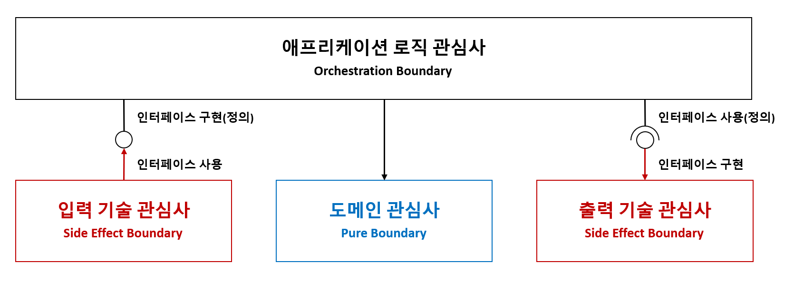

> Make It Work, Make It Right, Make It Fast

## 목표
> 코드는 팀이 함께 완성해 가는 한 편의 글입니다. 우리는 그 글을 차곡차곡 쌓아 시스템을 만들어 갑니다.
- 소스 코드의 구조는 **책의 목차처럼** 명확하고 직관적이어야 하며, 이를 통해 도메인과 시스템을 자연스럽게 이해할 수 있어야 합니다.
- 테스트 코드는 검증 도구를 넘어, **비즈니스 규칙을 이해하고 학습하는** 데 핵심적인 가이드 역할을 해야 합니다.

<br/>

## 도메인 주도 설계와 함수형 프로그래밍

### 주요 개념
도메인 주도 설계의 '무엇을 표현할지'와 함수형 프로그래밍의 '어떻게 표현할지'가 만나서, 변경에 강하고, 테스트 가능하고, 명확한 의도를 가진 코드를 만듭니다.
- **무엇을 표현할지: 복잡성 분리**
  - 복잡한 비즈니스 로직을 도메인 모델 중심으로 풀어나가는 설계 방법입니다.
  - 도메인 전문가의 언어 (Ubiquitous Language) 로 시스템을 설계하는 것이 핵심입니다.
- **어떻게 표현할지: 부작용 최소화**
  - 함수(수학적인 함수)에 기반한 프로그래밍 방식입니다.
  - 상태 변경 없이, 입력에 따라 일관된 출력을 보장합니다.

### 공통 목표
- **변경에 강한 모델**
  - DDD: 복잡성 분리 (관심사의 분리: 도메인과 기술)
  - FP: 부작용 최소화 (합성 함수: 부작용 없는 순수 함수 연결)
- **예측 가능한 동작**
  - DDD: 명확한 경계 (Bounded Context)
  - FP: 순수 함수 지향
- **정확한 도메인 표현**
  - DDD: 명확한 의미 부여 (Ubiquitous Language)
  - FP: 타입 기반 설계

<br/>

## 애플리케이션 아키텍처

### 아키텍처 기술 맵


### Internal 아키텍처 (Hexagonal 아키텍처)


- 도메인
  - `LanguageExt.Core`: 함수형
  - `MediatR`: 기술 관심사와 도메인 관심사 간의 느슨한 결합 (Mediator 패턴)
  - `FluentValidation`: 유효성 검사
  - `Ardalis.SmartEnum`: 열거형 도메인 타입
  - `Ulid`: 고유 ID
- 테스트
  - `xUnit`: 테스트
  - `coverlet`: 코드 커버리지
  - `Shouldly`: Fluent 테스트 검증
  - `TngTech.ArchUnitNET`: 아키텍처 테스트
  - `NSubstitute`: Mocking
  - `Bogus`: Fake 데이터 생성기
  - `Verify`: 스냅샷 테스트
- 기술
  - `ZiggyCreatures.FusionCache`: 메모리 캐시


### External 아키텍처 (Microservices 아키텍처)
> TODO

<br/>

## 글쓰기 지침
- 001 | 솔루션 | [관심사의 분리 (Separation of Concerns)](./03-guide/solution/solution-separation-of-concerns.md)
- 002 | 솔루션 | [테스트 자동화 (Unit Test, Integration Test)](./03-guide/solution/solution-test-automation.md)
- 003 | 솔루션 | [폴더 구성](./03-guide/solution/solution-structure-principle.md)
- 004 | 솔루션 | [.NET SDK 버전 (global.json)](./03-guide/solution/solution-sdk-version.md)
- 005 | 솔루션 | [NuGet 소스 설정 (nuget.config)](./03-guide/solution/solution-nuget-config.md)
- 006 | 솔루션 | [NuGet 패키지 버전 중앙 관리 (Directory.Packages.props)](./03-guide/solution/solution-package-version.md)
- 007 | 솔루션 | 프로젝트 속성 중앙 관리 (Directory.Build.props)
- 008 | 솔루션 | 전역 버전
- 009 | 프로젝트 | [어셈블리별 어셈블리 정의 (AssemblyReference.cs)](./03-guide/project/project-assemblyreference.md)
- 010 | 프로젝트 | [클래스 기본 접근 제어자 (internal, sealed)](./03-guide/project/project-class-access-modifiers.md)
- 011 | 프로젝트 | [호스트 옵션](./03-guide/project/project-host-options.md)
- 012 | 프로젝트 | [소스 생성기](./03-guide/project/project-source-generator.md)
- 013 | 애플리케이션 레이어 | [CQRS 메시지](./03-guide/layer/application-cqrs-message.md)
- 014 | 애플리케이션 레이어 | 이벤트 메시지
- 015 | 애플리케이션 레이어 | [파이프라인](./03-guide/layer/application-pipelines.md)
- 016 | 테스트 | [테스트 범주화](./03-guide/test/test-category.md)
- 017 | 테스트 | [스냅샷(Snapshot)](./03-guide/solution/solution-test-snapshot.md)
- 018 | 아키텍처 테스트 | 레이어 의존성
- 019 | 아키텍처 테스트 | 사용자 정의 규칙
- 020 | 아키텍처 테스트 | 도메인 타입 규칙(정적 메서드: Create, Validate, 생성자: private, Parameter less)
- 021 | 아키텍처 테스트 | 중첩 클래스 규칙
- ...

<br/>

## 글쓰기 Hands-on Labs
"[Getting Started: Domain-Driven Design](https://dometrain.com/course/getting-started-domain-driven-design-ddd/?ref=dometrain-github&promo=getting-started-domain-driven-design)" 강의 예제를 Functional 도메인 주도 설계와 아키텍처로 재구성하는 글입니다.

- **Part 1. Hexagonal 아키텍처 (도메인 레이어)**
  - [ ] Chapter 01. 도메인 탐험
  - [ ] Chapter 02. 도메인 구조화
  - [ ] Chapter 03. 도메인 함수형화
  - [ ] Chapter 04. 도메인 Entity Id 소스 생성기
  - [ ] Chapter 05. 도메인 단위 테스트
- **Part 2. Hexagonal 아키텍처 (애플리케이션 레이어)**
  - [ ] Chapter 06. 유스케이스 탐험 (CQRS)
  - [ ] Chapter 07. 유스케이스 미들웨어
  - [ ] Chapter 08. 유스케이스 단위 테스트
  - [ ] Chapter 09. 유스케이스 시나리오 테스트 (Cucumber)
- **Part 3. Hexagonal 아키텍처 (어댑터 레이어)**
  - [ ] Chapter 10. WebApi
  - [ ] Chapter 12. IAdapter 인터페이스 소스 생성기
  - [ ] Chapter 13. 저장소 CQRS (Command: EF Core, Query: Dapper)
  - [ ] Chapter 14. 컨테이너화
  - [ ] Chapter 15. 통합 테스트
  - [ ] Chapter 16. 성능 테스트
- **Part 4. Microservices 아키텍처**
  - [ ] Chapter 17. Aspire
  - [ ] Chapter 18. RabbitMQ
  - [ ] Chapter 19. Resilience
  - [ ] Chapter 20. Reverse Proxy
  - [ ] Chapter 21. Chaos Engineering
- **Part 5. 운영**
  - [ ] Chapter 22. OpenFeature (Feature Flag Management)
  - [ ] Chapter 23. OpenSearch (Observability System)
  - [ ] Chapter 24. Ansible (Infrastructure as Code)
  - [ ] Chapter 25. Backstage (Building developer portals)

<br/>

## Functional DDD 리팩토링

### 도메인 지식 코드화하기
- 도메인 레이어와 애플리케이션 레이어의 코드는 기술적인 관점의 용어보다, 비즈니스 도메인의 의도를 드러내는 용어로 클래스 이름과 메서드 이름을 구성해야 합니다.
- 이를 통해 코드 자체가 도메인 지식을 표현하는 모델이 되며, 코드를 읽는 것만으로도 비즈니스 규칙과 흐름을 이해할 수 있어야 합니다.

### Map과 Bind 함수 이해하기
```cs
// Monad 스타일
.Map(_ => Pure(x))
.Bind(y => SideEffect(y));

// Monad LINQ 스타일
from x in SizeEffect(y)
let y = Pure()
select unit;
```

### 합성 함수 만들기
- 함수를 작게 나누어 마치 레고 블록처럼 연결해서 처리 흐름을 만듭니다.

```cs
// 적용 전 1. Imperative Guard 스타일
public Fin<Guid> PromoteToTrainer()
{
  if (TrainerId is not null)
      return UserErrors.TrainerAlreadyPromoted(TrainerId.Value);

  Guid newTrainerId = Guid.NewGuid();

  TrainerId = newTrainerId;
  _domainEvents.Add(new TrainerPromotedEvent(Id, newTrainerId));

  return TrainerId.Value;
}

// 적용 후 2. Monad 스타일
public Fin<Guid> PromoteToTrainer()
{
  return EnsureTrainerNotPromoted(TrainerId)
    .Map(_ => NewTrainerId())
    .Bind(newTrainerId => ApplyTrainerPromotion(newTrainerId));

  // 로컬 함수: EnsureTrainerNotPromoted, ...
}

// 적용 후 3. Monad LINQ 스타일
public Fin<Guid> PromoteToTrainer()
{
  // 합성 함수
  return from _1 in EnsureTrainerNotPromoted(TrainerId)
         let newTrainerId = NewTrainerId()
         from _2 in ApplyTrainerPromotion(newTrainerId)
         select newTrainerId;

  // 로컬 함수
  Fin<Unit> EnsureTrainerNotPromoted(Guid? trainerId) =>
    trainerId.HasValue
      ? UserErrors.TrainerAlreadyPromoted(trainerId.Value)
      : unit;

  Guid NewTrainerId() =>
    Guid.NewGuid();

  Fin<Guid> ApplyTrainerPromotion(Guid newTrainerId)
  {
    TrainerId = newTrainerId;
    _domainEvents.Add(new TrainerPromotedEvent(Id, newTrainerId));
    return newTrainerId;
  }
}
```

### void 반환 메서드 개선하기
```cs
// 적용 전
void UnregisterSession(Guid sessionId)

// 적용 후
Fin<Unit> UnregisterSession(Guid sessionId)
```

- void를 반환하는 메서드는 값을 전달하지 않기 때문에, 이후에 함수 체인으로 연결할 수 없습니다.
- 따라서 체인 구성을 가능하게 하기 위해 반환 타입을 Unit으로 변경합니다.
- 또한 void를 반환하는 메서드는 부수 효과(예: 상태 변경, 외부 시스템 호출 등)를 포함하고 있기 때문에, 반환 타입을 `Fin<Unit>`으로 변경합니다.

```cs
// 적용 전. Imperative Guard 스타일
public Fin<Unit> UnscheduleSession(Session session)
{
  if (!_sessionIds.Contains(session.Id))
  {
      return TrainerErrors.SessionNotScheduled;
  }

  var unbookTimeSlotResult = _schedule.UnbookTimeSlot(session.Date, session.Time);
  if (unbookTimeSlotResult.IsFail)
  {
      return (Error)unbookTimeSlotResult;
  }

  _sessionIds.Remove(session.Id);

  return unit;
}

// 적용 후. Monad LINQ 스타일
public Fin<Unit> UnscheduleSession(Session session)
{
  return from _1 in EnsureSessionScheduled(session.Id)
         from _2 in _schedule.UnbookTimeSlot(session.Date, session.Time)
         from _3 in UnregisterSession(session.Id)
         select unit;

  Fin<Unit> EnsureSessionScheduled(Guid sessionId) =>
    _sessionIds.Contains(sessionId)
      ? unit
      : TrainerErrors.SessionNotScheduled(sessionId);

  // void -> Fin<Unit>
  Fin<Unit> UnregisterSession(Guid sessionId)
  {
    _sessionIds.Remove(sessionId);    // 부수 효과
    return unit;
  }
}
```

### 조기 반환 메서드 개선하기
```cs
// 적용 전. Imperative Guard 스타일
internal Fin<Unit> BookTimeSlot(DateOnly date, TimeRange newTimeSlot)
{
  if (!_calendar.TryGetValue(date, out var timeSlots))
  {
      _calendar[date] = [time];
      return unit;      // 조기 반환
  }

  if (timeSlots.Any(timeSlot => timeSlot.OverlapsWith(time)))
  {
      return ScheduleErrors.CannotHaveTwoOrMoreOverlappingSessions(date, time);
  }

  timeSlots.Add(time);
  return unit;
}

// 적용 후. Monad LINQ 스타일
internal Fin<Unit> BookTimeSlot(DateOnly date, TimeRange newTimeSlot)
{
  return from timeSlots in GetOrCreateTimeSlots(date)
         from _1 in CheckOverlap(date, timeSlots, newTimeSlot)
         from _2 in ApplyTimeSlotToCalendar(timeSlots, newTimeSlot)
         select unit;

  // 조기 반환을 Get Or Create 동작으로 개선합니다.
  Fin<List<TimeRange>> GetOrCreateTimeSlots(DateOnly date)
  {
    if (!_calendar.TryGetValue(date, out var slots))
    {
      slots = new List<TimeRange>();
      _calendar[date] = slots;
    }

    return slots;
  }

  Fin<Unit> CheckOverlap(DateOnly date, List<TimeRange> timeSlots, TimeRange newTimeSlot) =>
    timeSlots.Any(existingTimeSlot => timeSlot.OverlapsWith(newTimeSlot))
      ? ScheduleErrors.CannotHaveTwoOrMoreOverlappingSessions(date, newTimeSlot)
      : unit;

  Fin<Unit> ApplyTimeSlotToCalendar(List<TimeRange> timeSlots, TimeRange newTimeSlot)
  {
    timeSlots.Add(newTimeSlot);
    return unit;
  }
}
```
