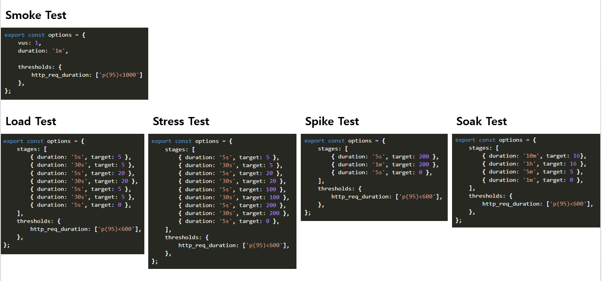
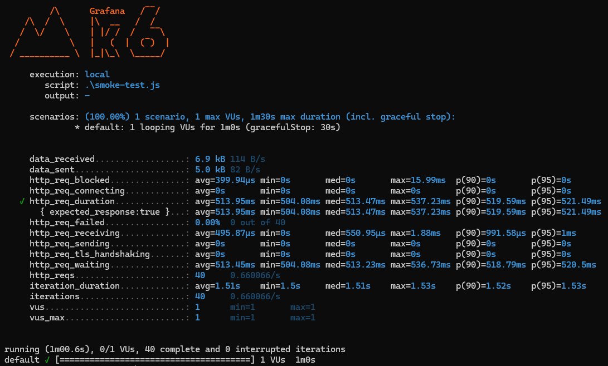

choco install k6 --version=0.56.0

```cs
[ApiController]
[Route("[controller]")]
public class StringController : ControllerBase
{
    private static readonly string[] Summaries = new[]
    {
        "Freezing", "Bracing", "Chilly", "Cool", "Mild", "Warm", "Balmy", "Hot", "Sweltering", "Scorching"
    };

    private readonly ILogger<StringController> _logger;

    public StringController(ILogger<StringController> logger)
    {
        _logger = logger;
    }

    // https://localhost:7133/string/reverse?input=emosewa%C2%A0si%C2%A0ezamedoc
    [HttpGet("reverse")]
    public string Reverse([FromQuery] string input)
    {
        _logger.LogInformation($"{input}");

        var reverse = new StringBuilder(input.Length);
        for (int i = input.Length - 1; i >= 0; i--)
        {
            reverse.Append(input[i]);
        }
        Thread.Sleep(500);
        return reverse.ToString();
    }
}
```

```js
import http from 'k6/http';
import { sleep } from 'k6';

export default function() {
    http.get('https://localhost:7133/string/reverse?input=emosewa%C2%A0si%C2%A0ezamedoc');
    sleep(1);
}
```
```
k6 run basic-test.js
```


## 성능 테스트 요약


## Smoke test


```js
const API_BASE_URL = 'http://localhost:5202/';
const API_REVERSE_URL = API_BASE_URL + 'string/reverse?input=codemaze%20is%20awesome';

export { API_REVERSE_URL };
```
```js
import http from 'k6/http';
import { sleep } from 'k6';
import * as config from './config.js';

export const options = {
    vus: 1,
    duration: '1m',

    thresholds: {
        http_req_duration: ['p(95)<1000']
    },
};

export default function () {
    http.get(config.API_REVERSE_URL);
    sleep(1);
}
```
```
k6 run smoke-test.js
```

## Load test
```js
import http from 'k6/http';
import { sleep } from 'k6';
import * as config from './config.js';

export const options = {
    stages: [
        { duration: '5s', target: 5 },
        { duration: '30s', target: 5 },
        { duration: '5s', target: 20 },
        { duration: '30s', target: 20 },
        { duration: '5s', target: 5 },
        { duration: '30s', target: 5 },
        { duration: '5s', target: 0 },
    ],
    thresholds: {
        http_req_duration: ['p(95)<600'],
    },
};

export default () => {
    http.get(config.API_REVERSE_URL);
    sleep(1);
};
```

## Stress test
```js
import http from 'k6/http';
import { sleep } from 'k6';
import * as config from './config.js';

export const options = {
    stages: [
        { duration: '5s', target: 5 },
        { duration: '30s', target: 5 },
        { duration: '5s', target: 20 },
        { duration: '30s', target: 20 },
        { duration: '5s', target: 100 },
        { duration: '30s', target: 100 },
        { duration: '5s', target: 200 },
        { duration: '30s', target: 200 },
        { duration: '5s', target: 0 },
    ],
    thresholds: {
        http_req_duration: ['p(95)<600'],
    },
};

export default () => {
    http.get(config.API_REVERSE_URL);
    sleep(1);
};
```

## Spike test
```js
import http from 'k6/http';
import { sleep } from 'k6';
import * as config from './config.js';

export const options = {
    stages: [        
        { duration: '5s', target: 200 },
        { duration: '1m', target: 200 },
        { duration: '5s', target: 0 },
    ],
    thresholds: {
        http_req_duration: ['p(95)<600'],
    },
};

export default () => {
    http.get(config.API_REVERSE_URL);
    sleep(1);
};
```

## Soak test
```js
import http from 'k6/http';
import { sleep } from 'k6';
import * as config from './config.js';

export const options = {
    stages: [        
        { duration: '10m', target: 16},
        { duration: '1h', target: 16 },
        { duration: '5m', target: 5 },
        { duration: '1m', target: 0 },
    ],
    thresholds: {
        http_req_duration: ['p(95)<600'],
    },
};

export default () => {
    http.get(config.API_REVERSE_URL);
    sleep(1);
};
```

- [Performance Testing of ASP.NET Core APIs With k6](https://code-maze.com/aspnetcore-performance-testing-with-k6/)