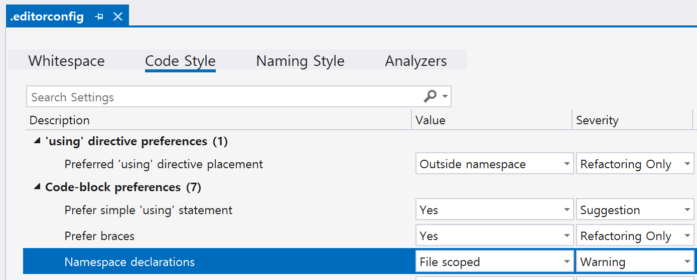

- [ ] [Microsoft.CodeAnalysis.PublicApiAnalyzers](https://github.com/dotnet/roslyn-analyzers/blob/main/src/PublicApiAnalyzers/PublicApiAnalyzers.Help.md)
  - https://github.com/dotnet/roslyn-analyzers/tree/main/src/PublicApiAnalyzers

```
dotnet add package Microsoft.CodeAnalysis.PublicApiAnalyzers

PublicAPI.Shipped.txt: 릴리스된 API를 정의.
PublicAPI.Unshipped.txt: 아직 릴리스되지 않은 API를 정의

RS0016: 공개 API가 추가되었지만 PublicAPI.Unshipped.txt에 반영되지 않았음.
RS0017: PublicAPI.Shipped.txt 또는 PublicAPI.Unshipped.txt에서 제거된 API가 발견됨.
RS0025: API가 새로 추가되었지만 공개 API 파일에 정의되지 않음.


<Project>
  <PropertyGroup>
    <EnableNETAnalyzers>true</EnableNETAnalyzers>
    <AnalysisMode>AllEnabledByDefault</AnalysisMode>
  </PropertyGroup>
</Project>

```
- [x] OpenTelemetry MediatR | Logs
- [ ] OpenTelemetry MediatR | Traces
- [ ] OpenTelemetry MediatR | Metrics
---
- [] [Analyze this: Raise your code quality and follow code standards with Roslyn - Fredrik Ljung](https://www.youtube.com/watch?v=ZX7RTZX9_aE)
---
- grafana
- 지표 -> grafana
- 성능 테스트
---
- 지표 콘솔로 확인하기
- OpenTelemetry 테스트트
---
- Job 설정 이해
- 설정 파일 기반으로 테스트 환경 설정
- github action 로컬 실행: act
- 리눅스 단일 파일 배포
- 배포 파일 재구성

<br/>

- [ ] Job 설정
- [ ] Job 통합 테스트, 테스트 종료
---
- [ ] Serilog 구조적 파일 로그, https://github.com/ijardillier/netclient-elastic?tab=readme-ov-file#logs-via-serilog
- [ ] Serilog 예외
- [ ] Serilog 테스트 https://seankilleen.com/2024/04/how-to-test-logging-when-using-microsoft-extensions-logging-and-serilog/
- [ ] Serilog 데이터 출력 제약
  - [ ] 제외
  - [ ] 건수 제약
---
- [ ] 도커 desktop 없이 CLI
- [ ] 도커 헬스체크, https://github.com/Xabaril/AspNetCore.Diagnostics.HealthChecks

<br/>

- [x] aspire | 컨테이너 구성
- [x] aspire | 로그 출력
- [x] aspire | 로그 -> 추적 연동동
- [x] aspire | 지표 출력
- [x] aspire | 추적 출력
- [ ] OpenTelemtry | https://github.com/open-telemetry/opentelemetry-dotnet/blob/main/src/OpenTelemetry.Exporter.InMemory/README.md
- [ ] grafana | 지표
- [ ] grafana | 성능 모니터링
- [ ] grafana | 로그
- [ ] grafana | 추적

---
- [x] 도커 | 도커 컴포즈 구성
- [x] 도커 | 이름 규칙
- [x] 도커 | 로그 볼륨 구성성
- [ ] 도커 | docker compose 이름
- [ ] 도커 | docker 로그 볼륨 소유자
- [ ] 도커 | docker 컨테이너 실행 계정
- [ ] 도커 | docker /tmp 설정
- [ ] 도커 | docker-compose.infra.yml 더버그 통합
---
- [x] 빌드 자동화 | 빌드
- [x] 빌드 자동화 | 테스트
- [x] 빌드 자동화 | 코드 커버리지
- [x] 빌드 자동화 | 테스트 보고서
- [ ] 빌드 자동화 | 로컬 빌드/코드 커버리지
- [ ] 빌드 자동화 | 코드 품질 지표
- [ ] 빌드 자동화 | 프로젝트 의존성 다이어그램
- [ ] 빌드 자동화 | 정적 사이트
- [ ] 빌드 자동화 | "Add Coverage PR Comment" 빌드 자동화
- [ ] 빌드 자동화 | 코드 커버리지 외부 사이트 연동
- [ ] 빌드 자동화 | 컨테이너 배포
- [ ] 빌드 자동화 | 컨테이너 배포, 단일 파일
---
- [x] 옵션 패턴 | FluentValidation 통합

<br/>

```dockerfile

FROM mcr.microsoft.com/dotnet/aspnet:8.0 AS base

# 필수 패키지 설치
#   - procps        : ps -ef
#   - net-tools     : ifconfig
#   - iputils-ping  : ping
#   - curl          : curl
#   - sudo          : sudo
USER root
RUN apt-get update -q \
  && apt-get --no-install-recommends --no-install-suggests --yes --quiet install \
          procps \
          net-tools \
          iputils-ping \
          curl \
          sudo \
  && apt-get clean \
  && apt-get --yes --quiet autoremove --purge \
  && rm -rf /var/lib/apt/lists/* /tmp/* /var/tmp/* \
            /usr/share/doc/* /usr/share/groff/* /usr/share/info/* /usr/share/linda/* \
            /usr/share/lintian/* /usr/share/locale/* /usr/share/man/*

RUN apt-get update -q \
    && apt-get install -qy build-essential wget libfontconfig1 \
    && rm -rf /var/lib/apt/lists/*
WORKDIR /app
...

FROM base AS final
ARG SERVICE_USER
ARG SERVICE_USER_ID

WORKDIR /app
COPY --from=publish /app/publish .

RUN addgroup --gid $SERVICE_USER_ID $SERVICE_USER \
    && adduser --uid $SERVICE_USER_ID --gid $SERVICE_USER_ID --disabled-password --gecos "" $SERVICE_USER \
    && chown -R $SERVICE_USER:$SERVICE_USER /app
USER $SERVICE_USER

ENTRYPOINT ["dotnet", "Crop.Solution.Service.dll"]

LABEL solution=solution
LABEL category=service
```
```yml
x-logging-common: &logging-common
  driver: "json-file"
  options:
    max-size: "10m"
    max-file: "7"

services:
  corp.solution.service:
    env_file: .env
    image: corp.solution.service:${SERVICE_TAG}
    build:
      context: .
      args:
        - SERVICE_USER=${SERVICE_USER}
        - SERVICE_USER_ID=${SERVICE_USER_ID}
      dockerfile: Corp.Solution.Service\Src\Corp.Solution.Service\Dockerfile
    container_name: corp.solution.service
    hostname: corp.solution.service
    networks:
      - net
    logging: *logging-common

networks:
  net:
    name: crop.solution
```


## 완: 프로젝트 구성(레이어 구성)
- [X] AssemblyReference 파일
- [X] 단위 테스트 | xunit.runner.json 파일(모든 테스트 프로젝트)
- [X] 단위 테스트 | Directory.Build.props 테스트 전용 파일
- [X] 단위 테스트 | Abstractions/Constants/Constants.Constants.cs 파일
- [X] 단위 테스트 | ArchitectureTests/ArchitectureBaseTest.cs 파일
- [X] 단위 테스트 | ArchitectureTests/LayerDependencyTests.cs 파일

## 관찰 가능성 옵션/의존성
- [X] 옵션 패턴: IConfigureOptions, IValidateOptions
- [X] 의존성 폴더 구성
  - XxxRegistration
  - RegisterXxx
- [X] 옵션 의존성 주입
  - ConfigureOptions
  - AddSingleton
- [x] appsettings.json
- [x] 단위 테스트: 옵션 네이밍
- [ ] 통합 테스트: 옵션 네이밍

## 관찰 가능성 로그
- [ ] 구조적 로그 Microsoft
- [ ] 구조적 로그 Microsoft, Error
- [ ] 구조적 로그 Microsoft, Exception
- [ ] 로그 시스템 Aspire
- [ ] 로그 시스템
- [ ] 로그 시스템 OpenSearch
- [ ] 구조적 로그 Serilog
- [ ] 구조적 로그 Serilog, Error
- [ ] 구조적 로그 Serilog, Exception

## 컨테이너
- [ ] 도커 파일
- [ ] 도커 컴포즈
- [ ] 헬스체크
- [ ] 로그?

---

## 의존성 주입
- 옵션 값

## Logs

## Metrics

## Traces

---

## 완: Result
### Framework 프로젝트
- [x] Error
- [x] Result, ValidationResult

### Unit 테스트 프로젝트
- [x] Error
- [x] Result
- [ ] Error -> IError
---

## 완: CQRS
### Framework 프로젝트
- [x] ICommand, IQuery
- [ ] ICachedQuery

### Unit 테스트 프로젝트
- [x] ArchitectureTests/NamingConventionsCQRSTests

---

## Known Pipeline(CQRS)
- 유효성 검사
- 로그
- QueryCachingPipeline
---
- 예외
- 시간
- 트랜잭션

---

## Unknown Pipeline

- 예외
- 로그
- 시간

---

## Usecase Validation

## 에러 코드

## 통합 테스트(컨테이너)
- RabbitMQ

## 애플리케이션 타입
- Domain Event

## 도메인 타입
- Entity
- ValueObject
- Domain Service
- Enum

## CQRS
- Command: EFCore
- Query: Dapper

## Adapter
- 반복 작업
- RabbitMQ
- WebApi

## Cache?

## 컨테이너화
- 환경 설정


## TODO
- [ ] CI/CD
- [ ] Mapping(DTO)
- [ ] Repository 패턴
- [ ] UoW 패턴
- [ ] Retry 패턴
- [ ] Circuit Breaker 패턴
- [ ] Saga 패턴
- [ ] Specification 패턴
- [ ] [Outbox 패턴](https://www.kamilgrzybek.com/blog/posts/the-outbox-pattern)
- [ ] 트랜잭션 스크립트 vs 모델

```
root = true

[*.cs]
# CA1501: DepthOfInheritance(5)
#   상속성을 너무 많이 사용하지 마십시오
#   Avoid excessive inheritance
#   https://learn.microsoft.com/en-us/dotnet/fundamentals/code-analysis/quality-rules/ca1501
dotnet_diagnostic.CA1501.severity = error

# CA1502: CyclomaticComplexity(25)
#   지나치게 복잡하게 만들지 마십시오(순환 복잡성)
#   Avoid excessive complexity
#   https://learn.microsoft.com/en-us/dotnet/fundamentals/code-analysis/quality-rules/ca1502
dotnet_diagnostic.CA1502.severity = error

# CA1505: MaintainabilityIndex(10)
#   유지 관리할 수 없는 코드는 사용하지 마십시오
#   Avoid unmaintainable code
#   https://learn.microsoft.com/ko-kr/dotnet/fundamentals/code-analysis/quality-rules/ca1505
dotnet_diagnostic.CA1505.severity = error

# CA1506: ClassCoupling(95/40)
#   클래스 결합을 지나치게 많이 사용하지 마십시오
#   Avoid excessive class coupling
#   https://learn.microsoft.com/ko-kr/dotnet/fundamentals/code-analysis/quality-rules/ca1506
#dotnet_diagnostic.CA1506.severity = error
```

```
public static Serilog.ILogger CreateSerilogLogger()
{
    return new LoggerConfiguration()
        .MinimumLevel.Override(Microsoft, Information)
        .Enrich.FromLogContext()                          // ?
        .WriteTo.Console()
        .CreateBootstrapLogger();                         // ?
}

Log.Logger = CreateSerilogLogger();

try
{
    Log.Information("Staring the host");
}
catch (Exception exception)
{
    Log.Fatal(exception, "Host terminated unexpectedly");
    return 1;
}
finally
{
    Log.Information("Stopping the host");
    Log.CloseAndFlush();
}

return 0;

 https://github.com/serilog/serilog-extensions-hosting
using Serilog;

Log.Logger = new LoggerConfiguration()
    .Enrich.FromLogContext()
    .WriteTo.Console()
    .CreateLogger();

try
{
    Log.Information("Starting host");

    var builder = Host.CreateApplicationBuilder(args);
    builder.Services.AddHostedService<PrintTimeService>();
    builder.Services.AddSerilog();

    var app = builder.Build();

    await app.RunAsync();
    return 0;
}
catch (Exception ex)
{
    Log.Fatal(ex, "Host terminated unexpectedly");
    return 1;
}
finally
{
    await Log.CloseAndFlushAsync();
}

//--------------------------------------------------------------------------------

public static void ConfigureSerilog(this WebApplicationBuilder builder)
{
    builder.Host.UseSerilog((context, services, configuration) => configuration
        .ReadFrom.Configuration(context.Configuration)
        .ReadFrom.Services(services)
        .Enrich.FromLogContext());
}

 https://mohsen.es/configuring-serilog-through-appsettings-json-file-33b26594bb46
```

- protected internal Result(TValue? value, Error error)
- private protected Result(Error error)
- 제네릭 타입(variance)
  - out TValue: 공변성 (Covariance)
    - 이는 제네릭 타입이 **반환 타입으로만** 사용될 수 있음을 보장합니다.
    - 공변성 덕분에 더 구체적인 타입으로 대체가 가능합니다. 즉, **서브타입   관계를 유지합니다.**
  - in TValue: 반공변성 (Contravariance)
    - 이는 제네릭 타입이 **입력 타입으로만** 사용될 수 있음을 보장합니다.
    - 반공변성 덕분에 더 일반적인 타입으로 대체가 가능합니다. 즉, **슈퍼타입   관계를 유지합니다.**

```
root = true

# All files
[*]
indent_style = space

# Xml files
[*.xml]
indent_size = 2

# C# files
[*.cs]

#### Core EditorConfig Options ####

# Indentation and spacing
indent_size = 4
tab_width = 4

# New line preferences
insert_final_newline = false

[*.{cs,vb}]
dotnet_analyzer_diagnostic.category-Style.severity = none

dotnet_diagnostic.MA0053.severity = warning
```

### Ch 9.5.1 코드 스타일("IDExxxx")
- 코드 스타일 인덱스: [링크](https://learn.microsoft.com/en-us/dotnet/fundamentals/code-analysis/style-rules/#index)



```shell
# 코드 스타일: File Scoped 네임스페이스가 아닐 때
#   - IDE0160: Use block-scoped namespace
#   - IDE0161: Use file-scoped namespace
dotnet_diagnostic.IDE0161.severity = warning
csharp_style_namespace_declarations = file_scoped:warning
```

- [x] [네임스페이스 file_scoped](https://learn.microsoft.com/en-us/dotnet/fundamentals/code-analysis/style-rules/ide0160-ide0161)
  ```ini
  dotnet_diagnostic.IDE0161.severity = warning
  csharp_style_namespace_declarations = file_scoped:warning
  ```
- [x] sealed: CA1852,	MA0053
  - CA only applies to internal types in assemblies that do not expose internal types and members and - by default - report types that inherit from [Exception] (https://learn.microsoft.com/en-us/dotnet/api/system.exception?WT.mc_id=DT-MVP-5003978), but cannot be configured to report types that define virtual members
- [x] [Meziantou.Analyzer's rules: .editorconfig - all rules disabled](https://github.com/meziantou/Meziantou.Analyzer/tree/main/docs#editorconfig---all-rules-disabled)
- [ ] 잘못된 네임스페이스
- [ ] [사용하지 않는 using 구문](https://learn.microsoft.com/ko-kr/dotnet/fundamentals/code-analysis/style-rules/ide0005?pivots=lang-csharp-vb)
  ```ini
  dotnet_diagnostic.IDE0005.severity = warning
  ```
- [ ] [primary 생성자](https://learn.microsoft.com/ko-kr/dotnet/fundamentals/code-analysis/style-rules/ide0290)
  ```ini
  dotnet_diagnostic.IDE0290.severity = warning
  csharp_style_prefer_primary_constructors = true:warning
  ```
- [ ] internal sealed class

```xml
<EnforceCodeStyleInBuild>true</EnforceCodeStyleInBuild>
<TreatWarningsAsErrors>true</TreatWarningsAsErrors>
```
- `EnforceCodeStyleInBuild`: 명령줄 및 Visual Studio에서 빌드할 때 코드 스타일("IDExxxx") 분석을 사용하도록 설정할 수 있습니다.


### Ch 9.5.2 코드 분석
- TODO `AnalysisLevel`: latest
- TODO `AnalysisMode`: All
- TODO `CodeAnalysisTreatWarningsAsErrors`: true
- TODO 코드 품질
  - StyleCop.Analyzers
  - SonarAnalyzer.CSharp
- TODO 스레드 분석
- todo clr 메모리 분석
- https://swharden.com/blog/2023-03-05-dotnet-code-analysis/
- https://swharden.com/blog/2023-03-07-treemapping/

<br/>

- https://github.com/cybermaxs/awesome-analyzers?tab=readme-ov-file
  - https://www.meziantou.net/the-roslyn-analyzers-i-use.htm
  - https://github.com/dotnet/roslynator
  - Microsoft.CodeAnalysis.NetAnalyzers
  - https://github.com/meziantou/Meziantou.Analyzer/tree/main
  - https://github.com/code-cracker/code-cracker
  - https://github.com/SonarSource/sonar-dotnet

```

csharp_style_namespace_declarations = file_scoped:error
dotnet_diagnostic.IDE0161.severity = error

Filescope
internal sealed class ...

- Scalability
- Load Balancing
- Latency and Throughput
- Caching
- Consistency
- Availability
- Partitioning
- Replication
- Fault Tolerance
- CAP Theorem
- Database Indexing
- Rate Limiting
- Communication
- Reverse proxy
- Content delivery network
- Performance
- Streaming
- Batch Processing

```
- 전역
- 부분 변경
- 부분 제외
- 공통 설정
  - ServerGarbageCollection
- 확인: dotnet msbuild /pp

폴더별 빌드 사용자 지정
https://learn.microsoft.com/ko-kr/visualstudio/msbuild/customize-by-directory?view=vs-2022

Directory.Build.props - Centralize your builds
https://steven-giesel.com/blogPost/f3f46814-06c9-41b7-84fa-09ebb3305ed0


Understand Directory.Build.props: Centralizing .NET Project Configurations
https://blog.ndepend.com/directory-build-props/
```

# 패턴
## Internal 전술 설계 패턴
- [ ] 서비스
  - [ ] 파일 시스템(반복)
  - [ ] WebApi 서비스
  - [ ] RabbitMQ
- [ ] Assembly.cs
- [ ] 레이어 의존성 테스트
- [x] 의존성(Strategy 패턴)
- [x] .josn 옵션 패턴
- [ ] Result/Error
- [x] Mediator 패턴
  - [ ] [REPR Pattern(Request-Endpoint-Response)](https://code-maze.com/aspnetcore-repr-request-endpoint-response-pattern/)
- [x] Decorator 패턴(Known Input/Output: Message)
  - [ ] Validation 패턴(Application Service)
  - [ ] 로그
  - [ ] 예외
- [ ] Decorator 패턴(Unknown Input/Output: Adapter)
  - [ ] 로그
  - [ ] 예외
- [x] [CQRS 패턴](https://www.kamilgrzybek.com/blog/posts/simple-cqrs-implementation-raw-sql-ddd)
- [ ] Mapping(DTO)
- [ ] Repository 패턴
- [ ] UoW 패턴
- [ ] Retry 패턴
- [ ] Circuit Breaker 패턴
- [ ] Saga 패턴
- [ ] Specification 패턴
- [ ] [Outbox 패턴](https://www.kamilgrzybek.com/blog/posts/the-outbox-pattern)

## External 전술 설계 패턴
- [ ] Pub/Sub 패턴
- [ ] API Gateway/Load Balancer 패턴
- [ ] BFF(Backend For Frontend) 패턴
- [ ] Cache
- [ ] 분산 락
- [ ] CDC

```


  - ServerGarbageCollection
- 코드 정적 분석
  - 코드 스타일
  - 코드 품질?
  - 코드 정적 분석
    - https://github.com/MarvinDrude/DotNet.GitHubActionMetrics
    - https://github.com/dotnet/samples/tree/main/github-actions/DotNet.GitHubAction
- 도커
- 도커 컴포즈

<br/>

- `TreatWarningsAsErrors`: Treat all warnings as errors.
- `CodeAnalysisTreatWarningsAsErrors`: Treat code quality (CAxxxx) warnings as errors.
- `EnforceCodeStyleInBuild`: Enables code-style analysis ("IDExxxx") rules.
  - code quality analysis: EnableNETAnalyzers
    - .NET code quality analysis is enabled, by default,
  - code style analysis: EnforceCodeStyleInBuild
    - .NET code style analysis is disabled, by default,
- `AnalysisLevel`: Specifies which analyzers to enable. The default value is latest.
- `AnalysisMode`: Configures the predefined code analysis configuration.


<TreatWarningsAsErrors>true</TreatWarningsAsErrors>
<CodeAnalysisTreatWarningsAsErrors>true</CodeAnalysisTreatWarningsAsErrors>
<EnforceCodeStyleInBuild>true</EnforceCodeStyleInBuild>
<AnalysisLevel>latest</AnalysisLevel>
<AnalysisMode>All</AnalysisMode>

StyleCop.Analyzer
SonarAlayzer.CSharp

스레드 분석
clr 메모리 분석


- https://code-maze.com/entity-framework-core-best-practices/


Meziantou.Analyzer
Microsoft.VisualStudio.Threading.Analyzers
Microsoft.CodeAnalysis.BannedApiAnalyzers

- [Understanding the impact of Roslyn Analyzers on build time](https://www.meziantou.net/understanding-the-impact-of-roslyn-analyzers-on-the-build-time.htm)


- 전략 설계
    
  ※ 이미지 출처: [Strategic Design Explained](https://miro.medium.com/v2/resize:fit:1400/format:webp/1*vJzxC1yeMtIKxuk-8Fj8YA.png)


<br/>

- [API 게이트웨이, Domain-Driven Design example](https://github.com/draphyz/DDD)
- [API 게이트웨이 패턴과 클라이언트-마이크로 서비스 간 직접 통신](https://learn.microsoft.com/ko-kr/dotnet/architecture/microservices/architect-microservice-container-applications/direct-client-to-microservice-communication-versus-the-api-gateway-pattern)
- [Ocelot을 사용하여 API 게이트웨이 구현](https://learn.microsoft.com/ko-kr/dotnet/architecture/microservices/multi-container-microservice-net-applications/implement-api-gateways-with-ocelot)
```


## 도커 컴포즈 arg 전달
```shell
# .env

SERVICE_USER=hello
SERVICE_USER_ID=1000

# {T1}-{T2}       : 도커 컴포즈
# {T1}.{T2}       : 볼륨, 네트워크
# {T1}.{T2}.{T3}  : 서비스(services), 컨테이너(container_name), 호스트(hostname)
# {T1}/{T2}/{T3}  : 이미지

# docker-compose.yml
x-logging-common: &logging-common
  driver: "json-file"
  options:
    max-size: "10m"
    max-file: "7"

    env_file: .env
    build:
      context: .
      args:
        - SERVICE_USER=${SERVICE_USER}
        - SERVICE_USER_ID=${SERVICE_USER_ID}
      dockerfile: Services/Api/Src/Crop.Hello.Api/Dockerfile
    logging: *logging-common
    

#Dockerfile
FROM mcr.microsoft.com/dotnet/aspnet:8.0 AS base

# 필수 패키지 설치
#   - procps        : ps -ef
#   - net-tools     : ifconfig
#   - iputils-ping  : ping
#   - curl          : curl
#   - sudo          : sudo
USER root
RUN apt-get update \
    && apt-get --no-install-recommends --no-install-suggests --yes --quiet install \
            procps \
            net-tools \
            iputils-ping \
            curl \
            sudo \
    && apt-get clean \
    && apt-get --yes --quiet autoremove --purge \
    && rm -rf /var/lib/apt/lists/* /tmp/* /var/tmp/* \
              /usr/share/doc/* /usr/share/groff/* /usr/share/info/* /usr/share/linda/* \
              /usr/share/lintian/* /usr/share/locale/* /usr/share/man/*

...

FROM base AS final
ARG SERVICE_USER
ARG SERVICE_USER_ID

WORKDIR /app
COPY --from=publish /app/publish .

RUN addgroup --gid $SERVICE_USER_ID $SERVICE_USER \
    && adduser --uid $SERVICE_USER_ID --gid $SERVICE_USER_ID --disabled-password --gecos "" $SERVICE_USER \
    && chown -R $SERVICE_USER:$SERVICE_USER /app
USER $SERVICE_USER

ENTRYPOINT ["dotnet", "Corp.Hello.Api.dll"]

LABEL solution=hello
LABEL category=service
```

```
sudo usermod -aG sudo {계정}
id
groups
```

- DB 서비스
  ```cs
  private IServiceScopeFactory _serviceScopeFactory = serviceScopeFactory;
  using var scope = _serviceScopeFactory.CreateScope();
  var dbContext = scope.ServiceProvider.GetService<ApplicationDbContext>()!;
  ```
- 옵션 접근
- 컨테이너 HealthCheck 


```
  C:\Assets\Domains\Tests\Crop.Hello.Domain.Unit\Crop.Hello.Domain.Unit.csproj : warning NU1903: 'System.Net.Http' 4.3.0 패키지에 알려진 높은 심각도 취약성인 https://github.com/advisories/GHSA-7jgj-8wvc-jh57이(가) 있습니다.
  C:\Assets\Domains\Tests\Crop.Hello.Domain.Unit\Crop.Hello.Domain.Unit.csproj : warning NU1903: 'System.Text.RegularExpressions' 4.3.0 패키지에 알려진 높은 심각도 취약성인 https://github.com/advisories/GHSA-cmhx-cq75-c4mj이(가) 있습니다.
  C:\Assets\Frameworks\Tests\Crop.Hello.Framework.Tests.Unit\Crop.Hello.Framework.Tests.Unit.csproj : warning NU1903: 'System.Net.Http' 4.3.0 패키지에 알려진 높은 심각도 취약성인 https://github.com/advisories/GHSA-7jgj-8wvc-jh57이(가) 있습니다.
  C:\Assets\Frameworks\Tests\Crop.Hello.Framework.Tests.Unit\Crop.Hello.Framework.Tests.Unit.csproj : warning NU1903: 'System.Text.RegularExpressions' 4.3.0 패키지에 알려진 높은 심각도 취약성인 https://github.com/advisories/GHSA-cmhx-cq75-c4mj이(가) 있습니다.
Crop.Hello.Domain.Unit 2 경고와 함께 성공 (0.8초) → Assets\Domains\Tests\Crop.Hello.Domain.Unit\bin\Debug\net8.0\Crop.Hello.Domain.Unit.dll
  C:\Assets\Domains\Tests\Crop.Hello.Domain.Unit\Crop.Hello.Domain.Unit.csproj : warning NU1903: 'System.Net.Http' 4.3.0 패키지에 알려진 높은 심각도 취약성인 https://github.com/advisories/GHSA-7jgj-8wvc-jh57이(가) 있습니다.
  C:\Assets\Domains\Tests\Crop.Hello.Domain.Unit\Crop.Hello.Domain.Unit.csproj : warning NU1903: 'System.Text.RegularExpressions' 4.3.0 패키지에 알려진 높은 심각도 취약성인 https://github.com/advisories/GHSA-cmhx-cq75-c4mj이(가) 있습니다.
Crop.Hello.Framework.Tests.Unit 2 경고와 함께 성공 (1.6초) → Assets\Frameworks\Tests\Crop.Hello.Framework.Tests.Unit\bin\Debug\net8.0\Crop.Hello.Framework.Tests.Unit.dll
  C:\Assets\Frameworks\Tests\Crop.Hello.Framework.Tests.Unit\Crop.Hello.Framework.Tests.Unit.csproj : warning NU1903: 'System.Net.Http' 4.3.0 패키지에 알려진 높은 심각도 취약성인 https://github.com/advisories/GHSA-7jgj-8wvc-jh57이(가) 있습니다.
  C:\Assets\Frameworks\Tests\Crop.Hello.Framework.Tests.Unit\Crop.Hello.Framework.Tests.Unit.csproj : warning NU1903: 'System.Text.RegularExpressions' 4.3.0 패키지에 알려진 높은 심각도 취약성인 https://github.com/advisories/GHSA-cmhx-cq75-c4mj이(가) 있습니다.
```


## 빌드 옵션
```xml
<TargetFramework>net8.0-windows</TargetFramework>
<RuntimeIdentifier>win-x64</RuntimeIdentifier>
<PlatformTarget>x64</PlatformTarget>

<PublishSingleFile>true</PublishSingleFile>
<PublishSingleFile Condition="'$(Configuration)' == 'Release'">true</PublishSingleFile>

<PublishReadyToRun>true</PublishReadyToRun>
<SelfContained>true</SelfContained>
<DebugType>embedded</DebugType>
```
```
TargetFramework		  : -f net8.0-windows
RuntimeIdentifier	  : -r win-x64
  https://learn.microsoft.com/en-us/dotnet/core/rid-catalog
PlatformTarget		  : -none-
PublishSingleFile	  : -p:PublishSingleFile=true
PublishReadyToRun	  : -p:PublishReadyToRun=true
SelfContained		    : --self-contained true
DebugType			      : -p:DebugType=Embedded
```

## 윈도우 서비스
### Host.CreateDefaultBuilder
```cs
// Microsoft.Extensions.Hosting.WindowsServices 패키지
//
// IHostApplicationBuilder, Host.CreateApplicationBuilder : 서비스 X
// IHostBuilder           , Host.CreateDefaultBuilder     : 서비스 O
var builder = Host.CreateDefaultBuilder(args)
    .UseWindowsService()
    .ConfigureServices(services =>
    {
        services.AddQuartz(configure =>
        {
            var subscribeMessageWorkerKey = JobKey.Create(nameof(SubscribeMessageWorker));
            configure
                .AddJob<SubscribeMessageWorker>(jobBuilder =>
                    jobBuilder
                        .WithIdentity(subscribeMessageWorkerKey))
                .AddTrigger(trigger =>
                    trigger
                        .ForJob(subscribeMessageWorkerKey)
                        .WithIdentity(nameof(SubscribeMessageWorker) + "-Trigger")
                        .StartNow()
                        .WithCronSchedule("0/5 * * * * ?"));
                    //.WithSimpleSchedule(schedule => schedule.WithRepeatCount(0)));
        });

        services.AddQuartzHostedService(option =>
        {
            option.WaitForJobsToComplete = true;
        });

        string appPath = AppDomain.CurrentDomain.BaseDirectory;

        Log.Logger = new LoggerConfiguration()
            .WriteTo.File(Path.Combine(appPath, "logs\\log.txt"))
            //.WriteTo.File("logs/logs-.txt")
            .WriteTo.Console()
            .CreateLogger();

        services.AddSerilog();
    });

using var app = builder.Build();
```

### WebApplication.CreateBuilder
```cs
var builder = WebApplication.CreateBuilder(args);

//var builder = WebApplication.CreateBuilder(new WebApplicationOptions
//{
//    Args = args,
//    ContentRootPath = Directory.GetCurrentDirectory(),    <-
//});

builder.Services.AddWindowsService();

builder.Service. ...
```

### 윈도우 서비스 로그 파일
```
Serilog.Settings.Configuration

"path": "${BaseDirectory}Logs\\log-.txt"

 var configuration = new ConfigurationBuilder()
            .SetBasePath(AppContext.BaseDirectory) // BaseDirectory 설정
            .AddJsonFile("appsettings.json", optional: false, reloadOnChange: true)
            .Build();

Log.Logger = new LoggerConfiguration()
            .ReadFrom.Configuration(configuration)
            .CreateLogger();
```

### 서비스 생성
```
sc.exe create "서비스 이름" binpath="전체 경로"

get-service "서비스 이름"
start-service "서비스 이름"
stop-service "서비스 이름"

sc.exe delete "서비스 이름"
```

```
     build:
        context: .
          dockerfile: WebFrontEnd/Dockerfile

<PropertyGroup>
   <!-- existing properties -->
   <DependencyAwareStart>true</DependencyAwareStart>
</PropertyGroup>
```
- https://learn.microsoft.com/en-us/visualstudio/containers/tutorial-multicontainer?view=vs-2022