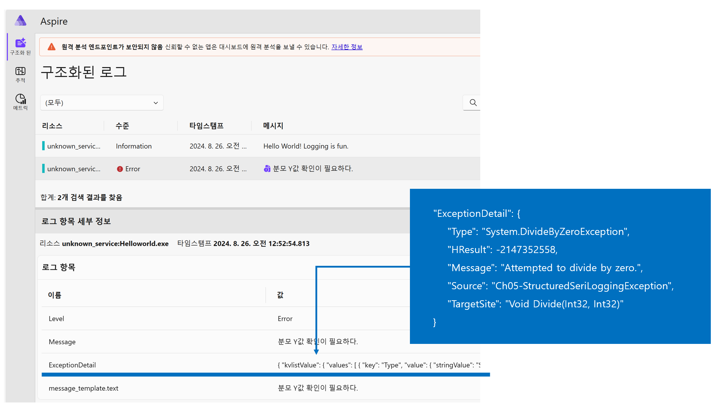

# Aspire 대시보드


```
netstat -ano | findstr :4317
netstat -ano | findstr :9001
```

## Dockerfile
```dockerfile
FROM mcr.microsoft.com/dotnet/aspire-dashboard:9.0
```

## docker-compose.yml
```yml
services:
  {조직}.{프로젝트}.infra.aspire:
    env_file: .env
    image: {조직}/{프로젝트}/infra/aspire:${INFRA_TAG}
    build:
      context: .
      dockerfile: Dockerfile
    container_name: {조직}.{프로젝트}.infra.aspire
    hostname: {조직}.{프로젝트}.infra.aspire
    restart: always
    environment:
      - DOTNET_DASHBOARD_UNSECURED_ALLOW_ANONYMOUS=true
    networks:
      - net
    ports:
      - 4317:18889
      - 18888:18888
    volumes:
      - /etc/localtime:/etc/localtime
    logging: *logging-common
```

- `DOTNET_DASHBOARD_UNSECURED_ALLOW_ANONYMOUS=true`: Token 입력을 비활성화합니다.

## OpenTelemetry 전송
- 패키지: Serilog.Sinks.OpenTelemetry

```cs
using Serilog;
using Serilog.Exceptions;
using Serilog.Formatting.Json;
using Serilog.Sinks.OpenTelemetry;

Log.Logger = new LoggerConfiguration()
    .WriteTo.Console(formatter: new JsonFormatter())
    .Enrich.WithExceptionDetails()
    .WriteTo.OpenTelemetry(x =>
    {
        //
        // Aspire Dashboard
        //
        x.Endpoint = "http://localhost:4317";
        x.Protocol = OtlpProtocol.Grpc;
    })
    .CreateLogger();

Log.Information("Hello World! Logging is {Description}.", "fun");
Log.CloseAndFlush();
```
