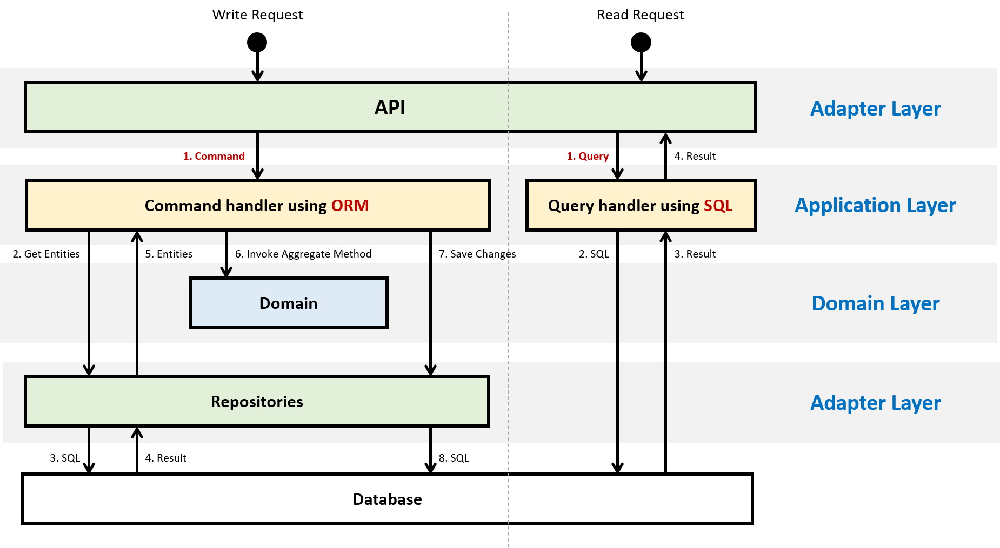

# 아키텍처

## 아키텍처 개요

### 아키텍처 정의


> 출처: [Making Architecture Matter, 소프트웨어 아키텍처의 중요성](https://www.youtube.com/watch?v=4E1BHTvhB7Y)

- 아키텍처는 프로젝트의 성공을 위해 팀과 이해관계자 모두가 공유하는 기본적인 원칙과 구조를 정의하는 데 초점을 맞춥니다. 특히, 모든 프로젝트 참여자가 공통적으로 이해하고 동의해야 하는 **핵심 요소(Shared Understanding)를** 바탕으로 설계가 이루어져야 합니다. 이는 프로젝트의 방향성과 목적을 명확히 하고, 팀 간의 효과적인 협업을 가능하게 합니다.

- 먼저, 아키텍처는 **변화하기 어려운 요소(Hard to Change)를** 신중히 설계하는 것을 중요하게 여깁니다. 이는 프로젝트의 핵심 가치를 반영하며, 처음 설계된 이후에는 변경이 어렵거나, 변경 시 큰 영향을 미칠 수 있는 요소들로 구성됩니다. 예를 들어, 시스템 아키텍처의 형태(모놀리식 또는 마이크로서비스)나 핵심 데이터 모델은 이러한 요소에 해당합니다. 따라서 초기 설계 단계에서 충분한 고민과 논의를 통해 신중하게 결정되어야 합니다.

- 또한, 프로젝트의 지속 가능한 성장을 위해 중요한 모든 것에 집중해야 합니다. 여기서 **"중요한 것(The Important Stuff)"은** 프로젝트의 목표와 환경에 따라 달라질 수 있지만, 이를 명확히 식별하고 우선 순위를 설정하는 것이 필요합니다. 예를 들어, 프로젝트 초기에는 최소 기능 제품(MVP)을 정의하고, 이를 바탕으로 점진적으로 확장 가능한 설계를 도입하는 것이 바람직합니다.

- 이를 구현하기 위해 다음과 같은 실천 사항이 필요합니다. 첫째, 모든 팀원이 프로젝트의 목표, 설계 방향, 그리고 핵심 원칙에 대해 명확히 이해할 수 있도록 문서화를 철저히 하고, 이를 정기적으로 검토하며 업데이트해야 합니다. 둘째, 기술적인 의사결정을 내릴 때는 단기적인 효율성보다 장기적인 안정성과 확장성을 우선시해야 합니다. 마지막으로, 팀 간 협업을 촉진하고 주요 의사결정 과정에서 모든 이해관계자가 참여할 수 있는 환경을 조성해야 합니다.

- 결론적으로, 이 아키텍처 정의는 공유된 이해를 바탕으로 하여 팀 전체가 동일한 목표를 향해 나아가게 하고, 변화하기 어려운 요소들을 체계적으로 관리하며, 중요한 요소에 집중하는 데 목적이 있습니다. 이를 통해 프로젝트는 **지속 가능하고 유연한 성장을** 이루어낼 수 있습니다.

### 아키텍처 범주


※ 출처: [Making old applications new again](https://sellingsimplifiedinsights.com/asset/app-development/ASSET_co-modernization-whitepaper-inc0460201-122016kata-v1-en_1511772094768.pdf)

```
Application Architecture
  ├─ Monolithic Architecture
  ├─ Modular Monolithic Architecture
  ├─ N-tier Architecture
  ├─ ...
  └─ Microservices Architecture
      ├─ Internal Architecture
      │    └─ Layered Architecture
      │         ├─ Hexagonal Architecture
      │         ├─ Onion Architecture
      │         ├─ Clean Architecture
      │         ├─ Vertical Slice Architecture
      │         └─ ...
      │
      └─ External Architecture
           └─ 외부 시스템 구성 아키텍처: 예. CNCF Landscape
```
- **`Application`** Architecture = `Internal` Architecture + `External` Architecture
  

  ※ 출처: [DDD 및 CQRS 패턴을 사용하여 마이크로 서비스에서 비즈니스 복잡성 처리](https://learn.microsoft.com/en-us/dotnet/architecture/microservices/microservice-ddd-cqrs-patterns/)

### 아키텍처 역사


  ※ 출처: [The Grand Unified Theory of Clean Architecture and  Pyramid ](https://www.youtube.com/watch?v=mzznsq4jCHY)

## 아키텍처 원칙
> 아키텍처 원칙: [Separation of concerns](https://learn.microsoft.com/ko-kr/dotnet/architecture/modern-web-apps-azure/architectural-principles#separation-of-concerns)


### 관심사의 분리
- 개발 시 요구사항과 운영 시 로그는 서로 다른 시점이지만, **코드에 대한 관점은 Biz.와 Tech. 관심사 기준으로 같아야 합니다.**
  - **개발 시** 요구사항을 비즈니스와 기술 관심사로 분해합니다.
  - **운영 시** 로그를 비즈니스와 기술 관심사로 식별합니다.


### 의존성 역전전


### 레이어
- 개발 시 요구사항과 운영 시 로그는 서로 다른 시점이지만, **코드에 대한 관점은 레이어 기준으로 동일해야 합니다.**


- **비즈니스 관심사**
  - Application: 비즈니스 흐름(Biz. Flow)
  - Domain: 비즈니스 단위(Biz. Unit)
- **기술 관심사**
  - Adapter
    - `Known` 입출력 Adapter
    - `Unknown` 입출력 Adapter: 부수 효과(Side Effects)

## 레이어 배치

### 레이어 Known I/O 배치


### 레이어 Unknown I/O 배치


## 레이어 격리

### 레이어 격리 전

- 출력의 변화 영향이 입력까지 전파됩니다.

### 레이어 격리 후

- 입출력 인터페이스를 활용하여, 입출력 변화의 영향이 Operation 레이어에 전파되지 않도록 차단합니다(Strategy 패턴).

## 레이어 테스트


- 단위 테스트: Biz. 관심사를 테스트합니다.
- 통합 테스트: Tech. 관심사까지 포함하여 Biz. 관심사를 테스트합니다.

## 레이어 고도화

### 격리 고도화


- Mediator 패턴을 활용하여, 격리된 레이어 간의 소통을 위해 인터페이스의 입출력을 메시지 기반으로 단순화합니다.
  - 메시지는 컴파일 타임과 런타임 모두에서 호출자와 수신자 정보를 숨길 수 있습니다(느슨한 결합).
    | 구분             | Mediator  패턴  | Strategy  패턴 |
    | ---              | ---            | ---            |
    | **Compile-time** | Unknown        | Unknown        |
    | **Runtime**      | Unknown        | Known          |
  - 메시지는 런타임에 메시지에 부가 기능을 더 쉽게 추가할 수 있습니다(Decorator 패턴)
  - 메시지는 입출력을 범주화할 수 있습니다(Command 메시지와 Query 메시지: CQRS 패턴).

### 메시지 고도화

- Known 입출력(Mediator 패턴)은 Decorator 패턴(Pipeline)과 조합하여 동적으로 메시지에 새 기능을 추가할 수 있습니다.
  - 예. 메시지 처리 시간 로그
  - 예. 입력 메시지 유효성 검사
  - 예. Command 메시지일 때 트랜잭션 처리(CQRS 패턴)


- Unknown 입출력(Strategy 패턴)도 역시 Decorator 패턴(Pipeline)과 조합하여 동적으로 새 기능을 추가할 수 있습니다.


### 메시지 범주화(CQRS)


- Mediator 패턴을 통해 데이터 쓰기를 위한 메시지(Command)와 데이터를 읽기 위한 메시지(Query)로 구분할 수 있습니다.
  - Command 메시지: 데이터 가변(`CUD`:`Create, Update, Delete`)
  - Query 메시지: 데이터 불변(`R`: `Read`)
- `Command`: ORM(OLTP, Create, Update, Delete)
  - Command는 데이터의 상태를 변경하는 작업을 담당합니다.
  - 이 작업은 일반적으로 여러 테이블을 참조하거나 복잡한 트랜잭션을 포함할 수 있습니다.
  - 따라서 Command는 데이터베이스에 변경을 가하는데, 복잡한 로직을 처리하거나 여러 엔티티와 상호작용할 수 있습니다.
- `Query`: SQL(OLAP, Read)
  - Query는 데이터베이스에서 데이터를 읽어오는 작업에 해당합니다.
  - 일반적으로 Command보다 쿼리의 수가 많을 수 있으며, 데이터 조회만을 목적으로 하므로 복잡도가 낮고 최적화된 방식으로 실행됩니다.
  - Query는 데이터의 상태를 변경하지 않고, 데이터를 읽어오는 데 집중합니다.

### 메시지 범주화(CQRS) 흐름

※ 출처: [Module Requests Processing via CQRS](https://github.com/kgrzybek/modular-monolith-with-ddd?tab=readme-ov-file#34-module-requests-processing-via-cqrs)  

| 구분       | Command  | Query      |
| ---        | ---      | ---        |
| 트랜잭션    | O(필요)  | X(불 필요)  |
| 구현       | ORM      | SQL        |
| DTO 변환   | O(필요)  | X(불 필요)  |
| SQL 복잡도 | ↓(낮다)  | ↑(높다)     |

- 데이터 읽기 위한 메시지 처리에서는 SQL 구문을 사용하여 DTO 데이터 변환 없이 데이터베이스 조회 결과를 바로 반환합니다.

