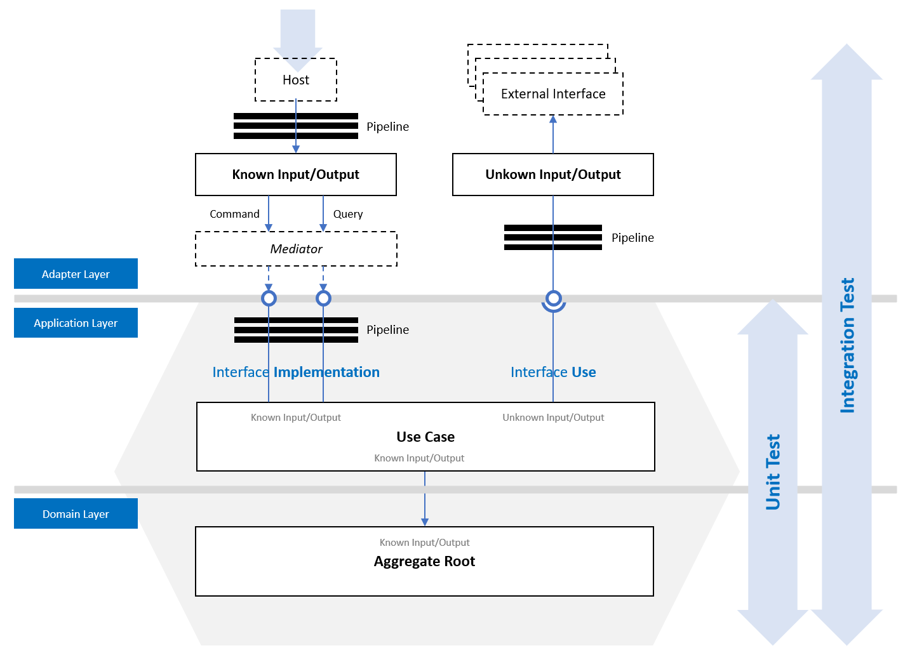
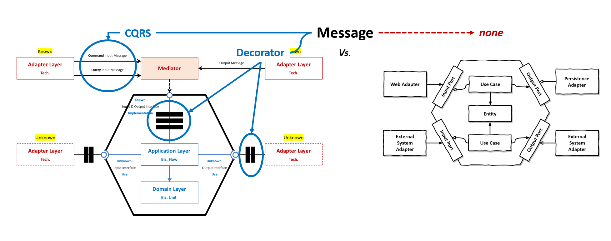

# Internal 아키텍처

## Internal 아키텍처 구성도

- Internal 아키텍처는 시스템을 구성하는 **레이어별로** 책임, 역할, 그리고 협력을 명확히 정의하고 구조화합니다. 이를 통해 각 레이어가 독립적으로 동작하면서도 유기적으로 협력할 수 있는 기반을 마련합니다.
- **유스케이스(Application 레이어: 비즈니스 흐름)가 모든 레이어를 주관합니다.**

## Internal 아키텍처 범주

## Internal 아키텍처 패키지
- Application 레이어
  - `MediatR`
    - MediatR.Contracts
- Adapter 레이어
  - `Serilog`
    - Serilog.Extensions.Hosting
    - Serilog.Settings.Configuration
    - Serilog.Sinks.Console
    - Serilog.Sinks.File
    - Destructurama.Attributed
    - Serilog.Exceptions
    - Serilog.Sinks.OpenTelemetry
  - `Microsoft.Extensions.Hosting.WindowsServices`
  - `Quartz`
    - Quartz.Extensions.Hosting
  - `FluentValidation`
    - FluentValidation.DependencyInjectionExtensions
  - `OpenTelemetry`
    - OpenTelemetry.Extensions.Hosting
    - OpenTelemetry.Instrumentation.Runtime
    - OpenTelemetry.Instrumentation.Process
    - OpenTelemetry.Instrumentation.Quartz
    - OpenTelemetry.Exporter.Console
    - OpenTelemetry.Exporter.OpenTelemetryProtocol
- Unit Test
  - `xunit`
  - `FluentAssertions`
  - `TngTech.ArchUnitNET.xUnit`
- GitHub Actions
  - `actions/checkout`
  - `actions/setup-dotnet`
  - `danielpalme/ReportGenerator-GitHub-Action`
  - `dorny/test-reporter`

## Internal 아키텍처 비교

### Port 비교

| 구분                | 아키텍처        | 헥사고날 아키텍처 |
| ---                 | ---           | ---               |
| Known 입출력 Port   | Mediator 패턴  | Strategy 패턴      |
| Unknown 입출력 Port | Strategy 패턴  | Strategy 패턴      |

- 헥사고날 아키텍처에서는 Known과 Unknown 외부 입출력을 명시적으로 구분하지 않지만, 우리는 이를 구분하여 Port를 정의합니다.
  - Known 입출력은 Mediator 패턴을 활용하여 메시지 기반으로 처리합니다.
  - Unknown 입출력은 Strategy 패턴을 사용하여 인터페이스를 통해 처리합니다.

### Message 비교

- 데이터 쓰기를 위한 메시지(Command)와 데이터를 읽기 위한 메시지(Query)로 구분합니다.
- 모든 메시지를 대상으로 부가 기능을 Decorator로 추가합니다.

### Adapter 비교

- Known과 Unknown 외부 입출력을 명시적으로 구분하여 Adapter 위치를 배치합니다.
  - Known 입출력은 Mediator 패턴을 활용하여 메시지 발신과 수신을 구현합니다.
  - Unknown 입출력은 Strategy 패턴을 사용하여 인터페이스을 구현합니다.

### Application 비교

- Application은 동일하게 모두 DDD 전술 설계 패턴에서 제시하는 Application Service 중심으로 구현됩니다.

### Domain 비교

- Domain은 동일하게 모두 DDD 전술 설계 패턴에서 제시하는 Entity와 Value Object 그리고 Domain Service을 중심으로 구현됩니다.
